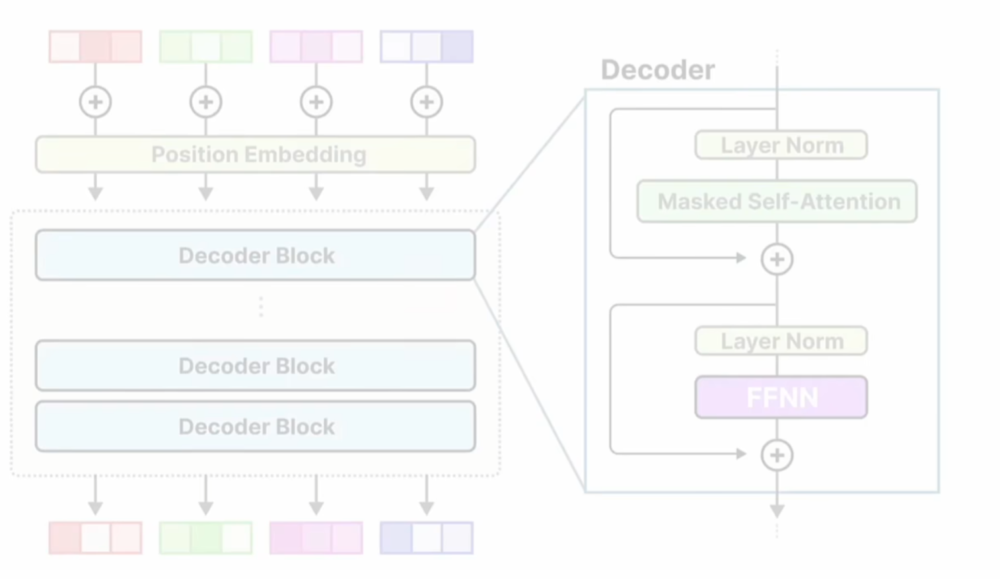

# MoE

## Introduce to MoE

时代背景之下，我们介绍 **MoE for Transformer Decoder**

 **two main component:**

- Router: Gate network -- Determines which tokens are sent to which experts
- Experts: They are FFNNs, at least one can be activated

在 MoE 架构的大模型中，**专家** （Expert）通常并非专注于某一特定领域（如“心理学”或“生物学”），而是更倾向于在**词汇层面学习句法结构** 或语言的通用特征。虽然MoE的设计理念是让每个专家在其“擅长的领域”内做出贡献但这些“领域”更多是指输入数据的某些特征或模式，而非具体学科领域。

###  Basic Princple

例如在 Decoder-only 的 LLM 架构，如下图所示：

- 为什么每个层的入口都需要 Layer Norm？ 输入的数据差距很大，将不利于自注意力和FFNN的计算。所以我们想要把数据拉到一个基准线上，所以要使用归一化层。 （当然，源头是什么？）
- 采用残差连接的结构有什么好处？ 使得深层神经网络可以被有效地训练，很好地抑制了训练时的梯度消失问题。
- 这种 block net 的结构有什么好处？ 这是目前深度神经网络构建的范式。

最初的想法是，将稠密的FFN（Dense net）变成稀疏的前传网络（Sparse net）。具体的方案是将全连接层的神经元分组，分别命名为 Expert1、Expert2、 ... , 每次前传**只激活一个或几个专家**，这样就降低了推理的成本。

就如上图所示，每个Expert其实都是完整的FFN，所以可以进行以下剥离，并且给其加上路由系统：

- 每个专家都有自己擅长的领域（这里的领域我们一般指输入token的类型分类）
- 如何让输入的 token 进入到对应的专家中？这就涉及到了**路由算法**。

### Routing Principle

**一个自然的想法**： Router 要做的其实是一个分类任务，我们仍然可以使用神经网络建模（全连接 + softmax 分类）。

对于专家的选择，可以根据 G(X) 分布选取对高的专家，也可以 TOP-k 选取（也还有别的选取方式： ）

如果选择了多个专家，一般要在最后的输出 y 使用加权平均 $ y = \sum (G(X） \cdot E(X)) $ 

### Load Balancing

Load Balancing 负载均衡，为了保证在模型推理的时候每个专家都能被均匀地选择。我们还希望每个专家在训练的时候都去学习不同领域的知识或者不同的隐表示。

**传统方法**通常依赖显式的辅助损失（auxiliary loss）来鼓励路由网络（gating mechanism）均衡分配输入到各专家。

- 例如，在训练过程中，通过正则化项惩罚专家负载的方差，迫使路由决策更均匀 。
- 局限性 ：过大的辅助损失可能导致模型训练不稳定，甚至影响主任务的性能

#### Keep Top-K

with **KeepTopK**，we introduce **trainable** gaussian noise. 通过可训练的高斯噪声 n 来抑制某些被高频选择的专家。（当然，这不是本质，本质在于 load balancing loss）
$$
H(X) = X * W + n
$$
如果每次都只选择一个专家来理解token，那么还是太极端了，很有可能导致最后训练出来的模型只有一个或几个专家在发挥作用。所以我们在训练和推理的时候都使用 Top-K routing 来实现负载均衡。

####  Auxiliary Loss 

Auxiliary Loss, namely **load balancing loss**

 

在一次前传中，计算每个专家的 importance，就是将每个token的softmax概率值相加（或者别的方式）。最后可以得到本次前传的 Expert Importance 的分布。可以根据该分布计算 Coefficient Variation .
$$
Coefficient \ \ Variation(CV) = \frac{standard \ \ deviation(\sigma)}{mean(\mu)}
$$
然后计算 Auxiliary Loss：
$$
\mathcal{L}_{aux}= \alpha V^2
$$

- $\alpha$ 为缩放因子(scaling factor)

全局loss 为：
$$
\mathcal{L}_{total} = \mathcal{L}_{main} + \lambda \cdot \mathcal{L}_{aux}
$$

#### Expert Capacity

通过给每个专家设置可以处理 token 数量的最大值，来实现 Load Balancing

## MoE 的前世今生

    
     
    
 <b>transformer 时代的 MoE 发展图 </b>

### RNN 时代 -- MoE 架构形成

Google,2017年1月 *《Outrageously Large Neural Networks:The Sparsely-Gated Mixture-of-Experts Layer》*, MoE 引入LSTM, 训出最大137B参数，Expert数达到128k。

### Transformer 时代

这里指的是 encoder-decoder 的经典 transformer 架构。

Google，2022年6月 *《Gshard: Scaling Giant Models with Conditional Computation and Automatic Sharding》*尝试将 FNN 替换为 MoE ，自此开始。

Switch Transformers

2022年2月，Google 发布 《ST-MoE》

### GPT 时代

其实也是 **transformer decoder** 的时代。

GLaM

展现了在

Deepseek MoE

## Deepseek MoE

**MoE 架构的演变趋势：**

- **dense net**  向 **sparse net** 的转换
- 从**大参数少专家**到**小参数多专家**的转换

**两个创新点：**

1. Fine-Grained Expert Segmentation 细颗粒度的专家细分
2. Shared Expert Isolation 共享专家

DeepseekMoE 是一种创新的 MoE 架构，旨在通过细分专家和共享专家策略，提高专家的专业化程度、较少冗余，并且在参数拓展时控制成本。MoE架构的核心目标时保持高性能的同时，显著降低推理时的计算资源消耗。

