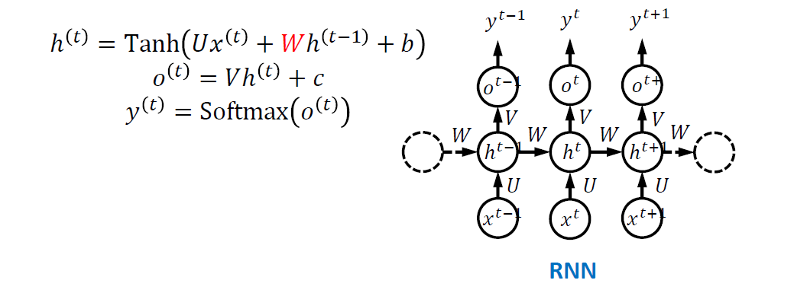
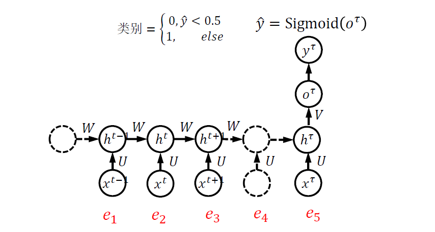
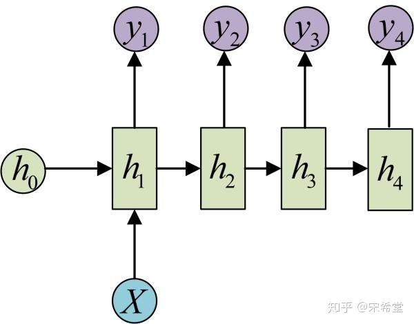
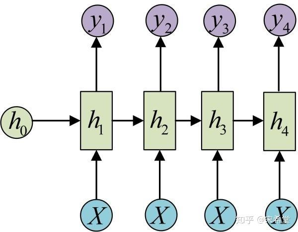
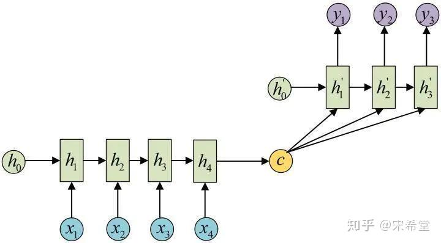
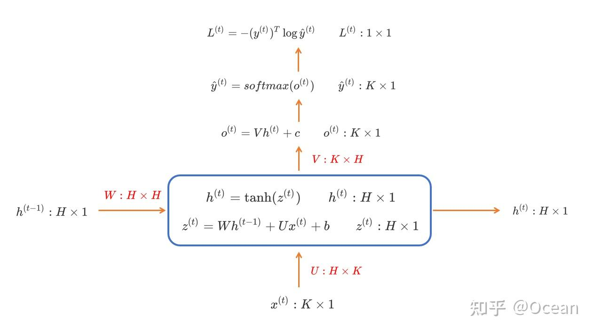

# RNN

## Reference

> [一文看尽 RNN（循环神经网络） - 知乎 (zhihu.com)](https://zhuanlan.zhihu.com/p/112998607)
>
> [BPTT算法推导 - Hiroki - 博客园](https://www.cnblogs.com/wacc/p/5341670.html)

## 基础知识

### 简介

循环神经网络（RNN），适合建模序列（sequence），可以保留序列的时序信息， 一般用于处理 NLP 任务

**优点：**

- 能处理时序，有记忆

**缺点：**

- 对历史一视同仁
- 有 **梯度消失** 和 **梯度爆炸** 问题

## 几种 RNN 结构

### N to N

> **标准 RNN**

**实现多分类任务（many to many）：**

- 在每个时间步上分类：对每个位置分类
- 在最终时间步上分类：对整个序列分类

### N to 1

**实现句子情感分类（many to one）：**

### 1 to N

**处理任务：**

- 从图像生成文字（image caption），此时输入的 $X$ 就是图像的特征，而输出的 $y$ 序列就是一段句子
- 从类别生成语音或音乐等

**两种计算方式：**

- 只在序列的开始进行输入计算：

- 把输入信息 $X$ 作为每个阶段的输入（输入虽是序列，但不随着序列变化):

### N to M

> **这种结构又称 Encoder-Decoder 模型，或者 Seq2Seq 模型**

**处理任务：**

- 机器翻译：`Encoder-Decoder` 的最经典应用，事实上这一结构就是在机器翻译领域最先提出的；
- 文本摘要：输入是一段文本序列，输出是这段文本序列的摘要序列；
- 阅读理解：将输入的文章和问题分别编码，再对其进行解码得到问题的答案；
- 语音识别：输入是语音信号序列，输出是文字序列。

### Attention 机制

## 变种 RNN

### LSTM

### GRU

### BRNN

### DRNN

## RNN 实现(numpy 为例)

### 网络定义

### 正向传播

### 反向传播

### 关于 loss 函数

