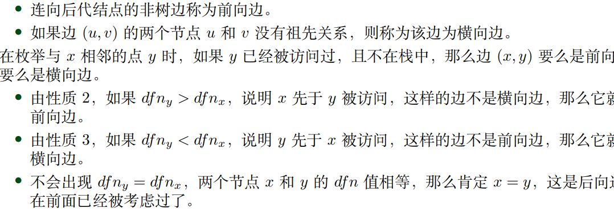

# 图论3

## Part 1

### 强联通相关

* 强联通：在有向图$G=(E,V)$中，两个节点$u,v\in V$,如果$u,v$可以互相到达，那么$u,v$强联通
* 强连通图：任意两个节点都强连通
* 强联通分量：图$G$的**极大强联通子图**$S$，即SCC(Strongly Connected Component)
* 强联通分量的根节点：当中时间戳最小的点

#### 强联通分量

> 推论1：（SCC判定） 对于图$G$如果$\exist u\in V$,u可以到达所有节点，且所有节点都可以到达$u$,则$G$强联通
> 推论2：对于
> 推论3：（SCC的连续性）


### DFS树

### 边的分类

- 树边(tree edge)，DFS树上的边
- 前向边(forward edge)，DFS树中祖先连向子孙(非树边)
- 返祖边(back edge)，子孙指向祖先，约定**自环**属于后向边
- 横向边(cross edge)，无祖孙关系的点的连边

> Theory 1: 无向图中没有横向边
> 显然
> Theory 2: 有向图中如果$(u,v)$为横向边或后向边，那么$v$先被访问
> 显然
> Theory 3: 有向图中如果$(u,v)$为横向边或前向边，那么$u$先被访问
> 同上



**代码**->按边分类
```cpp
#define MAXN 10005
vector<int> son[MAXN];
int cnt,stk[MAXN],top,dfn[MAXN];
bool instk[MAXN];
void DFS(int u)
{
    instk[u]=1,stk[++top]=u,dfn[u]=++cnt;
    for(auto v:son[u])
    {
        if(!dfn[v]){}   // u->v是树边
        else if(instk[v]){} // v已经被访问过了，（自环也是返祖边）u->v是返祖边
        else if(dfn[v]>dfn[u]){} // v被访问过了，且不在栈中，u->v为前向边
        else{}  // u->v为横向边
    }
    instk[u]=0,--top;
}
```

### 求强联通分量的Tarjan算法

维护两个变量：$dfn$时间戳，即每个点被访问的时间接节点，$low$回溯值

$low_u$定义为以下两类节点的时间戳最小值：
- u子树上的点
- u子树上通过一条DFS树的非树边可以到达的点

推论：
- $low_x<dfn_x$，等价于$SCC_x$根节点的时间戳小于x的时间戳
- $low_x=dfn_x$，等价于$SCC_x$根节点为$x$

**代码**
```cpp
vector<int> son[MAXN];
int stk[MAXN],top,cnt,scnt,low[MAXN],dfn[MAXN];
bool instk[MAXN];
vector<int> scc[MAXN];   // 当然是不会有交集的啦
void _Tarjan(int u)
{
    instk[u]=1,stk[++top]=u,dfn[u]=low[u]=++cnt;
    for(auto v:son[u])
    {
        if(!dfn[v]) _Tarjan(v),low[u]=min(low[u],low[v]);
        else if(instk[v])   low[u]=min(low[u],dfn[v]);
    }
    if(low[u]==dfn[u])
    {
        ++scnt;
        while(stk[top]!=u){scc[scnt].push_back(stk[top]);instk[stk[top--]]=0;}
        scc[scnt].push_back(u),instk[u]=0,--top;
    }
}
void Tarjan(int n)
{
    for(int i=1;i<=n;++i)
        if(!dfn[i]) _Tarjan(i);
}
```

### 应用

- 缩点，把原图中的强联通分量都缩为一个点，则原图会变为一个DAG，可以进行DP、拓扑排序等操作

一般性模板
```cpp
vector<int> g[MAXN];
int stk[MAXN],top,cnt,low[MAXN],dfn[MAXN];
bool instk[MAXN];
int id[MAXN],id_cnt,siz[MAXN];// id记录颜色id，siz记录该颜色的点数
void _Tarjan(int u)
{
    instk[u]=1,stk[++top]=u,dfn[u]=low[u]=++cnt;
    for(auto v:g[u])
    {
        if(!dfn[v]) _Tarjan(v),low[u]=min(low[u],low[v]);
        else if(instk[v])   low[u]=min(low[u],dfn[v]);
    }
    if(low[u]==dfn[u])
    {
        ++id_cnt;
        while(stk[top]!=u){id[stk[top]]=id_cnt;instk[stk[top--]]=0;siz[id_cnt]++;}
        id[u]=id_cnt,instk[u]=0,siz[id_cnt]++,--top;
    }
}
void Tarjan(int n)
{
    for(int i=1;i<=n;++i)
        if(!dfn[i]) _Tarjan(i);
}
```

一般性操作：
- 给缩点连边（一般用set存，因为太多重边了）
- 计算缩点的点权（所有点权之和）

例题：
[P2341 明星奶牛](../../23%20summer/%E5%9B%BE%E8%AE%BA/%E5%BC%BA%E8%81%94%E9%80%9A%20%26%20%E5%8F%8C%E8%81%94%E9%80%9A%20%26%20%E5%89%B2%E7%82%B9%E5%89%B2%E8%BE%B9/P2341.cpp)
[P3387 缩点模版](../../23%20summer/%E5%9B%BE%E8%AE%BA/%E5%BC%BA%E8%81%94%E9%80%9A%20%26%20%E5%8F%8C%E8%81%94%E9%80%9A%20%26%20%E5%89%B2%E7%82%B9%E5%89%B2%E8%BE%B9/P3387.cpp)

## Part 2

**都定义在无向图中**

### 割点 & 割边

- 割点：去掉这个点，原图的连通分支数增加
- 割边：去掉这条边，原图的联通分支数增加，也即**桥**

**割点的判定**
- 如果点$u$为根节点，且有不止一个儿子，那么为割点
- 如果点$u$不为根节点，且$low_v\geq dfn_u$,那么这是一个割点

**割边的判定**
- 对于一条边，在搜索树上的顺序是从$u$到$v$，如果$low[v]>dfn[u]$,那么这条边是桥

#### 求无向图中所有割点模板代码
$时间复杂度O(n+m)$
```cpp
vector<int> G[MAXN];
int n,m,ans,cnt,dfn[MAXN],low[MAXN];
bool tag[MAXN];
void _Tarjan(int u,int rt)
{
    int son=0;
    low[u]=dfn[u]=++cnt;
    for(auto v:G[u])
    {
        if(!dfn[v])
        {
            _Tarjan(v,rt);
            low[u]=min(low[u],low[v]);
            ++son;
            if(low[v]>=dfn[u]&&u!=rt)tag[u]=1;   // 可能会被多次赋值，计数时请注意
        }
        else    low[u]=min(low[u],dfn[v]);
    }
    if(u==rt&&son>1)tag[u]=1;   // 可能会被多次赋值，计数时请注意
}
void Tarjan(int n)
{
    for(int i=1;i<=n;++i)if(!dfn[i])_Tarjan(i,i);
}
```

#### 求无向图中的所有割边模板代码


### 点双联通 & 边双联通

边双联通可以传递，点双联通不可传递

- 点双联通子图：联通子图$S$,去掉任意一个点，仍然联通
- 边双联通子图：联通子图$S$,去掉任意一条边，仍然联通
- 点双联通分量：图$G$极大点双联通子图$S$
- 边双联通分量：图$G$极大边双联通子图$S$

- 两点之间的点双联通：对于联通两点$u,v$，去掉任意一个节点(除了$u,v$),这两点仍然联通
- 两点之间的边双联通：对于联通两点$u,v$，去掉任意一条边,这两点仍然联通

#### 点双联通分量模板代码

**注意**:一个割点一定属于多个点双联通变量
点双联通分量的求解：当我们发现节点$u$为割点时，将所有在$u$子树内，并且在栈中的点弹出栈，注意$u$不出栈

```cpp
int vcc_cnt,cnt,top,dfn[MAXN],low[MAXN],stk[MAXN],e[MAXM<<1],deg[MAXN];
vector<int> G[MAXN],vcc[MAXN];
void _getvcc(int u,int fa)
{
    int son=0;
    low[u]=dfn[u]=++cnt;stk[++top]=u;
    for(auto v:G[u])
    {
        if(!dfn[v])   // 树边
        {
            ++son;
            _getvcc(v,u);
            low[u]=min(low[u],low[v]);
            if(low[v]>=dfn[u])
            {
                ++vcc_cnt;
                while(stk[top+1]!=v)vcc[vcc_cnt].push_back(stk[top--]);  //把子树出栈
                vcc[vcc_cnt].push_back(u);  // 把树根/割点丢进去
            }
        }
        else if(v!=fa)  low[u]=min(low[u],dfn[v]);
    }
    if(fa==0&&son==0)vcc[++vcc_cnt].push_back(u);   //特判孤立点
}
void getvcc(int n)
{
    for(int i=1;i<=n;++i)if(!dfn[i])top=0,_getvcc(i,0);  // 0作为根节点的父亲
}
```


#### 边双联通分量模板代码


