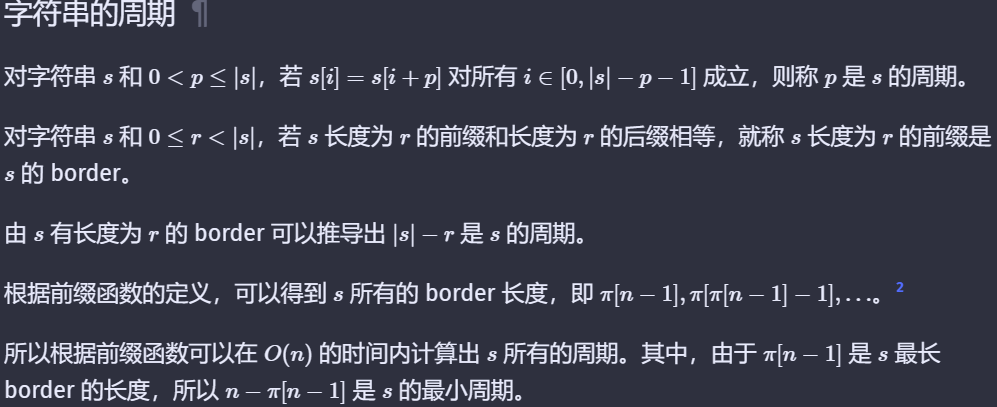
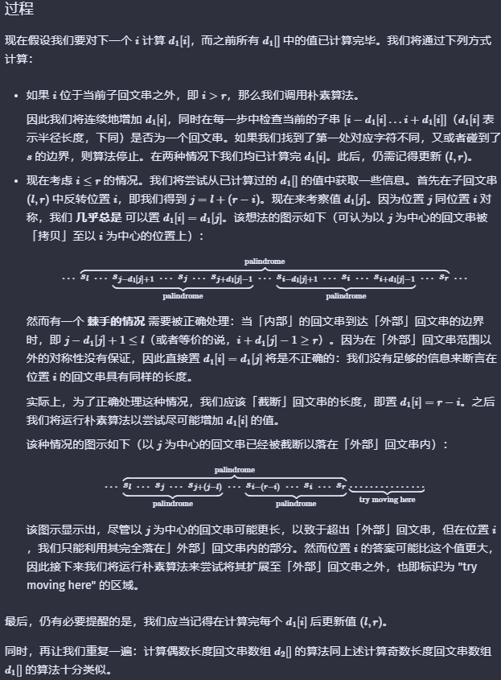

## 字符串算法

### 相关概念


### 字符串hash

#### 普通型

**一般使用进制hash**
挑选一个大质数 $M=1e9+7$  
一个较好的进制数 $B=233317$ (最好也是素数)

对于一个字符串s，计算其$hash$值
$h(s)=\sum_{i=0}^{n-1}s[i]\cdot B^{n-1-i}\qquad 其中，字符串下标从0开始计算，n为字符串长度$  

其中，B的幂次可以预处理，也可以使用快速幂，可以根据环境抉择

#### 处理一个字符串s的子串的hash值

进制hash可以使用前缀和，可以先预处理$f_k(s)=\sum_{i=0}^{k}s[i]*B^{n-1-i}, \quad k=0,1,\dots,n-1 \quad 时间复杂度为O(n)$
(tips:首先要预处理Bpow数组)

然后有$f(s[R,L])=f_R(s)-f_L(s)\cdot B^{R-L}$

#### hash准确率优化

##### 多重hash

**优点：**
**还是并不完全准确，但是正确率大大提高**
**增加了时间空间，但是时间复杂度不会变**

如果$n=1e6$级别,以上的普通hash不发生hash碰撞的概率是极低的，所以为了减少错误率，可以使用对多个大质数分别取模（一般两个就够了）
可以选择$M_1=1e9+7,M_2=1e9+9$

##### 无错hash

每次得到hash值都和已有的hash比较一下，看看是否冲突，如果冲突，就不断地加一个大质数，直到不再次冲突。

### KMP 

> [OIwiki资料](https://oi-wiki.org/string/kmp/)
> [正统KMP](https://zhuanlan.zhihu.com/p/105629613)，维护的$kmp$数组即我们的前缀数组$\pi$
> [有限状态机KMP](https://zhuanlan.zhihu.com/p/83334559)，后面的**AC自动机2**的单模式匹配版,由于只有一个模式串，所以不需要跳$fail$了

#### 前缀函数的定义

$\pi[i]$记录$s[0,i]$中使得$s[0,j]=s[(i-j+1),i]$成立的最大的$j$

#### 前缀函数的计算   

算法改进历程： 
$O(n^3)->O(n^2)->O(n)$   
$"j=i"->"j=pi[i-1]+1"->"保持前缀性质下迭代"$

**第二版**
```cpp
vector<int> prefix_function(string s) {
  int n = (int)s.length();
  vector<int> pi(n);
  for (int i = 1; i < n; i++)
    for (int j = pi[i - 1] + 1; j >= 0; j--)  // improved: j=i => j=pi[i-1]+1
      if (s.substr(0, j) == s.substr(i - j + 1, j)) {
        pi[i] = j;
        break;
      }
  return pi;
}
```

**Final**
```cpp
vector<int> prefix_function(string s) {
  int n = (int)s.length();
  vector<int> pi(n);
  for (int i = 1; i < n; i++) {
    int j = pi[i - 1];
    while (j > 0 && s[i] != s[j]) j = pi[j - 1];
    if (s[i] == s[j]) j++;
    pi[i] = j;
  }
  return pi;
}
```

#### kmp算法

##### 代码
先上代码
```cpp
typedef vector<int> vei;
vei prefix_func(string s)
{
    int n=(int)s.length();
    vei pi(n);        // 记录pi值,初始化n个0
    for(int i=1;i<n;++i)
    {
        int j=pi[i-1];
        while(j>0&&s[i]!=s[j])j=pi[j-1];
        if(s[i]==s[j])++j;
        pi[i]=j;
    }
    return pi;
}
vei kmp_find(string t,string s)
{
    int l1=(int)t.length();
    int l2=(int)s.length();
    string cur=s+'#'+t;    // 假设#是s和t中都不会出现的字符 
    vei pi=prefix_func(cur);
    vei v;      // 用于记录索引,无需初始化
    for(int i=l2+1;i<=l1+l2;++i)
        if(pi[i]==l2)v.push_back(i-2*l2);
    return v;
}
```

##### 算法流程

$在文本T中匹配字符串S，令cur=s+\#+t ,其中\#是绝对不会在s和t中出现的字符，使用一次前缀函数，找到所有使得\pi[i]=len(t)的i，可以得到匹配到的字符串在T中的位置$

#### 字符串的周期


**例题：P4391**

```cpp
// kmp + 字符串的周期 //
#include<bits/stdc++.h>
using namespace std;
const int maxn=1e7+5;
int pi[maxn],n;
char s[maxn];
int main(void)
{
    scanf("%d",&n);
    getchar();
    scanf("%s",s);
    for(int i=1;i<n;++i)
    {
        int j=pi[i-1];
        while(j>0&&s[i]!=s[j]) j=pi[j-1];
        if(s[i]==s[j])j++;
        pi[i]=j;
    }
    cout<<n-pi[n-1]<<endl;
    return 0;
}
```

#### 字符串压缩


### Manacher算法

处理回文字符串的压倒性算法，更小的常数和优秀的时间复杂度

#### 朴素算法

简单易懂，$d_1(i)$表示以$i$为中心的奇回文串的个数，同时也是最大半径;$d_2(i)$表示以$i-1,i$为中心的偶回文串的最大半径
时间复杂度$O(n^2)$

```cpp
scanf("%s",s);
    n=strlen(s);
    for(int i=0;i<n;++i)
    {
        d1[i]=1;
        while(i-d1[i]>=0&&i+d1[i]<=n-1&&s[i-d1[i]]==s[i+d1[i]])d1[i]++;
        d2[i]=0;
        while(i-d2[i]-1>=0&&i+d2[i]<=n-1&&s[i-d2[i]-1]==s[i+d2[i]])d2[i]++;
    }
```


#### Manacher

##### 算法流程

时间复杂度$O(n)$



##### 参考代码

```cpp
int n,d1[maxn],d2[maxn];
char s[maxn];
// 字符串s,长度n,两个数组d1[],d2[]
void manacher(char s[],int n,int d1[],int d2[])
{
    for(int i=0,l=0,r=-1;i<n;++i)
    {
        int k=(i>r)?1:min(r-i+1,d1[r+l-i]);
        while(i-k>=0&&i+k<n&&s[i-k]==s[i+k])    ++k;
        d1[i]=k;
        if(i+k-1>r){r=i+k-1;l=i-k+1;}
    }
    for(int i=0,l=0,r=-1;i<n;++i)
    {
        int k=(i>r)?0:min(r-i+1,d2[r+l-i]);
        while(i-1-k>=0&&i+k<n&&s[i+k]==s[i-1-k])    ++k;
        d2[i]=k;
        if(i+k-1>r){r=i+k-1;l=i-k;}
    }
    return;
}
```