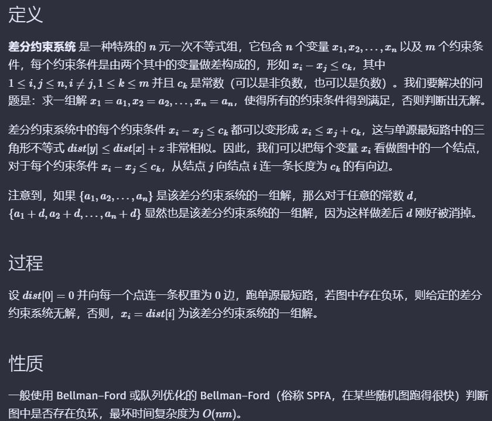

# 搜索

## DFS

遍历每一个节点：引入vis数组，不走回头路，但是回溯时记得复原（一些情况不要）

## BFS

入队时标记vis数组，不要出队时标记，可能导致重复入队

## 折半搜索

# 拓扑排序

## 相关概念

**DAG** :

- 有向无环图
- 可以重边，无自环
- 可以不联通

**一个图可以拓扑排序  $<=>$  DAG**

如果最后输出的拓扑序长度 **小于** 顶点数，则原图一定有环（程序同时可以判定一个有向图是否是DAG）

入度 & 出度

拓扑排序的特点：

- 入度为0的点，此点一定可以排在最前面
- 入度为0的点之间一定不可能有连边，这些点可以随便排序

## 算法实现

### BFS实现

**实现步骤：**

1. 将没有入边的点加入队列。
2. 将队头u出队，删除u的所有出边，若有点在删除之后入度为0，将其加
   入队列
3. 重复2，直至队空
4. 出队序列即为拓扑序。（一般喜欢如此，而不是入队序列）

代码模板：

```cpp
int in[101];  // 描述入度
int n;
int a[101];  // 用来存拓扑序
vector<int> g[101];
bool bfs()
{
    int tot = 0;
    queue<int> q;
    for(int u=1;u<=n;u++)
        if(!in[u])  q.push(u);   // 入度为0的点入队
    while(!q.empty())
    {
        int u = q.front();
        q.pop();
        a[++tot] = u;  // 一般以出队序为拓扑序
        for(auto v:g[u])
        {
            in[v]--;
            if(!in[v])  q.push(v);
        }
    }
    // 如果一定为DAG，则下面的代码不需要
    // 用于判定是否是 DAG
    if(tot==n)
        return true;   // 是DAG
    else    return false;   // 不是DAG
}
```

### DFS实现

出栈的逆序即拓扑排序

## 输出字典序最小的拓扑排序

把BFS实现中的队列改为优先队列即可。

QAQ

## 按照字典序从小到大输出所有拓扑排序

好难。

QAQ


# 最短路问题

## 性质 & 概念

1. 对于边权为正的图，任意两个节点之间的最短路，不会经过重复的节点
2. 对于边权为正的图，任意两个节点之间的最短路，不会经过重复的边
3. 对于边权为正的图，任意两个节点之间的最短路，任意一条的节点数不会超过n，边数不会超过n-1  (设n为顶点数)

### 一些记号

- n为图的顶点数，m为图的边数
- s为最短路的源点
- $ D(n)$是s点到u点的 **实际** 最短路长度
- $dis(u)$ 是 s 点到 u 点的 **估计** 最短路。任何时候均有  $ dis(u)\geq D(n)$ 特别地，当最短路算法结束时 二者相等
- $ w(u,v)$  为边 (u,v) 的边权

## 多源最短路

### 相关概念

多源最短路问题特指 **Floyd** 算法。

多源最短路：

- 图G中有n个点，m条边，每条边有边权。
- 求任意两点间的最短路径

### Floyd

#### 适用范围

任何图，无论有向或无向，边权正负，但是最短路必须存在（即不能有负环）

#### 实现

$空间复杂度O(n^3),时间复杂度O(n^3)$

dp算法 ->  状态： $dp[i][u][v] 表示只经过前i个点(或直达)，从u到v的最短路径$

状态转移：

$$
dp[i][u][v] = min\{dp[i-1][u][v],dp[i-1][u][i]+dp[i-1][i][v]\}
$$

**优化**：使用滚动数组，将第一维度滚动，空间复杂度$ O(n^2)$    可以证明第一维度对最后结果和递推式没有影响

**细节**：

- **初始化**

  $$
  dp[u][v]=\begin{cases}
  0 & if\quad u=v \\
  w(u,v) & if\quad u,v相邻 \\
  MAX/2 & if\quad u,v不相邻 \\
  \end{cases}
  $$

  其中，一般用，memset(dp,0x3f,sizeof(dp)) 来实现 Max/2

  用邻接矩阵储存边权时，边权也符合此初始化！！！

  处理不同类型的图只要不同的初始化即可！！！
- 重边怎么办？

  无向重边，取较小的权值边即可

  有向重边，同一方向取较小的权值边即可
- 怎么存储边的权值？

  建议使用邻接表

**代码模板**：

```cpp
void floyd()
{
    for(int k=1;k<=n;k++)
        for(int x=1;x<=n;x++)
	        for(int y=1;y<=n;y++)
		        dp[x][y] = min(dp[x][y],dp[x][k]+dp[k][y]);
}
```

一道模板题：

```cpp
// floyd 无向图,模板 //
#include<bits/stdc++.h>
using namespace std;
vector<int> g[101];
int dp[101][101];
int n,m;
void floyd()
{
    for(int k=1;k<=n;k++)
        for(int x=1;x<=n;x++)
            for(int y=1;y<=n;y++)
                dp[x][y] = min(dp[x][y],dp[x][k]+dp[k][y]);
}
int main(void)
{
    cin>>n>>m;
    int u,v,w;
    memset(dp,0x3f,sizeof(dp));   // 为了两个相加不会越界
    for(int i=1;i<=n;i++)
        dp[i][i] = 0;
    for(int i=1;i<=m;i++)
    {
        scanf("%d %d %d",&u,&v,&w);
        g[u].push_back(v);
        g[v].push_back(u);
        dp[u][v] = w;    // 边权初始化
        dp[v][u] = w;    // 一定注意：无向图的边权一定要两个都赋值，不要忘记赋值
    }
    floyd();
    for(int i=1;i<=n;i++)
    {
        for(int j=1;j<=n;j++)
            printf("%d%c",dp[i][j],(j==n)?'\n':' ');
    }
    return 0;
}
```

#### 应用

- 多源最短路
  说明：使用邻接矩阵，初始化后，三层for循环
- 给一个正权无向图，找一个最小权值的环(无向最小环,且至少三元环)
  说明：floyd算法中，考虑环中编号最大的点u，则f[u-1][x][y] 与 (u,x)  (u,y) 构成环
  P6175
  ```cpp
  // 无向图最小环（至少三元环） floyd //
  #include<bits/stdc++.h>
  using namespace std;
  const int INF = 0x3f3f3f3f;
  const int maxn = 105;
  int m,n,f[maxn][maxn],ans;
  int ww[maxn][maxn];
  void floyd()
  {
      for(int u=1;u<=n;u++)
          for(int x=1;x<=n;x++)
              for(int y=1;y<=n;y++)
              {
                  if(ww[u][x]!=INF&&ww[u][y]!=INF&&x!=y&&f[x][y]!=INF)
                      ans = min(ans,f[x][y]+ww[u][x]+ww[y][u]);
                  if(f[u][y]==INF||f[x][u]==INF)  continue;
                  if(f[x][y]>f[x][u]+f[u][y])
                      f[x][y]=f[x][u]+f[u][y];
              }
  }
  int main(void)
  {
      cin>>n>>m;
      int u,v,w;
      memset(f,0x3f,sizeof(f));
      memset(ww,0x3f,sizeof(ww));
      for(int i=1;i<=m;i++)
      {
          scanf("%d %d %d",&u,&v,&w);
          f[v][u] = f[u][v] = min(f[u][v],w);   
          ww[u][v]=ww[v][u]=min(ww[u][v],w);    // 小心重边！！
      }
      for(int i=1;i<=n;i++)
          f[i][i] = 0;
      ans = INF;
      floyd();
      if(ans==INF)    printf("No solution.\n");
      else printf("%d\n",ans);
      return 0;
  }
  ```
- 已知一个有向图中任意两点之间是否连边，要求判断任意两点是否联通
  说明：即 图的传递闭包
  B3611
  ```cpp
  // floyd 图的传递闭包 模板题 //
  #include<bits/stdc++.h>
  using namespace std;
  const int maxn=105;
  int f[maxn][maxn];
  int n;
  void floyd()
  {
      for(int k=1;k<=n;k++)
          for(int i=1;i<=n;i++)
              for(int j=1;j<=n;j++)
                  f[i][j]=f[i][j]|f[i][k]&f[k][j];
  }
  int main(void)
  {
      cin>>n;
      for(int i=1;i<=n;i++)
          for(int j=1;j<=n;j++)
              scanf("%d",&f[i][j]);
      floyd();
      for(int i=1;i<=n;i++)
          {for(int j=1;j<=n;j++)
              printf("%-2d",f[i][j]);
          printf("\n");
          }
      return 0;
  }
  ```
- 判断一个是否存在负圈（无论有向或无向图）
  说明：dp[i][i]初始化为0，每次更新dp[i][i]时，判断是否有 $dp[i][i] < 0$ ,如果直到算法结束都没有出现过负值，那么无负环，否则有负环

## 单源最短路

### 相关概念

定义：从某个固定起点(源点s) 开始，到其他所有点的最短路径

 $dis[v]$ 表示 s 到 v 的最短路径长度

### Dijkstra算法

#### 相关知识

**优点**：*效率稳定，基本解决正权图的所有问题*

**缺点**：*不适用于负权图*

**核心思想**：贪心，下面提到的S、T集合用一个 flag数组 即可实现

将所有点分为两个集合S、T。S中的点最短路已经确定，T中的点最短路未确定。（初始状态为S为空，T包含所有点。第一次操作将源点放入S）
每次在T中寻找与集合S相邻（与集合S中的某个点有边相连）的点中dis值最小的点，将它放入S集合中并用这个点来松弛与它相邻的点，直到最后T集合为空。

复杂度的关键在于找dis值最小的点。

**朴素的Dijkstra**直接暴力枚举所有的点，然后松弛，时间复杂度为O(n^2)，这一般适用于**稠密图。**

**堆优化的Dijkstra**用一个堆维护dis值，一般适用于**稀疏图。**
最简单的写法是用优先队列维护。
大概流程为：每成功松弛一个点u，就把二元组(dis[u],u)放入优先队列中。每次取堆顶，若u不在S中，则将u加入S并进行松弛操作

#### 朴素实现

$ 时间复杂度O(n^2)$

$空间复杂度O(n^2) $

**版本1**，邻接矩阵存图，并进行有效初始化（存边权）（点数多容易炸）

```cpp
void dij(int s)   // s为源点
{
    bool flag[1001];   // 用于实现集合 S T 的划分，初始化为 false，即全在集合T中
    memset(dis,0x3f,sizeof(dis));
    dis[s] = 0;   // 初始化dis数组
    for(int k=1;k<=n;k++)    // 共有n轮，每次找到不在S集合中的点中dis最小的点(不与集合S相邻，那么就是未初始化，不可能dis最小），将其放入S中并松弛其他点
    {
        int t=0;
        for(int i=1;i<=n;i++)
            if(!flag[i]&&(t==0 || dis[i]<dis[t]))  t=i;    // 如果（不在S中 && （t还么赋值 || i的dis值必t更小） 那么 t = i
        flag[t] = true;   // 标记t在S集合中
        for(int i=1;i<=n;i++)   // 松弛操作，其实真正有效的只有与t相邻的点
            dis[i] = min(dis[i],dis[t]+w[t][i]);   // 此处要求w有进行初始化
    }
}
```

**版本2**，邻接表存图

```cpp
struct edge {
  int to, w;
};
const int maxn = 10005;
vector<edge> e[maxn];
int dis[maxn], vis[maxn];

void dijkstra(int n, int s) {
  memset(dis, 63, sizeof(dis));
  dis[s] = 0;
  for (int i = 1; i <= n; i++) {
    int u = 0, mind = 0x3f3f3f3f;
    for (int j = 1; j <= n; j++)
      if (!vis[j] && dis[j] < mind) u = j, mind = dis[j];
    if(!u)    return;
    vis[u] = true;
    for (auto ed : e[u]) {
      int v = ed.to, w = ed.w;
      dis[v] = min(dis[v],dis[u]+w);
    }
  }
}
```

#### 堆实现

$ 时间复杂度O(n \log n)$

$ 空间复杂度O()$

邻接表存储，优先队列实现优化

```cpp
struct node{
    ll dis;    // 存点u以及他的最短路长度
    int u;
    bool operator>(const node& a) const { return dis > a.dis; };  // 重载运算符
};
priority_queue<node,vector<node>,greater<node>> q;
bool flag[1000005];    // 初始化为false，起初全在T集合中
void dijkstra(int s)
{
    memset(dis,0x3f,sizeof(dis));
    dis[s] = 0;     // 初始化
    q.push({0,s});  
    while(!q.empty())
    {
        int u = q.top().u;
        q.pop();
        if(flag[u]) continue;   // 点u已在集合S中了
        flag[u] = true;   // 先放到集合S中
        // 再对相邻点进行松弛
        for(auto ed:e[u])
        {
            int v=ed.to,w=ed.w;
            if(dis[v]>dis[u]+w)
            {
                dis[v] = dis[u] + w;
                q.push({dis[v],v});   // 没变小千万不要放
            }
        }
    }
}

```

#### 为何Dijkstra不能处理负权图？

---

### Bellman-Ford算法

#### 朴素版本 & 同时判断负环

在最短路存在的情况下，由于一次松弛操作会使最短路的边数至少 +1，而最短路的边数最多为 n-1，因此整个算法最多执行 n-1 轮松弛操作

***注意***：无向图中一条负权边就可以组成复环！！！

```cpp
truct edge {
  int v, w;
};

vector<edge> e[maxn];
int dis[maxn];
const int inf = 0x3f3f3f3f;

bool bellmanford(int n, int s) {
  memset(dis, 63, sizeof(dis));
  dis[s] = 0;
  bool flag;  // 判断一轮循环过程中是否发生松弛操作
  for (int i = 1; i <= n; i++) {
    flag = false;
    for (int u = 1; u <= n; u++) {
      if (dis[u] == inf) continue;
      // 无穷大与常数加减仍然为无穷大
      // 因此最短路长度为 inf 的点引出的边不可能发生松弛操作
      for (auto ed : e[u]) {
        int v = ed.v, w = ed.w;
        if (dis[v] > dis[u] + w) {
          dis[v] = dis[u] + w;
          flag = true;
        }
      }
    }
    // 没有可以松弛的边时就停止算法
    if (!flag) break;
  }
  // 第 n 轮循环仍然可以松弛时说明 s 点可以抵达一个负环
  return flag;
}
```

以上程序可以计算单源最短路

以上程序只能判断源点s能否到达一个负环

如果要判断 一个图中是否有负环，要建立一个超级源点s，向其余每一个点都连接一条权为0的边

#### SPFA算法(队列优化版)

**也是同时判断了源点出发能否到达负环**

***优化理由：***

很多时候我们并不需要那么多无用的松弛操作。

很显然，只有上一次被松弛的结点，所连接的边，才有可能引起下一次的松弛操作。

那么我们用队列来维护「哪些结点可能会引起松弛操作」，就能只访问必要的边了。

```cpp
struct edge {
  int v, w;
};

vector<edge> e[maxn];
int dis[maxn], cnt[maxn], vis[maxn];
queue<int> q;

bool spfa(int n, int s) {
  memset(dis, 63, sizeof(dis));
  dis[s] = 0, vis[s] = 1;
  q.push(s);
  while (!q.empty()) {
    int u = q.front();
    q.pop(), vis[u] = 0;
    for (auto ed : e[u]) {
      int v = ed.v, w = ed.w;
      if (dis[v] > dis[u] + w) {
        dis[v] = dis[u] + w;
        cnt[v] = cnt[u] + 1;  // 记录最短路经过的边数
        if (cnt[v] >= 2*n) return true;    // 为什么用2*n?  在有0环的情况下，可能会出现长度大于n的最短路，适当改大一点可以通过大部分数据
        // 在不经过负环的情况下，最短路至多经过 n - 1 条边
        // 因此如果经过了多于 n 条边，一定说明经过了负环
        if (!vis[v]) q.push(v), vis[v] = 1;
      }
    }
  }
  return false;
}

```

在判定负环的时候，这种写法忽略了0环，可以改成在记录顶点u的入队次数，如果大于等于n（即松弛了至少n次），那么必然有负环！！！

## 计数 & 打印路径

### 最短路计数  & 路径打印

方法一：

在dijkstra 或 bellmanford 或 spfa 中同时计数即可 , 在松弛过程中使用如下代码即可（负权图不能用dijkstra）

```cpp
if(dis[v]>dis[u]+w)
{
   dis[v] = dis[u]+w;
   q.push(make_pair(-dis[v],v));
   cnt[v] = cnt[u];
   pre[v] = u;
}
else if(dis[v]==dis[u]+w)
   cnt[v] += cnt[u];

// 路径打印函数 可实现正序打印
void print_path(ll x)
{
    if(!x)
    {
        printf("0");
        return;
    }
    print_path(pre[x]);
    printf("->%lld",x);
    return;
}
```

方法二：（先求出最短路，再记忆化搜索）

### 记录所有最短路

还是以dijkstra举例

```cpp
// defination: vector<int> pre[maxn]; //
if(dis[v]>dis[u]+w)
{
   dis[v] = dis[u]+w;
   q.push(make_pair(-dis[v],v));
   cnt[v] = cnt[u];
   pre[v].clear();
   pre[v].push_back(v);
}
else if(dis[v]==dis[u]+w)
   cnt[v] += cnt[u],pre[v].push_back(v);
```

### 次短路计数（difficult）

## 特殊图的最短路

### 无向图

- 无权图 ->  BFS , 时间复杂度 O(n)
  用队列实现，原理：
  BFS永远可以保证队列中的点，从队首到队尾，其dis值是递增的   （后入队的一定更远）
- 边权 0/1 的图 -> 0/1 BFS，时间复杂度 O(n)
  用双端队列实现，流程：
  如果边权为0 ， 则放到队首，dis不变；如果边权为1， 则放到队尾，dis加1   $ =>$  保证了dis值是递增的
  原理同上。

### 有向图

同有向图

### 最短路数量统计

无权无向图：P1144 最短路数量统计

```cpp
#include<bits/stdc++.h>
using namespace std;
const int maxn=1e6+5;
const int mod=100003;
int cnt[maxn],n,m,dis[maxn],vis[maxn];   // 顺便把最短路长度也算了,本题可以不算
vector<int> g[maxn];
queue<int> q;
set<int> st;   // 用来记录下一次要入队的点
// 不同于往常的bfs，这次按距离分层入队出队
void bfs(int s)
{
    dis[s]=0,cnt[s]=1,vis[s]=1;
    q.push(s);
    while(1)
    {
        while(!q.empty())
        {
            int u = q.front();
            q.pop();
            for(auto v:g[u])
            {
                if(!vis[v])
                {
                    dis[v]=dis[u]+1;
                    cnt[v]=(cnt[v]+cnt[u])%mod;
                    st.insert(v);
                }
            }
        }
        if(st.empty())  break;
        for(auto v:st)
            vis[v]=1,q.push(v);
        st.clear();
    }
}
int main(void)
{
    cin>>n>>m;
    int u,v;
    for(int i=1;i<=m;i++)
    {
        scanf("%d %d",&u,&v);
        g[u].push_back(v);
        g[v].push_back(u);
    }
    bfs(1);
    for(int i=1;i<=n;i++)
        printf("%d\n",cnt[i]);
    return 0;
}
```

## 最短路技巧  & 有约束条件的最短路

### 超级源点

2023 summer rating赛1 C题

求两个不相交点集A,B 之间的最短路

```cpp
// 最短路问题 虚拟顶点S,T S向A中所有点连一条0边 B中所有点向T中连一条0边 以S为源点跑最短路，dis_T即为答案 //
#include<bits/stdc++.h>
using namespace std;
const int INF = 0x3f3f3f3f;
int A[100005],B[100005],n,m,na,nb,dis[100005];
struct edge{
    int to;
    int w;
};
vector<edge> e[100005];
struct node{
    int dis;
    int u;
    bool operator>(const node& a)const {return dis > a.dis;};
};
priority_queue<node,vector<node>,greater<node>>q;
int flag[100005];
void dijkstra(int s)
{
    for(int i=1;i<=n+2;i++)    // 此处的n+2 ,一定要初始化
        dis[i] = INF;
    dis[s] = 0;
    q.push({0,s});
    while(!q.empty())
    {   
        int u=q.top().u;
        q.pop();
        if(flag[u]) continue;
        flag[u] = 1;
        for(auto ed:e[u])
        {
            int v=ed.to,w=ed.w;
            if(dis[v]>w+dis[u])
            {
                dis[v] = dis[u] + w;
                q.push({dis[v],v});
            }
        }
    }
    return;
}
int main(void)
{
    cin>>n>>m;
    int u,v,w;
    for(int i=1;i<=m;i++)
    {
        scanf("%d %d %d",&u,&v,&w);
        e[u].push_back({v,w});
        e[v].push_back({u,w});
    }
    cin>>na>>nb;
    for(int i=1;i<=na;i++)
    {
        scanf("%d",A+i);
    }
    for(int i=1;i<=nb;i++)
    {
        scanf("%d",B+i);
    }
    // 虚拟顶点s向所有A中的顶点连接一条0权边(有向无向均可)
    for(int i=1;i<=na;i++)
    {
        int u = A[i];
        e[n+1].push_back({u,0});
    }
    for(int i=1;i<=nb;i++)
    {
        int u = B[i];
        e[u].push_back({n+2,0});
    }
    dijkstra(n+1);
    // 输出最短路
    int ans = dis[n+2];
    printf("%d\n",ans);
    return 0;
}
```

### 分层图

P4568 飞机航线

```cpp
#include<bits/stdc++.h>
using namespace std;
const int maxn=1e6+5;
const int INF=0x3f3f3f3f;
struct edge{
    int v,w;
};
vector<edge> e[maxn];
int n,m,k,s,t,dis[maxn];
priority_queue<pair<int,int>> q;   // pair的比较方式：先比第一个，相等再比第二个  ->  优先队列默认为  //
int flag[maxn];
void dijkstra(int s)
{
    memset(dis,63,sizeof(dis));
    dis[s]=0;
    q.push(make_pair(0,s));
    while(!q.empty())
    {
        int u = q.top().second;
        q.pop();
        if(flag[u]) continue;
        flag[u] = 1;
        for(auto ed:e[u])
        {
            int v=ed.v,w=ed.w;
            if(dis[v]>dis[u]+w)
            {
                dis[v]=dis[u]+w;
                q.push(make_pair(-dis[v],v));
            }
        }
    }
}
int main(void)
{
    cin>>n>>m>>k;
    cin>>s>>t;
    int u,v,w;
    for(int i=1;i<=m;i++)
    {
        scanf("%d %d %d",&u,&v,&w);
        for(int j=0;j<=k;j++)  // 有k+1层
        {
            e[u+j*n].push_back({v+j*n,w});
            e[v+j*n].push_back({u+j*n,w});    // 重边无所谓
            if(j<=k-1)
            {
                e[u+j*n].push_back({v+(j+1)*n,0});
                e[v+j*n].push_back({u+(j+1)*n,0});   // 指向下一层的有向边
            }
        }
    }
    // 预防那组hack数据 , 大概是s t相邻，边权为1，k为偶数
    for(int i=1;i<=k;i++)
        e[t+(i-1)*n].push_back({t+i*n,0});
    dijkstra(s);
    printf("%d\n",dis[t+n*k]);
    return 0;
}
```

### 最多经过k条路径的最短路

设起点为 s，终点为 t，这个问题可以简单用 DP 解决：记 f(u, k) 表示从结点 u 出发，经过不超过 k 条边到达终点 t 的最短路径长度。转移时枚举 u 的出边 (u, v)，得到 f(u, k) = min{ f(v, k - 1) + w(u, v) }。边界是 f(t, k) = 0，f(u, 0) = +∞（u ≠ t），答案为 f(s, k)

时间复杂度 $O(|E|\cdot k)$

### 有点权的约束

1. 固定起点s，终点t，求所有s到t的满足点权和不超过c的路径的最小路

## 差分约束

> [差分约束](https://www.luogu.com.cn/blog/cyh-toby/xue-xi-bi-ji-ci-fen-yue-shu)
> 讲解了有极值限制下的差分约束，当然这也可以建立虚拟节点来解决
> **极值最大跑最短路；极值最小跑最长路**



简言之， $ x_i-x_j\leq c_k$   ,那么连一条有向边$j \rightarrow i$ ,边权为 $c_k$ ,然后跑最短路，有负环则无解，否则，所有距离值就是一组解。

### 模板题

P5960 差分约束算法
**tips**:由于原图不一定联通，所以**把n+1当做超级源点**，进行spfa判负环
```cpp
#include<bits/stdc++.h>
using namespace std;
const int maxn=5005;
const int INF=0x3f3f3f3f;
struct edge{
    int v;
    int w;
};
vector<edge> e[maxn];
queue<int> q;
int n,m,dis[maxn],flag[maxn],cnt[maxn];
int read()
{
    int f=1,x=0;char ch=getchar();
    while(ch>'9'||ch<'0'){if(ch=='-')f=-1;ch=getchar();}
    while(ch<='9'&&ch>='0'){x=x*10+ch-'0';ch=getchar();}
    return f*x;
}
bool spfa(int s)
{
    memset(dis,63,sizeof(dis));
    q.push(s);
    flag[s]=1,dis[s]=0;
    while(!q.empty())
    {
        int u=q.front();
        q.pop();
        flag[u]=0;
        for(auto ed:e[u])
        {
            int v=ed.v,w=ed.w;
            if(dis[v]>dis[u]+w)
            {
                dis[v]=dis[u]+w;
                if(!flag[v])    q.push(v),flag[v]=1;
                cnt[v]=cnt[u]+1;
                if(cnt[v]>=2*n)   return true;  // 长度为n也有可能是有0环，不一定就是有负环，可以把n适当改大一点
            }
        }
    }
    return false;
}
int main(void)
{
    n=read(),m=read();
    int u,w,v;
    for(int i=1;i<=m;i++)
    {
        u=read(),v=read(),w=read();
        e[v].push_back({u,w});  // 重边无所谓
    }
    for(int i=1;i<=n;i++)
        e[n+1].push_back({i,0});    // 以n+1为超级原点，向每一个点加一条0权边
    if(spfa(n+1))   // 有负圈，则无解
    {
        printf("NO\n");
        return 0;
    }
    for(int i=1;i<=n;i++)
        printf("%d%c",dis[i],(i==n)?'\n':' ');
    return 0;
}
```

**tips**:
- 仍然要建立超级源点，本题以$n+2$为超级源点
- 差分约束维护已知量的方法：$a_i=x \ \Leftrightarrow \ a_i-a_{im}\leq x ,a_{im}-a_i\leq -x$ 把$n+1$当做虚拟点，用于维护已知点 
[P4926 倍杀测量者 差分约束+二分答案](../../23%20summer/%E5%9B%BE%E8%AE%BA/%E6%9C%80%E7%9F%AD%E8%B7%AF/%E5%B7%AE%E5%88%86%E7%BA%A6%E6%9D%9F/P4926%E5%80%8D%E6%9D%80%E6%B5%8B%E9%87%8F%E8%80%85.cpp)

**tips**:
- 差分约束中的$a_i=a_j \ \Leftrightarrow \ a_i-a_j\leq 0,a_j-a_i\leq 0$,直接连两条有向边即可
[P1993 小K的农场](../../23%20summer/%E5%9B%BE%E8%AE%BA/%E6%9C%80%E7%9F%AD%E8%B7%AF/%E5%B7%AE%E5%88%86%E7%BA%A6%E6%9D%9F/P1993%20%E5%B0%8FK%E7%9A%84%E5%86%9C%E5%9C%BA.cpp)

Tarjan缩点优化差分约束
[P3275糖果](../../23%20summer/%E5%9B%BE%E8%AE%BA/%E6%9C%80%E7%9F%AD%E8%B7%AF/%E5%B7%AE%E5%88%86%E7%BA%A6%E6%9D%9F/P3275%E7%B3%96%E6%9E%9C(Tarjan%E4%BC%98%E5%8C%96%E5%B7%AE%E5%88%86%E7%BA%A6%E6%9D%9FAC%E7%89%88).cpp)

## 同余最短路
