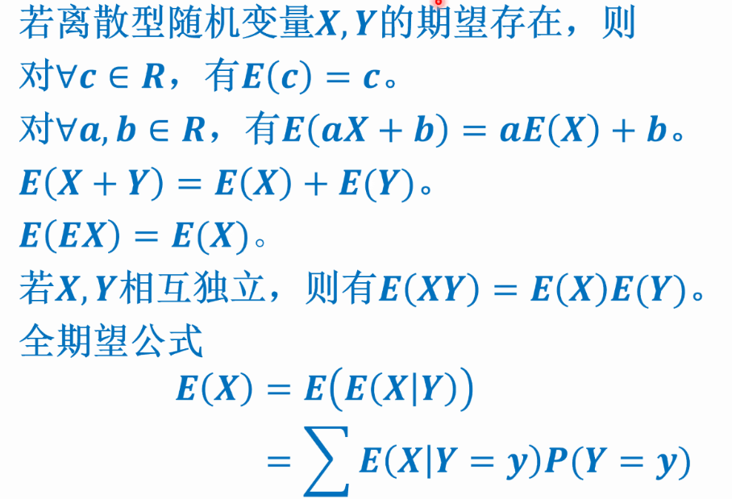
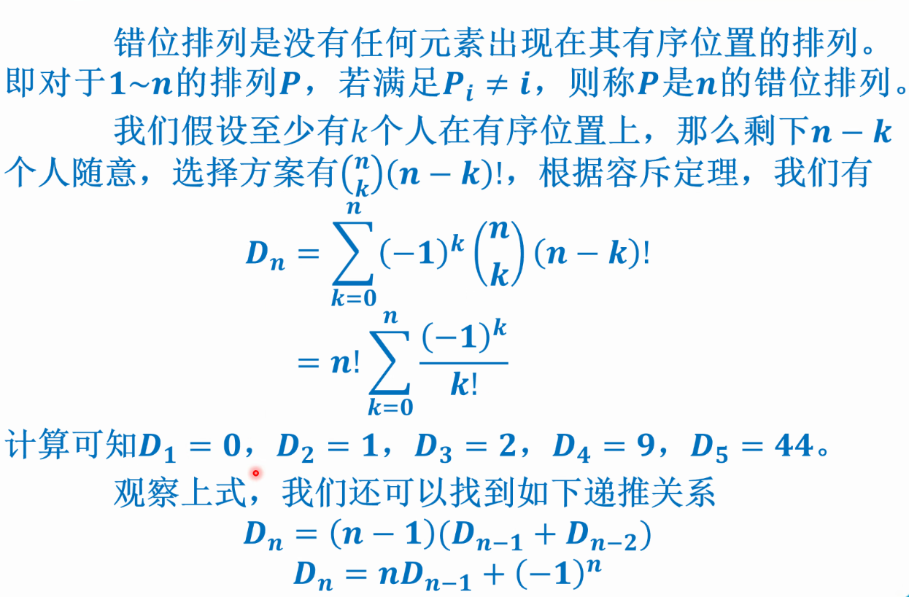

# 组合数学

## 概率与期望

### 二项式反演：

记$f_n$为恰好选择n个不同元素形成特定结构的方案数，$g_n$表示从n个不同元素中选出$i\geq 0$个不同元素形成特定结构的方案数

$$
有 g_n = \sum_{i=0}^nC^i_nf_i \\
从而 f_n = \sum_{i=0}^nC^i_n(-1)^{n-i}g_i \\
$$

### 范德蒙德恒等式：

$$
C_{n+m}^k=\sum^k_{i=0}C^i_nC^{k-i}_m
$$

### 错位排列

$D_n=\sum_{k=0}^n(-1)^kC^k_n(n-k)!=n!\sum_{k=0}^{n}\frac{(-1)^k}{k!} \qquad 容斥原理+组合恒等式$   
$D_n=(n-1)(D_{n-1}+D_{n-2})  \qquad  D_n=n*D_{n-1}+(-1)^n$   


### 贝叶斯公式


### 概率不等式

**布尔不等式**：   

**马尔科夫不等式**：   

### 数学期望
**性质**:   

   

### 概率DP

难点仍在DP的状态和转移，不过经过了概率论的包装   


## 鸽笼原理


## 容斥原理

### 例题

P5505 分特产 


```cpp
// 容斥原理 数学题 //
#include<bits/stdc++.h>
using namespace std;
typedef long long ll;
const ll mod=1e9+7;
ll n,m;
ll a[1005],fac[2005];
void pre()
{
    fac[0]=1;
    for(ll i=1;i<=2004;i++)
        fac[i]=fac[i-1]*i%mod;
    return;
}
ll fpm(ll x,ll power,ll mod)    // 求逆元函数,费马小定理+快速幂
{
    x=x%mod;
    ll ans = 1;
    for (; power; power >>= 1, x=x*x%mod)
    	if(power & 1) ans=ans*x%mod;
    return ans;
}
ll C(ll n,ll m)
{
    return n<m?0:fac[n]*fpm(fac[m],mod-2,mod)%mod*fpm(fac[n-m],mod-2,mod)%mod;
}
int main(void)
{
    scanf("%lld %lld",&n,&m);
    for(ll i=1;i<=m;i++)
        scanf("%lld",a+i);
    pre();
    ll ans=0;
    for(ll i=0;i<=n-1;i++)
    {
        ll temp;
        if(i%2==0)  temp=C(n,i);
        else        temp=-C(n,i);
        for(ll j=1;j<=m;j++)
            temp=temp*C(a[j]+n-i-1,a[j])%mod;
        ans=(ans+temp+mod)%mod;    // 要加mod防止负数
    }
    cout<<ans<<endl;
    return 0;
}

```


## 错位排列



# 数论

## 逆元

以素数 p 为模数

单个数的逆元：

- 拓展欧几里得

```cpp

```

- 费马小定理 + 快速幂 （O(logn))

```cpp
ll qpow(ll x,ll power,ll mod)    // 求逆元函数,费马小定理+快速幂
{
    x=x%mod;
    ll ans = 1;
    for (; power; power >>= 1, x=x*x%mod)
    	if(power & 1) ans=ans*x%mod;
    return ans;
}
int main() 
{
	ll x = qpow(a, p - 2, p); //x为a在mod p意义下的逆元
}
```

多个连续数的逆元：

- 线性递推
  
```cpp
#include<bits/stdc++.h>
using namespace std;
typedef long long ll;
const int maxn=3e6+5;
ll n,p;
// inverse--逆元//
ll inv[maxn];
int main(void)
{
    cin>>n>>p;
    inv[1]=1;
    for(ll i=2;i<=n;i++)
        inv[i]=((p-p/i)*inv[p-(p/i)*i])%p;
    for(ll i=1;i<=n;i++)
        printf("%d\n",inv[i]);
    return 0;
}
```

阶乘逆元：

- 递推方法（不同于线性递推）

$$
\frac{1}{(i+1)!}*(i+1) \equiv \frac{1}{i!} \ \ (mod \ p)   \\
同样有,  \frac{1}{i!}*(i-1)! \equiv \frac{1}{i} \ (mod\ p)  \\
$$

阶乘的逆元可以倒推，利用两个阶乘的逆元也可以得到 i 的逆元   

## Lucas 定理

解决组合数的同余问题

非负整数n , m , 质数p , 不妨设 $(m1,m2,m3,...,mk) , (n1,n2,n3,...,nk)$ 是m,n的 p进制 展开，那么有

$$
C_n^m \equiv \prod_{i=0}^kC_{n_i}^{m_i}\quad (mod \quad p)    \\
也即\qquad C_n^m \equiv C_{n \  mod\ p}^{m \ mod \ p}*C_{\lfloor \frac{n}{p} \rfloor }^{\lfloor \frac{m}{p} \rfloor}  \quad (mod \quad p)   \\
$$

**模板代码：**  

```cpp
// Lucas 定理 //
#include<bits/stdc++.h>
using namespace std;
typedef long long ll;
const ll maxn=1e5+4;
ll n,m,T,p;
// 阶乘 factory //
ll fac[maxn];
void pre()   // 预处理阶乘
{
    fac[0]=1;   // 一定要从0开始，血的教训
    for(ll i=1;i<=p;i++)    fac[i]=fac[i-1]*i%p;   // p-1之后都是0
    return;
}
ll qpow(ll x,ll power,ll mod)    // 求逆元函数,费马小定理+快速幂
{
    x=x%mod;
    ll ans = 1;
    for (; power; power >>= 1, x=x*x%mod)
    	if(power & 1) ans=ans*x%mod;
    return ans;
}
ll C(ll n,ll m){return n<m?0:fac[n]*qpow(fac[m],p-2,p)%p*qpow(fac[n-m],p-2,p)%p;}  // n个物品取m个
ll Lucas(ll n,ll m,ll p){return !m?1:C(n%p,m%p)*Lucas(n/p,m/p,p)%p;}
int main(void)
{
    scanf("%lld",&T);
    while(T--)
    {
        scanf("%lld %lld %lld",&n,&m,&p);
        pre();
        printf("%lld\n",Lucas(n+m,n,p));
    }
    return 0;
}
```

