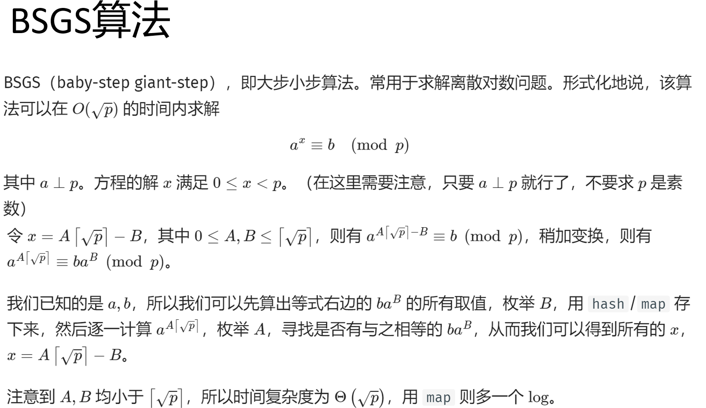

# 数论学习

## 一些板子   


### 素数和素数筛法   

#### 埃氏筛法       

```cpp

```

#### 线性筛法（欧拉筛法） 

时间复杂度O(n)   

```cpp
// 找出1~n中所有素数 //
ll cnt=0,pri[maxn];
bool vis[maxn];
void linear_prime(ll n) {
  for (ll i = 2; i <= n; ++i) {
    if (!vis[i])pri[++cnt]=i;
    for (ll j=1; j<=cnt&&i*pri[j]<=n;++j) {
      vis[i*pri[j]]=true;
      if (i%pri[j]==0) break;
    }
  }
}
        // i % pri[j] == 0
        // 换言之，i 之前被 pri[j] 筛过了
        // 由于 pri 里面质数是从小到大的，所以 i乘上其他的质数的结果一定会被
        // pri[j]的倍数筛掉，就不需要在这里先筛一次，所以这里直接 break
        // 掉就好了
```

### 质因数分解

```cpp
for(ll i=2;i<=sqrt(n+0.5);i++)
{
    if(n%i==0)
    {
        while(n%i==0)
        {
            n=n/i;
            printf("%lld ",i);
        }
    }
}
if(n!=1)printf("%lld ",n);
printf("\n");
```

### 欧拉函数

#### 相关性质   

$\sum_{d|n}\varphi(d)=n$   


#### 单个
**单个欧拉函数的计算**，时间复杂度最坏$O(n \sqrt{n})$
```cpp
// phi(0)=0 phi(1)=1 //
ll euler_phi(ll x)
{
    if(x==0)return 0;
    ll ans=x;
    for(ll i=2;i<=sqrt(x+0.5);i++)
    {
        if(x%i==0)
        {
            while(x%i==0)   x/=i;
            ans=ans/i*(i-1);
        }
    }
    if(x!=1)    ans=ans/x*(x-1);
    return ans;
}
```

#### 线性筛
**求1~n的欧拉函数值**,时间复杂度    

```cpp
// 在素数的欧拉筛法上稍微修改 //
ll n,cnt,pri[maxn],phi[maxn];
bool vis[maxn];   // 其实就是is_prime反过来 
void linear_prime(ll n)
{
    cnt=0;phi[0]=0;phi[1]=1;
    for(ll i=2;i<=n;++i)
    {
        if(!vis[i]){pri[++cnt]=i;phi[i]=i-1;}  // i是素数
        for(ll j=1;j<=cnt&&i*pri[j]<=n;++j)
        {
            vis[i*pri[j]]=true;
            if(i%pri[j])    phi[i*pri[j]]=phi[i]*phi[pri[j]];  // 积性函数
            else
            {
                phi[i*pri[j]]=phi[i]*pri[j];
                break;
            }
        }
    }
}
```

### gcd & lcm & 欧几里得算法

#### 朴素欧几里得

计算最大公约数 O(logn)，算法内容即**辗转相除**  

```cpp
ll gcd(ll a,ll b) {
    ll t;
    if(a<b)swap(a,b);
    while(b)
    {
        t=a%b;
        a=b;
        b=t;
    }
    return a;
}
```


#### 拓展欧几里得

以下代码可以求不定方程 $a*x+b*y=gcd(a,b)$ 的一组特解     

如果a,b互质，那么，得到的x,y分别为a在mod b意义下的逆元和b在mod a意义下的逆元   

```cpp
void exgcd(ll a, ll b, ll& x, ll& y) {
  if (b == 0) {
    x = 1, y = 0;
    return;
  }
  exgcd(b, a % b, y, x);
  y -= a / b * x;
}

// 调用实例
int main(void)
{
    cin>>a>>b;
    ll x,y;     // 用来存答案
    exgcd(a,b,x,y);
    cout<<x<<y<<endl;
    return 0;
}
```

对于不定方程 $a*x+b*y=gcd(a,b)$ 用 $a'=\frac{a}{gcd(a,b)},b'=\frac{b}{gcd(a,b)}$ 代换即可转换为以上方程   

#### 全部解


### 中国剩余定理  CRT   

#### 正常情况 -- 模数两两互质   

P1495 板子题  

**欧拉函数+快速幂**    
```cpp
#include<bits/stdc++.h>
using namespace std;
typedef long long ll;
const ll maxn=11;
// 接受 x>=0 //
ll euler_phi(ll x)
{
    if(x==0)return 0;
    ll ans=x;
    for(ll i=2;i<=sqrt(x+0.5);i++)
    {
        if(x%i==0)
        {
            while(x%i==0)   x=x/i;
            ans=ans/i*(i-1);
        }
    }
    if(x>1){ans=ans/x*(x-1);}
    return ans;
}
ll qpow(ll x,ll power,ll mod)
{
    ll ans=1;
    x=x%mod;
    for(;power;power=power>>1,x=x*x%mod)
        if(power&1) ans=ans*x%mod;
    return ans;
}
// x \equive b_i mod a_i //
ll n,a[maxn],b[maxn];
ll CRT(ll* a, ll* b,ll n)
{
    ll A=1,AA,inv,ans=0;
    for(ll i=1;i<=n;i++)
        A*=a[i];
    for(ll i=1;i<=n;i++)
    {
        AA=A/a[i];
        inv=qpow(AA,euler_phi(a[i])-1,a[i]);
        ans=(ans+b[i]*AA*inv%A)%A;
    }   
    return ans;
}
int main(void)
{
    scanf("%lld",&n);
    for(ll i=1;i<=n;i++)
        scanf("%lld %lld",a+i,b+i);
    ll ans=CRT(a,b,n);
    printf("%lld\n",ans);
    return 0;
}
```

**拓展欧几里得解法**        

```cpp
void exgcd(ll a, ll b, ll& x, ll& y) {
  if (b == 0) {
    x = 1, y = 0;
    return;
  }
  exgcd(b, a % b, y, x);
  y -= a / b * x;
}
// x \equive b_i mod a_i //
ll n,a[maxn],b[maxn];
ll CRT(ll* a, ll* b,ll n)
{
    ll A=1,AA,inv,ans=0;
    for(ll i=1;i<=n;i++)
        A*=a[i];
    for(ll i=1;i<=n;i++)
    {
        AA=A/a[i];
        ll x,y;
        exgcd(AA,a[i],x,y);
        inv=x;
        ans=(ans+b[i]*AA*inv%A)%A;
    }   
    return (ans+A)%A;
}
```

#### 拓展 -- 模数不互质

### BSGS算法 (baby-step giant-step)

处理离散对数问题   

  

```cpp
// 需要 (a,mod)=1 //
// 能够计算出 0~phi(mod)-1中的一个解 //
ll bsgs(ll a,ll b,ll mod)
{
    a=a%mod+mod;
    b=b%mod+mod;   // 让a,b变成非负数
    map<ll,ll> mp;
    ll t=ceil(sqrt(mod));ll cur=1;
    for(int d=1;d<=t;d++)
    {
        cur=cur*a%mod;
        mp[cur*b%mod]=(ll)d;
    }
    ll now=cur;
    for(int c=1;c<=t;c++)
    {
        if(mp[now])return (ll)c*t-mp[now];
        now=now*cur%mod;
    }
    return -1;   // 无解 
}
```


### d(n)

### tao(n)

## 一些题目

**P2158**   

分析：

```cpp
#include<bits/stdc++.h>
using namespace std;
typedef long long ll;
ll ans,n;
ll euler_phi(ll x)
{
    if(x==0)return 0;
    ll ans=x;
    for(ll i=2;i<=sqrt(x);i++)
    {
        if(x%i==0)
        {
            while(x%i==0)   x/=i;
            ans=ans/i*(i-1);
        }
    }
    if(x!=1)    ans=ans/x*(x-1);
    return ans;
}
int main(void)
{
    cin>>n;
    if(n==1)  // 特解
    {
        cout<<0<<endl;
        return 0;
    }
    // n>1的情况
    ans=1;
    for(ll i=0;i<=n-1;i++)
        ans+=2*euler_phi(i);
    cout<<ans<<endl;
    return 0;
}
```


