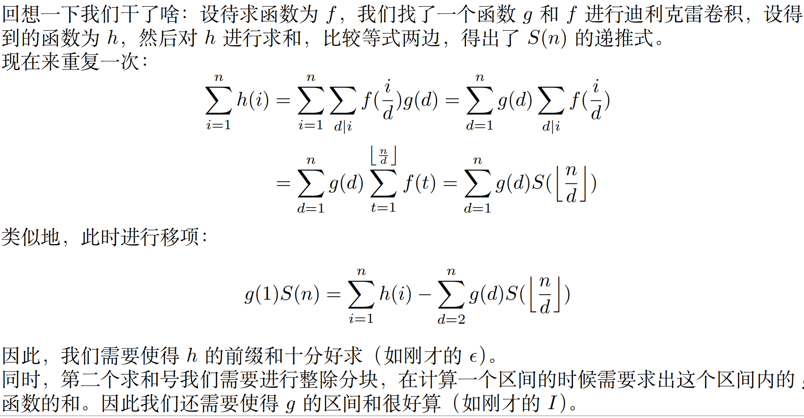

## 数论分块

### 一维

求解形如：$ans=\sum_{i=1}^nf(i)g(\lfloor \frac{n}{i}\rfloor)$的式子  
使得$[\frac{n}{i}]=[\frac{n}{j}]$成立的最大的 j 为 $[\frac{n}{[\frac{n}{i}]}]$,故每次以区间$[l,\frac{n}{[\frac{n}{l}]}]$为一块来计算贡献值   
其中，函数 f 可以使用前缀和优化   

**参考代码**
```cpp
// s[i]为函数f的前缀和 //
typedef long long ll;
ll sum(ll n)
{
    ll res=0;
    ll l=1,r;
    while(l<=n)
    {
        r=n/(n/l);
        res+=(s[r]-s[l-1])*g(l);
        l=r+1;
    }
    return res;
}
```

### 高维

解决：$ans=\sum_{i=1}^{n}f(i)g([\frac{n_1}{i}],\dots,[\frac{n_k}{i}])$的式子   

多维的数论分块只需要将r的更新公式设置为：
$r={min}_{1\leq t \leq k}\{\frac{n_t}{[\frac{n_t}{l}]}\}$即可(一般只要解决二维的数论分块)     

### 改为上取整  

由于$[\frac{n+i-1}{i}]=\lceil \frac{n}{i} \rceil$    
故 r 的更新表达式改为
$r=[\frac{n-1}{[\frac{n-1}{l}]}] $


-----
## Mobius  

### 莫比乌斯函数

#### 定义   
对于一个正整数n,可以定义莫比乌斯函数$\mu(n)$
$$
\mu(n)=
\begin{cases}
    1 & n=1 \\
    (-1)^k & n=p_1p_2\cdots p_k \\
    0 & \exist p \in prime,p^2|n
\end{cases}
$$

#### 线性筛求1~n所有莫比乌斯函数   

```cpp
// 类似于欧拉筛 //
int mu[maxn],pri[maxn],cnt;bool vis[maxn]; 
void linear_mu(int n)
{
    mu[1]=1;cnt=0;
    for(int i=2;i<=n;i++)
    {
        if(!vis[i]){pri[++cnt]=i;mu[i]=-1;}
        for(int j=1;j<=cnt&&i*pri[j]<=n;j++)
        {
            vis[i*pri[j]]=true;
            if(i%pri[j]==0){mu[i*pri[j]]=0;break;}
            else    mu[i*pri[j]]=-mu[i];
        }
    }
}
```

#### 反演    

$若有两个函数F(n)=\sum_{d|n}f(n)$    
$则有：$  
$$
f(n)=\sum_{d|n}F(d)\mu(\frac{n}{d})=\sum_{d|n}F(\frac{n}{d})\mu(d)     
$$

#### 积性函数

一个数论函数f(n)为积性函数，当且仅当：    
$对于gcd(x,y)=1,有f(xy)=f(x)f(y)$    

完全积性函数，将上面的互质条件去掉，结论不变   

一些例子：
- $\varphi(n)$是积性函数
- $\mu(n)$是积性函数
- $\tau(n)$(约数个数)是积性函数
- $\sigma(n)$(约数和)是积性函数
- $I(n)=1$是完全积性函数  
- $id(n)=n$是完全积性函数
- 元函数$\epsilon(n)=[n=1]$是完全积性函数  

##### 线性筛计算积性函数值(通用模板)

```cpp
// calc函数只要解决 n=p^k的形式即可 //
// isnp 即 is_not_prime ; 设n最小质因子为p，p^k||n,mnp记录p^k的值 
int f[maxn],pri[maxn],mnp[maxn],cnt;bool isnp[maxn];
void linear(int n)
{
    f[1]=1;cnt=0;   // 积性函数的f(1)=1,进行初始化 
    for(int i=2;i<=n;i++)
    {
        if(!isnp[i]){pri[++cnt]=i;mnp[i]=i;f[i]=calc(i);} // 此时，n=p
        for(int j=1;j<=cnt&&i*pri[j]<=n;j++)
        {
            isnp[i*pri[j]]=true;
            if(i%pri[j]==0)
            {
                mnp[i*pri[j]]=mnp[i]*pri[j];   // 此时一定有pri[j]是i的最小素因子
                if(i==mnp[i])  // 此时，n=p^k形式
                    f[i*pri[j]]=calc(i*pri[j]);
                else
                    f[i*pri[j]]=f[i/mnp[i]]*f[mnp[i]*pri[j]];
                break;
            }
            else
            {
                mnp[i*pri[j]]=pri[j];
                f[i*pri[j]]=f[pri[j]]*f[i];
            }
        }
    }
}
```
calc函数以euler函数举例  
```cpp
// 欧拉函数的例子，calc函数可以多加几个参数，直接传入p,k也可以（会更快） //
int calc(int n)   
{
    int id;
    for(int j=1;j<=cnt;j++)
    {
        if(n%pri[j]==0){id=j;break;}
    }
    int cnt=0;
    while(n%pri[id]==0)cnt++,n=n/pri[id];
    return pow(pri[id],cnt)-pow(pri[id],cnt-1);
}
```

#### Dirichlet卷积   

**定义**  
$对于两个数论函数f(n),g(n)$   
$定义：$
$$
h(n)=\sum_{d|n}f(d)g(\frac{n}{d})=\sum_{ab=n}f(a)g(b),\quad 简记为 h=f*g
$$
$为两个数论函数的Dirichlet卷积$   

**运算律**   
满足交换律、结合率、分配律   

**常用函数的卷积**   
- $f*\epsilon=f$  
- $I*I=\tau$  
- $I*id=\sigma$  
- $\varphi*I=id$
- $\mu*I=\epsilon$ 

前三个都可以由定义简单推出，第四个式子是欧拉函数的一个重要性质，下面给出证明：    
$(\varphi*I)(n)=\sum_{d|n}\varphi(d)=\sum_{d|n}\varphi(\frac{n}{d})=\sum_{d|n}\sum_{k=1}^{\lfloor \frac{n}{d} \rfloor}[gcd(k,\frac{n}{d})=1)]=\sum_{d|n}\sum_{i=1}^n[gcd(i,n)=d]=\sum_{i=1}^n\sum_{d|n}[gcd(i,n)=d]=\sum_{i=1}^n 1=n=id(n)$

第五个是莫比乌斯函数的重要结论，下面给出证明：
$设n=\prod_{i=1}^kp_i^{\alpha_i},n'=\prod_{i=1}^kp_i$     
$(\mu*I)(n)=\sum_{d|n}\mu(d)=\sum_{d|n'}\mu(d)=\sum_{i=0}^kC_{k}^{i}(-1)^i=\epsilon(n)$


#### 杜教筛  



**两个典例：**  
- Mobius前缀和, $S(n)=\sum_{i=1}^n\mu(i),有S(n)=1-\sum_{d=2}^{n}S([\frac{n}{d}])$
- Euler前缀和, $S(n)=\sum_{i=1}^n\varphi(i),有S(n)=\frac{n(n+1)}{2}-\sum_{d=2}^nS([\frac{n}{d}])$

先用线筛筛选出$O(n^{\frac{2}{3}})$级别的函数值与前缀和，然后杜筛+记忆化搜索 可以达到$O(n^{\frac{2}{3}})$级别的时间复杂度

使用map是因为空间限制，如果空间够，可以更快（指常数更小）
参考代码： 以$\mu(x)$为例  
```cpp
// 板子：杜教筛 //
#include<bits/stdc++.h>
using namespace std;
typedef long long ll;
const ll maxn=2e6+10;
ll mu[maxn],phi[maxn],sum_mu[maxn],sum_phi[maxn];
ll T,n;
ll pri[maxn],cnt;bool isnp[maxn];
void linear()
{
    int n=maxn-1;
    cnt=0;mu[1]=1;phi[1]=1;
    sum_mu[0]=sum_phi[0]=0;
    sum_mu[1]=sum_phi[1]=1;
    for(int i=2;i<=n;++i)
    {
        if(!isnp[i]){pri[++cnt]=i;mu[i]=-1;phi[i]=i-1;}
        for(int j=1;j<=cnt&&i*pri[j]<=n;++j)
        {
            isnp[i*pri[j]]=true;
            if(i%pri[j]==0){mu[i*pri[j]]=0;phi[i*pri[j]]=phi[i]*pri[j];break;}
            else
            {
                mu[i*pri[j]]=-mu[i];
                phi[i*pri[j]]=phi[i]*phi[pri[j]];
            }
        }
        sum_mu[i]=sum_mu[i-1]+mu[i];
        sum_phi[i]=sum_phi[i-1]+phi[i];
    }
    return;
}
// 杜教筛 + 记忆化搜索 //
map<ll,ll> mp1;
ll du_sieve_mu(ll n)
{
    if(n<maxn)  return sum_mu[n];
    if(mp1.count(n))    return mp1[n];
    // 数论分块
    ll res=1;
    for(ll l=2,r;l<=n;l=r+1){r=n/(n/l);res-=(r-l+1)*du_sieve_mu(n/l);}
    return mp1[n]=res;
}
map<ll,ll> mp2;
ll du_sieve_phi(ll n)
{
    if(n<maxn)  return sum_phi[n];
    if(mp2.count(n))    return mp2[n];
    // 数论分块
    ll res=n*(n+1)/2;
    for(ll l=2,r;l<=n;l=r+1){r=n/(n/l);res-=(r-l+1)*du_sieve_phi(n/l);
    return mp2[n]=res;
}
int main(void)
{
    cin>>T;
    linear();
    while(T--)
    {
        cin>>n;
        printf("%lld %lld\n",du_sieve_phi(n),du_sieve_mu(n));
    }
    return 0;
}
```

