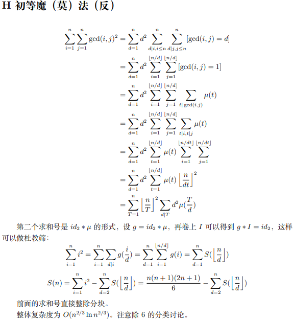
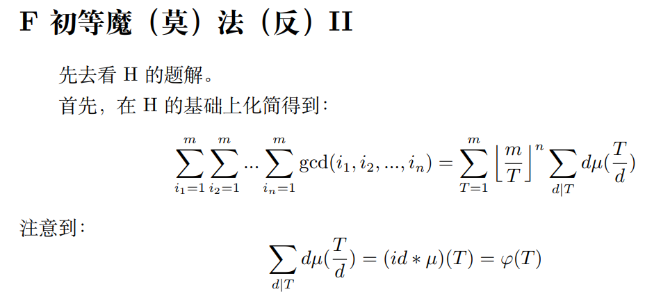

P2522  

- 每次询问的答案有前缀和的性质
- 只要处理$cnt(n,m)=\sum_{i=1}^n\sum_{j=1}^{m}[gcd(i,j)=k]即可$
- 然后容斥原理，每次询问的答案$ans=cnt(b,d)-cnt(a-1,d)-cnt(b,c-1)+cnt(a-1,c-1)$
  

核心式子的推导：
$$
\sum_{i=1}^{m}\sum_{j=1}^{n}[gcd(i,j)=k]=\sum_{k|i}^{m}\sum_{k|j}^{n}[gcd(\frac{i}{k},\frac{j}{k})=1]=\sum_{i=1}^{[\frac{m}{k}]}\sum_{j=1}^{[\frac{n}{k}]}[gcd(i,j)=1]=\sum_{i=1}^{[\frac{m}{k}]}\sum_{j=1}^{[\frac{n}{k}]}\sum_{d|gcd(i,j)}\mu(d)=\sum_{d=1}^{min([\frac{m}{k}],[\frac{n}{k}])}\mu(d)\sum_{d|i}^{[\frac{m}{k}]}\sum_{d|j}^{[\frac{n}{k}]}1=\sum_{d=1}^{min([\frac{m}{k}],[\frac{n}{k}])}\mu(d)[\frac{[\frac{m}{k}]}{d}][\frac{[\frac{n}{k}]}{d}]
$$


逐个计算，时间复杂度$O(Tn)$  

数论分块优化，时间复杂度$O(T\sqrt{n})$  

注意到，可以将$[\frac{m}{k}],[\frac{n}{k}]$看做$n',m'$故可以消除k的影响，从而可以预处理$cnt(maxn,maxn)$，时间复杂度为$O(n^2\sqrt{n}+T)$,这个在T较大时可用  

选用第二种方法，AC：
```cpp
// 有前缀和的性质，但是由于k在变，没法直接预处理前缀和 //
// 数论分块 + Mobius //
#include<bits/stdc++.h>
using namespace std;
const int maxn=5e4+5;
int n,a,b,c,d,k;
int mu[maxn],sum_mu[maxn],pri[maxn],cnt;bool isnp[maxn];
void linear(int n)
{
    cnt=0;mu[1]=1;
    for(int i=2;i<=n;++i)
    {
        if(!isnp[i])pri[++cnt]=i,mu[i]=-1;
        for(int j=1;j<=cnt&&i*pri[j]<=n;++j)
        {
            isnp[i*pri[j]]=true;
            if(i%pri[j]==0){mu[i*pri[j]]=0;break;}
            else    mu[i*pri[j]]=-mu[i];
        }
    }
}
void pre()
{
    linear(5e4+1);
    // 预处理莫比乌斯函数的前缀和 //
    sum_mu[0]=0;
    for(int i=1;i<=5e4+1;i++)
        sum_mu[i]=sum_mu[i-1]+mu[i];
    return;
}
int ccnt(int n,int m,int k)
{
    n=n/k,m=m/k;
    int top=min(n,m);
    int r,l=1,res=0;
    while(l<=top)
    {
        r=min(n/(n/l),m/(m/l));
        res+=(sum_mu[r]-sum_mu[l-1])*(n/l)*(m/l);
        l=r+1;
    }
    return res;
}
int main(void)
{
    cin>>n;
    pre();
    while(n--)
    {
        scanf("%d %d %d %d %d",&a,&b,&c,&d,&k);
        int ans;
        ans=ccnt(b,d,k)-ccnt(a-1,d,k)-ccnt(b,c-1,k)+ccnt(a-1,c-1,k);
        printf("%d\n",ans);
    }
    return 0;
}
```

P3911 最小公倍数之和2  


P3327 约数个数和

分析：
核心等式: 
- $\tau(ij)=\sum_{x|i}\sum_{y|j}[gcd(x,y)=1]$
- $\sum_{i=1}^n\tau(i)=\sum_{t=1}^n[\frac{n}{t}]$  

两种推导思路，最后殊途同归，式子略

AC代码：
```cpp
// 约数个数和 //
#include<bits/stdc++.h>
using namespace std;
typedef long long ll;
const int maxn=5e4+5;
int pri[maxn],cnt,mu[maxn],sum[maxn];
bool isnp[maxn];
void linear_mu(int n)
{
    cnt=0;mu[1]=1;
    sum[0]=0,sum[1]=1;
    for(int i=2;i<=n;++i)
    {
        if(!isnp[i])pri[++cnt]=i,mu[i]=-1;
        for(int j=1;j<=n&&i*pri[j]<=n;++j)
        {
            isnp[i*pri[j]]=true;
            if(i%pri[j]==0){mu[i*pri[j]]=0;break;}
            else    mu[i*pri[j]]=-mu[i];
        }
        sum[i]=sum[i-1]+mu[i];
    }
    return;
}
ll g[maxn],n,m,T;
void pre(int n)    //O(n*sqrt(n))
{
    for(ll i=1;i<=n;++i)
    {
        ll res=0;
        for(ll l=1,r;l<=i;l=r+1){r=i/(i/l);res+=(r-l+1)*(i/l);}
        g[i]=res;
    }
    return;
}
ll solve(ll n,ll m)  // O(T*sqrt(n))
{
    ll ans=0;
    ll top=min(m,n);
    for(ll l=1,r;l<=top;l=r+1)
    {
        r=min(n/(n/l),m/(m/l));
        ans+=(sum[r]-sum[l-1])*g[n/l]*g[m/l];
    }
    return ans;
}
int main(void)
{
    int num=5e4+2;
    linear_mu(num);
    pre(num);
    // 预处理
    cin>>T;
    while(T--)
    {
        scanf("%lld %lld",&n,&m);
        printf("%lld\n",solve(n,m));
    }
    return 0;
}
```


P1829   最小公倍数之和1

求和：$\sum_{i=1}^n\sum_{j=1}^mlcm(i,j) \qquad mod \ p$

```cpp
// 一种最小公倍数求和 //
// AC //
#include<bits/stdc++.h>
using namespace std;
typedef long long ll;
const ll mod=20101009;
const int maxn=1e7+5;
ll n,m,ans,mu[maxn],g[maxn];
void pre()
{
    // 先预处理g
    g[0]=0;
    for(ll i=1;i<=m;++i)   
        g[i]=(g[i-1]+i)%mod;
    return;
}
ll sum(ll n,ll m)    // sum(n,m)
{
    ll res=0;
    for(ll d=1;d<=n;++d)
        if(mu[d])res=(res+(mu[d]*d*d%mod+mod)%mod*(g[n/d]*g[m/d]%mod))%mod;
    return res;
}
void solve()
{
    // 解决ans , 二维数论分块
    ans=0;
    ll l=1,r;
    while(l<=n)  // n<=m
    {
        r=min(n/(n/l),m/(m/l));  // 计算当前区间的右端点
        ans=(ans+(l+r)*(r-l+1)/2%mod*sum(n/l,m/l)%mod)%mod;
        l=r+1;
    }
    return;
}
// Mobius函数线性筛 
bool isnp[maxn];int pri[maxn],cnt;
void linear(int n)
{
    mu[1]=1;cnt=0;
    for(int i=2;i<=n;++i)
    {
        if(!isnp[i]){pri[++cnt]=i;mu[i]=-1;}
        for(int j=1;j<=cnt&&i*pri[j]<=n;++j)
        {
            isnp[i*pri[j]]=true;
            if(i%pri[j]==0){mu[i*pri[j]]=0;break;}
            else    mu[i*pri[j]]=-mu[i];
        }
    }
}
int main(void)
{
    cin>>n>>m;
    if(n>m)swap(n,m);   // 保证n<=m
    linear(n);
    pre();
    solve();
    cout<<ans<<endl;
}

```

P3768 （可以看出与P1829本质相同）(但是本题数据太大了)

求和：$\sum_{i=1}^n\sum_{j=1}^m i \cdot j \cdot gcd(i,j)\qquad mod \ p$

推导：$$

AC代码：
```cpp

```


P????    ？？？？的数表 & rating 3 H（数据大多了,得用杜教筛）

**求和$\sum_{i=1}^{n}\sum_{j=1}^{n}{gcd}^2(i,j)$**

暴力法略

法一    
此法只能处理两个上标都是n的情况，利用了对称性  
$原式=\sum_{d=1}^{n}d^2\sum_{i=1}^{n}\sum_{j=1}^{n}[gcd(i,j)=d]=\sum_{d=1}^{n}d^2\sum_{i=1}^{[\frac{n}{d}]}\sum_{j=1}^{[\frac{n}{d}]}[gcd(i,j)=1]=\sum_{d=1}^{n}d^2(2 \varphi([\frac{n}{d}])-1)$

可以使用**线性筛**，时间复杂度为$O(n)$
可以使用**杜教筛** + 数论分块，时间复杂度$O(n^{\frac{2}{3}})$

法二
此法可以处理上标是n,m


如果只转换到倒数第二步，可以用两次数论分块 + (杜教筛 or 线性筛)
时间复杂度 $O(n)$
按照题解解法，将$id_2*\mu$看做积性函数，用杜教筛求其前缀和，然后原式数论分块
时间复杂度$O(n^{\frac{2}{3}})$

补充：rating 3 F

同上，杜教筛，时间复杂度$O(n^{\frac{2}{3}})$


**P3768  简单的数学题**  (困难啊)

$求\sum_{i=1}^n\sum_{j=1}^ni\cdot j\cdot gcd(i,j) \qquad n\leq 10^{10}$

推导：
$$
\sum_{i=1}^n\sum_{i=1}^nijgcd(i,j)=\sum_{d=1}^n\sum_{i=1}^{[\frac{n}{d}]}\sum_{j=1}^{[\frac{n}{d}]}d^3ij[gcd(i,j)=1]=\sum_{d=1}^n\sum_{i=1}^{[\frac{n}{d}]}\sum_{j=1}^{[\frac{n}{d}]}d^3ij\sum_{t|gcd(i,j)}\mu(t)   \\
=\sum_{d=1}^n d^3 \sum_{t=1}^{[\frac{n}{d}]} t^2 \mu(t)(\sum_{i=1}^{[\frac{n}{td}]}i)^2 \\
$$
令$T=d\cdot t$有：
$$
原式=\sum_{T=1}^n (\sum_{i=1}^{[\frac{n}{T}]}i)^2\cdot (T^2\sum_{d|T}d\mu(\frac{T}{d}))=\sum_{T=1}^n (\sum_{i=1}^{[\frac{n}{T}]}i)^2\cdot (T^2\varphi(T))
$$

只需要处理前缀和$S(n)=\sum_{i=1}^ni^2\varphi(i)$

线性筛会超时，所以只能使用杜教筛，将$T^2\cdot \varphi(T)$看做积性函数，进行杜教筛 

注意到$(id_2\varphi*id_2)=id_3$,从而有
$$
1^2\cdot S(n)=(\frac{n(n+1)}{2})^2-d^2\sum_{d=2}^nS([\frac{n}{d}])
$$

参考代码：
```cpp
// 一道简单（困难）的数学题 //
#include<bits/stdc++.h>
using namespace std;
typedef __int128_t ll;    // 大杀器
const ll maxn=5e6+5;
ll p,n;
ll S[maxn],pri[maxn],cnt,phi[maxn];bool isnp[maxn];
ll read()
{
    ll x=0,f=1;char ch=getchar();
    while(ch>'9'||ch<'0'){if(ch=='-')f=-1;ch=getchar();}
    while(ch>='0'&&ch<='9'){x=x*10+ch-'0';ch=getchar();}
    return f*x;
}
ll calc(ll l, ll r)
{return (r*(r+1)*(2*r+1)/6-(l-1)*l*(2*l-1)/6)%p;}
void linear()
{
    S[0]=0,S[1]=1,phi[1]=1,cnt=0;
    for(ll i=2;i<maxn;++i)
    {
        if(!isnp[i])pri[++cnt]=i,phi[i]=i-1;
        for(ll j=1;j<=cnt&&i*pri[j]<maxn;++j)
        {
            isnp[i*pri[j]]=true;
            if(i%pri[j]==0){phi[i*pri[j]]=phi[i]*pri[j];break;}
            else    phi[i*pri[j]]=phi[i]*phi[pri[j]];
        }
        S[i]=(S[i-1]+i*i%p*phi[i]%p)%p;
    }
}
map<ll,ll> mp;
ll du(ll n)
{
    if(n<maxn)return S[n];
    if(mp.count(n))return mp[n];
    ll res=(n*(n+1)/2%p)*(n*(n+1)/2%p)%p;
    for(ll l=2,r;l<=n;l=r+1)
    {
        r=n/(n/l);
        res=((res-calc(l,r)*du(n/l))%p+p)%p;
    }
    return mp[n]=res;
}
int main(void)
{
    p=read();n=read();
    linear();
    ll ans=0;
    for(ll r,l=1;l<=n;l=r+1)
    {
        ll x=n/l;
        r=n/(n/l);
        ans=(ans+(du(r)-du(l-1)+p)%p*(x*(x+1)/2%p)*(x*(x+1)/2%p)%p)%p;
    }
    cout<<(long long)ans<<endl;
    return 0;
}
```


