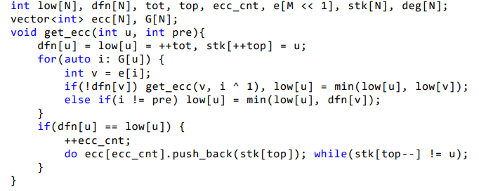
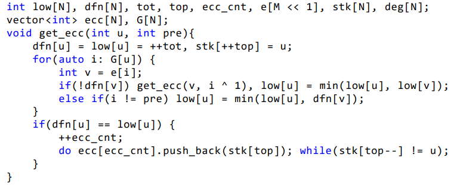

```cpp
struct Edge {
  ll from, to, cap, flow;
  Edge(ll u, ll v, ll c, ll f) : from(u), to(v), cap(c), flow(f) {}
};

// Dinic算法的结构体，包含了初始化，添加边等等各类功能
struct Dinic {
  ll n, m, s, t;
  vector<Edge> edges;
  vector<ll> G[maxn];
  ll d[maxn], cur[maxn];
  bool vis[maxn];

  void init(ll n) {
    for (ll i = 0; i < n; i++) G[i].clear();
    edges.clear();
  }

  void AddEdge(ll from, ll to, ll cap) {
    edges.push_back(Edge(from, to, cap, 0));
    edges.push_back(Edge(to, from, 0, 0));
    m = edges.size();
    G[from].push_back(m - 2);
    G[to].push_back(m - 1);
  }
 
  bool BFS() {
    memset(vis, 0, sizeof(vis));
    queue<ll> Q;
    Q.push(s);
    d[s] = 0;
    vis[s] = 1;
    while (!Q.empty()) {
      ll x = Q.front();
      Q.pop();
      for (ll i = 0; i < G[x].size(); i++) {
        Edge& e = edges[G[x][i]];
        if (!vis[e.to] && e.cap > e.flow) {
          vis[e.to] = 1;
          d[e.to] = d[x] + 1;
          Q.push(e.to);
        }
      }
    }
    return vis[t];
  }
  ll DFS(ll x, ll a) {
    if (x == t || a == 0) return a;
    ll flow = 0;ll f;
    for (ll& i = cur[x]; i < G[x].size(); i++) {
      Edge& e = edges[G[x][i]];
      if (d[x] + 1 == d[e.to] && (f = DFS(e.to, min(a, e.cap - e.flow))) > 0) {
        e.flow += f;
        edges[G[x][i] ^ 1].flow -= f;
        flow += f;
        a -= f;
        if (a == 0) break;
      }
    }
    return flow;
  }
  ll Maxflow(ll s, ll t) {
    this->s = s;
    this->t = t;
    ll flow = 0;
    while (BFS()) {
      memset(cur, 0, sizeof(cur));
      flow += DFS(s, INF);
    }
    return flow;
  }
};
Dinic mf;
```
欧拉回路核心(无向图只要改一下即可)
```cpp
void Dfs(int now)
{
    for(int i=del[now];i<G[now].size();i=del[now])
    {
        del[now]=i+1;
        Dfs(G[now][i]);
    }
    stk[++top]=now;
}
```
kruskal
```cpp
int n,m;
struct edge{
    int u,v;
    int w;
}e[maxm];
bool cmp_ed(edge a,edge b)
{
    return a.w<b.w;
}
int s[maxn];  // 实现并查集
int find_set(int x)   // 找x所属的集合
{
    int r = x;
    while(r!=s[r]) r=s[r];  // 先找到根节点
    int t;
    while(x!=r)   // 将这条链上的元素全部连到根节点
    {
        t = s[x];
        s[x] = s[r];
        x = t;
    }
    return s[r];  
}
void union_set(int x,int y)
{
    x=find_set(x);y=find_set(y);
    s[x]=s[y];return;
}
vector<int> edans;  // 记录取的边
int ans;
bool kruskal()
{
    int cnt=0;
    for(int i=1;i<=m&&cnt<n-1;i++)
    {
        int x=find_set(e[i].u),y=find_set(e[i].v);
        if(x==y)    continue;   // 表示u,v在未添加这条边之前就已经连通了 
        ans+=e[i].w;
        edans.push_back(i);
        union_set(x,y);
        cnt++;
    }
    if(cnt==n-1)    return true;
    else            return false;
}
void print_ans()
{
    printf("ans=%d\n",ans);
    for(auto id:edans)
        printf("(%d,%d) 权值=%d\n",e[id].u,e[id].v,e[id].w);
    return;
}
```
Tarjan缩点
```cpp
vector<int> g[MAXN];
int stk[MAXN],top,cnt,low[MAXN],dfn[MAXN];
bool instk[MAXN];
int id[MAXN],id_cnt,siz[MAXN];// id记录颜色id，siz记录该颜色的点数
void Tarjan(int u)
{
    instk[u]=1,stk[++top]=u,dfn[u]=low[u]=++cnt;
    for(auto v:g[u])
    {
        if(!dfn[v]) Tarjan(v),low[u]=min(low[u],low[v]);
        else if(instk[v])   low[u]=min(low[u],dfn[v]);
    }
    if(low[u]==dfn[u])
    {
        ++id_cnt;
        while(stk[top]!=u){id[stk[top]]=id_cnt;instk[stk[top--]]=0;siz[id_cnt]++;}
        id[u]=id_cnt,instk[u]=0,siz[id_cnt]++,--top;
    }
}
```
Tarjan求割点
```cpp
vector<int> G[MAXN];
int n,m,ans,cnt,dfn[MAXN],low[MAXN];
bool tag[MAXN];
void _Tarjan(int u,int rt)
{
    int son=0;
    low[u]=dfn[u]=++cnt;
    for(auto v:G[u])
    {
        if(!dfn[v])
        {
            _Tarjan(v,rt);
            low[u]=min(low[u],low[v]);
            ++son;
            if(low[v]>=dfn[u]&&u!=rt)tag[u]=1;   // 可能会被多次赋值，计数时请注意
        }
        else    low[u]=min(low[u],dfn[v]);
    }
    if(u==rt&&son>1)tag[u]=1;   // 可能会被多次赋值，计数时请注意
}
void Tarjan(int n)
{
    for(int i=1;i<=n;++i)if(!dfn[i])_Tarjan(i,i);
}
```
Tarjan求点双
```cpp
int vcc_cnt,cnt,top,dfn[MAXN],low[MAXN],stk[MAXN],e[MAXM<<1],deg[MAXN];
vector<int> G[MAXN],vcc[MAXN];
void _getvcc(int u,int fa){
    int son=0;
    low[u]=dfn[u]=++cnt;stk[++top]=u;
    for(auto v:G[u])
    {
        if(!dfn[v])   // 树边
        {
            ++son;
            _getvcc(v,u);
            low[u]=min(low[u],low[v]);
            if(low[v]>=dfn[u])
            {
                ++vcc_cnt;
                while(stk[top+1]!=v)vcc[vcc_cnt].push_back(stk[top--]);  //把子树出栈
                vcc[vcc_cnt].push_back(u);  // 把树根/割点丢进去
            }
        }
        else if(v!=fa)  low[u]=min(low[u],dfn[v]);
    }
    if(fa==0&&son==0)vcc[++vcc_cnt].push_back(u);}
void getvcc(int n){for(int i=1;i<=n;++i)if(!dfn[i])top=0,_getvcc(i,0);}
```
Tarjan求桥

Tarjan求所有边双

字符串类
acam
```cpp
struct ACam
{
    // 字典树中，0为根节点，0也为空节点，记得判断
    int nex[50*maxn+5][26],cnt;  // 只考虑小写的26个字母
    int fail[50*maxn+5];  // fail指针,自动机的精髓
    int indeg[50*maxn+5];   // 记录fail图入度，是此优化的核心
    int ans[50*maxn+5];    // ans标记，可以最后拓扑排序得到答案，此优化的核心
    int vis[50*maxn+5];    // 记录某个字符串被匹配了多少次，这个可以在topu排序中叠加计算
    queue<int> q;
    // 自定义参数
    bool exist[50*maxn+5];  // 某个节点的字符串是否存在
    int ccnt[50*maxn+5];    // 某个节点的某个属性的计数
    bool flag[50*maxn+5];   // 某个节点是否被遍历过或其他什么操作
    int fa[50*maxn+5];  // 可能有些题需要用到父节点
    //
    int getnum(char ch)   // 字符集和整数的对应
    {
        return ch-'a';
    }
    void Insert(char s[],int l)
    {
        int p=0;
        for(int i=0;i<l;++i)
        {
            int c=getnum(s[i]);
            if(!nex[p][c])nex[p][c]=++cnt;
            p=nex[p][c];
        }
    }       
    // 多模式匹配
    void Query(char t[],int l)    
    {
        int p=0;
        for(int i=0;i<l;++i){p=nex[p][getnum(t[i])];ans[p]++;}   // 返回值不需要，打上ans标记即可
    }
    void Pre_fail()   // 插入完毕后再预处理fail指针,处理类似于BFS
    {
        fail[0]=0;   // 约定一下，不初始化也可以
        for(int i=0;i<26;++i)
            if(nex[0][i])q.push(nex[0][i]),fail[nex[0][i]]=0;   // 初始化第一层
        while(q.size())
        {
            int u=q.front();
            q.pop();
            for(int i=0;i<26;++i)    
            {
                int v=nex[u][i];
                if(!v)
                {
                    nex[u][i]=nex[fail[u]][i];
                    continue;
                }
                fail[v]=nex[fail[u]][i];
                indeg[nex[fail[u]][i]]++;    // 入度加一,与上一个唯一的不同之处
                q.push(v);
            }
        }
    }
    // 拓扑排序算答案       只是找存在性可以用拓扑遍历
    void topu()
    {
        for(int i=1;i<=cnt;++i)
            if(!indeg[i])q.push(i);
        while(q.size())
        {
            int fr=q.front();q.pop();
            vis[fr]=ans[fr];
            int v=fail[fr];
            ans[v]+=ans[fr];
            if(!(--indeg[v]))q.push(v);
        }
    }
};
ACam AC;
```
Gsam
```cpp
namespace GSam
{
    queue<pair<int,int>> q;    
    int cnt;  // 节点总数:[1,cnt],1为根节点
    struct state{
        int nex[CHAR_NUM];  // 转移
        int len;            // 节点长度
        int link;           // 后缀连接，link
    };
    state st[MAXN];      // 最大节点数2*\sum|s_i|
    void _init_()
    {
        cnt=1;
        st[1].link=st[1].len=0;
    }
    // 依旧是核心函数 //
    int expendGSam(int last,int c)     // last为父节点，cur为c儿子
    {
        int cur=st[last].nex[c];
        if(st[cur].len) return cur;   // *
        st[cur].len=st[last].len+1;
        int p=st[last].link;     // 因为已知last有c儿子了，所以p从这里开始（和之前的Sam稍有不同）
        for(;p&&!st[p].nex[c];p=st[p].link) st[p].nex[c]=cur;
        if(!p){st[cur].link=1;return cur;}   // 没找到，直接连到根节点
        int q=st[p].nex[c];
        if(st[q].len==st[p].len+1){st[cur].link=q;return cur;}
        int nq=++cnt;  // 准备分裂
        for(int i=0;i<CHAR_NUM;++i)
            st[nq].nex[i]=(st[st[q].nex[i]].len)?st[q].nex[i]:0;    // 又一处不同 **
        st[nq].len=st[p].len+1;       // upd:又一次把p写成了q，然后查了一个小时
        for(;p&&st[p].nex[c]==q;p=st[p].link)   st[p].nex[c]=nq;
        st[nq].link=st[q].link;     
        st[q].link=st[cur].link=nq;
        return cur;
    }
    // 在字典树基础上，用BFS建立后缀自动机，新增函数 //
    void build()
    {
        for(int i=0;i<CHAR_NUM;++i)
            if(st[1].nex[i])q.push({i,1});    // 第一层入队
        while(!q.empty())
        {
            auto it=q.front();q.pop();
            auto last=expendGSam(it.second,it.first);       // 只有在此处用到expendGSam函数
            for(int i=0;i<CHAR_NUM;++i)
                if(st[last].nex[i])q.push({i,last});
        }
    }
    // 下面为Trie的插入操作，轻车熟路
    inline int getnum(char ch)          // 这里以小写字母举例,字符集和整数的映射函数
    {
        return ch-'a';   
    }
    inline int insertTrie(int cur,int c)    // 该函数主要是为了封装更好看
    {
        if(st[cur].nex[c])return st[cur].nex[c];  // 节点已经存在，直接返回即可
        return st[cur].nex[c]=++cnt;              // 节点不存在，新建一个
    }
    void insert(const string& s)     // 一个处理string类型的insert版本
    {
        int p=1;    // 刚开始是根节点
        for(auto ch:s)  p=insertTrie(p,getnum(ch));
    }
};
using namespace GSam;
```
sam+endpos
```cpp
namespace Sam
{
    // cnt记录点状态数，last为上次更新的状态 //
    int cnt=0,last;
    ll f[2*MAXN];
    struct state
    {
        int len,link;
        int nex[26];    // 这里默认26个小写字母集
        // 如果字符集太大了，可以使用map
        // std::map<char,int> nex 
    };
    state st[2*MAXN];   // 节点数<=2n
    // 字符和整数的映射 
    inline int getnum(char ch)
    {
        return ch-'a';
    }
    // 初始化：根节点为1，空节点为0
    void _init_()
    {
        last=1,cnt=1;
        st[1].len=0;
        st[1].link=0;   // 后缀连接为空节点
    }
    // 扩展，在线维护Sam，每次加入一个字符 
    void extend(char ch)
    {
        int c=getnum(ch);
        int cur=++cnt;
        f[cur]=1;//此处很重要
        int p=last;last=cur;
        st[cur].len=st[p].len+1;    // 不要忘了初始化长度
        for(;p&&!st[p].nex[c];p=st[p].link){st[p].nex[c]=cur;}
        if(!p){st[cur].link=1;return;}
        int q=st[p].nex[c];
        if(st[q].len==st[p].len+1){st[cur].link=q;return;}
        int nq=++cnt;
        st[nq].len=st[p].len+1;
        memcpy(st[nq].nex,st[q].nex,sizeof(state::nex));
        st[nq].link=st[q].link;st[q].link=st[cur].link=nq;
        for(;st[p].nex[c]==q;p=st[p].link)st[p].nex[c]=nq;   // st[0].nex[c]=0,无需担心
    }
};
using namespace Sam;
vector<int> e[2*MAXN];
inline void adde(int u,int v){e[u].push_back(v);}
void dfs(int u)   // parent tree 上树形DP
{
    for(auto v:e[u])
    {
        dfs(v);
        f[u]+=f[v];
    }  
}
```
string hash
```cpp
const ll M=1e9+7;   // 大质数
const ll B=233317;     // 进制数
const ll maxn=1e4+1;
const ll maxm=1501;
ll h[maxn],Bpow[maxm];
ll n;
string s;
void pre()
{
    Bpow[0]=1;
    for(ll i=1;i<maxm;++i)
        Bpow[i]=Bpow[i-1]*B%M;
    return;
}
ll get_hash(string &s)
{
    int n=(int)s.length();
    ll res=0;
    for(int i=0;i<n;++i)
        res=(res+Bpow[n-1-i]*(ll)s[i])%M;
    return res;
}
```
manacher
```cpp
char s[maxn];
int d1[maxn],d2[maxn];
void manacher(char s[],int n,int d1[],int d2[])
{
    for(int i=0,l=0,r=-1;i<n;++i)
    {
        int k=(i>r)?1:min(r-i+1,d1[r+l-i]);
        while(i-k>=0&&i+k<n&&s[i-k]==s[i+k])++k;
        d1[i]=k;if(ans<2*k-1)ans=2*k-1;
        if(i+k-1>r){r=i+k-1;l=i-k+1;}
    }
    for(int i=0,l=0,r=-1;i<n;++i)
    {
        int k=(i>r)?0:min(r-i+1,d2[r+l-i]);
        while(i-k-1>=0&&i+k<n&&s[i-k-1]==s[i+k])++k;
        d2[i]=k;if(ans<2*k)ans=2*k;
        if(i+k-1>r){r=i+k-1;l=i-k;}
    }
}
```
伪kmp
```cpp
vector<int> prefix_func(string s)
{
    int n=(int)s.length();
    vector<int> pi(n);   // 最大容量是n,全部用0初始化
    for(int i=1;i<n;++i)
    {
        int j=pi[i-1];
        while(j>0&&s[i]!=s[j])j=pi[j-1];
        if(s[i]==s[j])  ++j;
        pi[i]=j;
    }
    return pi;
}
vector<int> kmp_find(string t,string s)
{
    int sz1=(int)t.length(),sz2=(int)s.length();
    string cur = s+'#'+t;
    vector<int> id;
    vector<int> pi=prefix_func(cur);
    for(int i=sz2+1;i<=sz1+sz2;++i)
        if(pi[i]==sz2)  id.push_back(i-2*sz2);
    return id;
}
```
dfs判环,有向图
```cpp
// Dfs判环
int ins[maxn],vis[maxn];
bool Dfs(int u)
{
    ins[u]=1;     // ins[u]=1表示u正在被访问
    for(int i=0;i<=1;++i)
    {
        int v=nex[u][i];
        if(ins[v])return 1;     // 如果到了一个正在被访问的点，那么找到了一个圈
        if(vis[v]||End[v])continue;    // 如果v被访问过,就不走这条路了（板子里不需要End）
        vis[v]=1;      // 标记v被访问过了
        if(Dfs(v))return 1;
    }
    ins[u]=0;   // 访问结束
    return 0;
}
```
字典树异或贪心
```cpp
int nex[3200005][2],cnt;
int find(int val)
{ 
    // 搜索可以和val异或得到的最大值 //
    int ans=0;
    int p=0;
    for(int i=(1<<30);i;i>>=1)
    {
        bool c=val&i;
        if(nex[p][!c])
        {//如果这一位可以进行异或就沿着这一条往下走
            ans+=i;
            p=nex[p][!c];
        }
        else p=nex[p][c];//否则就沿着另一条路往下走
    }
    return ans;
}
```

