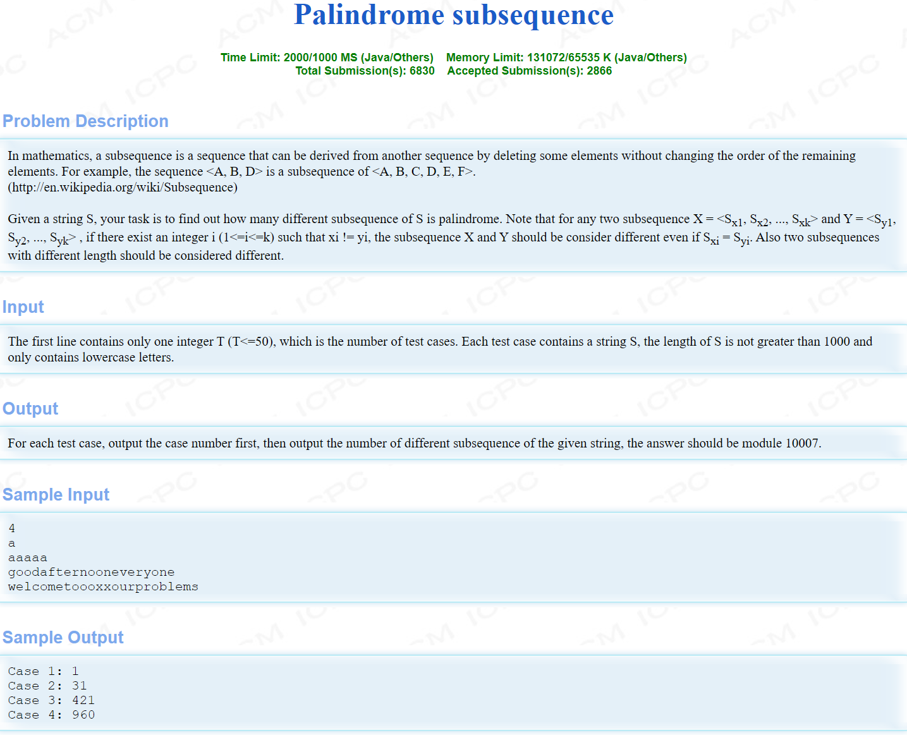

# 动态规划算法

## 概念

Dynamic Programming,DP是一种算法思想**DP算法适用于所有有重叠子问题和最优子结构性质的问题**  

**求解DP问题有三步：**

1. 定义状态
2. 状态转移
3. 算法实现

用状态转移方程处理状态，**状态往往就是问题的解**。

DP的线性和非线性：

1. 线性DP:有顺推和逆推两种方向，一般用表格表示
2. 非线性DP：例如树形DP，有两种方向，即树根->树叶 & 树叶->树根

## 最优子结构和重叠子问题

`<br><br>`

## 基础DP和递推法

example:

### 1. 最少硬币问题

```cpp
#include<bits/stdc++.h>
using namespace std;
const int VALUE = 5;  // 5种面值的硬币
const int coin[VALUE] = {1,5,10,25,50};  // 五种面值
const int money = 251;  // 定义最大金额
int Min[money];       // 不能和min函数重名了，表示面额为money时的最小硬币数
// 打表
void solve()
{
    // 初始化
    Min[0] = 0;
    for(int i=1;i<money;++i)
        Min[i] = INT_MAX;
    // 状态转移，同时防止溢出
    for(int i=0;i<VALUE;++i)
        for(int j=coin[i];j<money;++j)
            Min[j] = min(Min[j],Min[j-coin[i]]+1);
}
int main(void)
{
    int m;
    solve();
    while(cin>>m)
        cout<<Min[m]<<endl;
    return 0;
}
```

### 2. 打印最少硬币的组合

```cpp
#include<bits/stdc++.h>
using namespace std;
const int VALUE = 5;  // 5种面值的硬币
const int coin[VALUE] = {1,5,10,25,50};  // 五种面值
const int money = 251;  // 定义最大金额
int Min[money];       // 不能和min函数重名了，表示面额为money时的最小硬币数
int min_path[money];  // 路径记录表
// 打表
void solve()
{
    // 初始化
    Min[0] = 0;
    for(int i=1;i<money;++i)
        Min[i] = INT_MAX;
    // 状态转移，同时防止溢出，同时记录路径
    for(int i=0;i<VALUE;++i)
        for(int j=coin[i];j<money;++j)
        {
            if(Min[j]>Min[j-coin[i]]+1)
            {
                Min[j] = Min[j-coin[i]]+1;
                min_path[j] = coin[i];    // 达到金额j的最后一枚硬币的面额为coin[i] 
            }
        }
}
void print_path(int m)
{
    while(m)
    {
        cout<<min_path[m]<<" ";
        m=m-min_path[m];
    }
    cout<<endl;
}
int main(void)
{
    int m;
    solve();
    while(cin>>m)      // 常用技巧，读到EOF结束
    {
        cout<<Min[m]<<endl;
        print_path(m);
    }
    return 0;
}
```

### 3. 所有硬币组合数

```cpp
// 只要求方案数量，也可以用生成函数解决 //
#include<bits/stdc++.h>
using namespace std;
const int type_num = 5;
const int type[type_num] = {1,5,10,25,50};
const int money = 251;   // 最大面额
int dp[money];
void solve()
{
    // init start //
    for(int i=1;i<money;++i)
        dp[i] = 0;
    dp[0] = 1;    // 规定
    // init end //
    for(int i=0;i<type_num;++i)
        for(int j=type[i];j<money;++j)
            dp[j] = dp[j] + dp[j-type[i]];
}
int main(void)
{
    solve();
    int m;
    while(cin>>m)
        cout<<dp[m]<<endl;
    return 0;
}
```

进阶版  (hdu 2069)

```cpp
// hdu 2069 "coin change" //
// 硬币总数 num <= 100 & 金额 <= 250 //
// 用更高维的dp来记录更详细的状态 //
#include<bits/stdc++.h>
using namespace std;
const int money = 251;
const int coin_num = 101;
const int type_num = 5;
const int type[type_num] = {1,5,10,25,50};
int dp[money][coin_num];    //dp[i][j]表示使用j枚硬币达到金额i的组合数
int ans[money];    //ans[i]表示金额i的合法方案数
void solve()
{
    // init //
    dp[0][0] = 1;   // 剩余的dp[i][0] = 0
    //
    for(int i=0;i<type_num;++i)
        for(int j=1;j<coin_num;++j)
            for(int k=type[i];k<money;++k)
                dp[k][j] = dp[k][j] + dp[k-type[i]][j-1];
    //
    for(int i=0;i<money;++i)
        for(int j=0;j<coin_num;++j)
            ans[i] += dp[i][j];
}
int main(void)
{   
    solve();
    int m;
    while(cin>>m)
        cout<<ans[m]<<endl;
    return 0;
}
```

### 4. 01背包 无限背包 LCS LIS

```cpp
// 01背包 ， dp数组需要二维，记录物品取放信息和重量信息 //
// 通过滚动数组减少空间复杂度 //
#include<bits/stdc++.h>
using namespace std;
const int item_num = 20;   //最多物品数
const int weight_max = 100;  //最大背包承重
typedef struct item{
    int w;
    int v;
}Item;
Item goods[item_num+1];
int N,W;      // N个物品，W背包总承重
int dp[2][weight_max+1];   //滚动dp数组 dp[i][j]原本表示前i个物品中取，重量为j的最大价值
void solve()
{
    memset(dp[0],0,sizeof(dp[0]));   // 将dp[0][i]全部初始化为0
    int i;
    for(i=0;i<N;++i)   // 一共要执行N次该循环
    {
        for(int j=0;j<=W;j++)
        {
            if(j<goods[i+1].w)     // 防止溢出
                dp[(i+1)%2][j] = dp[i%2][j];
            else
                dp[(i+1)%2][j] = max(dp[i%2][j],dp[i%2][j-goods[i+1].w]+goods[i+1].v);
        }   
    }
    // print
    cout<<"max_value="<<dp[i%2][W]<<endl;
}
int main(void)
{
    int T;  //测试用例数
    cin>>T;
    while(T--)
    {
        cin>>N>>W;
        for(int i=1;i<=N;++i)
            scanf("%d %d",&goods[i].w,&goods[i].v);
        solve();
    }
    return 0;
}
```

```cpp
// 无限背包 //
// 易于01背包，dp数组只需一维，记录重量信息即可 //
#include<bits/stdc++.h>
using namespace std;
const int item_num = 20;
const int weight_max = 100;
typedef struct item{
    int w;
    int v;
} Item;
Item goods[item_num+1];
int N,W;
int dp[weight_max];
void solve()
{
    memset(dp,0,sizeof(dp));  
    for(int i=1;i<=W;i++)    // dp[0]=0一定成立
        for(int j=1;j<=N;j++)
        {
            if(i>=goods[j].w)
                dp[i] = max(dp[i],dp[i-goods[j].w]+goods[j].v);
        }
    cout<<"max_value="<<dp[W]<<endl;
}
int main(void)
{
    int T;
    cin>>T;
    while(T--)
    {
        cin>>N>>W;
        for(int i=1;i<=N;i++)
            scanf("%d %d",&goods[i].w,&goods[i].v);
        solve();
    }
    return 0;
}
```

LCS, longest common subsequence

```cpp

```

LIS,

```cpp

```

`<br><br>`

## 详细讲解背包问题

### 一、 01背包

**easy!**
**状态：** $dp[i][j]$ 表示前i件物品中取，总重量不超过j，所能达到的最大价值。

**初始化：** $dp[0][k] = 0 , k=0,1,2,3,...,max\_vol  , dp[k][0] = 0 , k=0,1,2,3,...,max\_item$

**状态转移：** $dp[i][j] = max\{dp[i-1][j] , dp[i-1][j-w[i]]+v[i]\}$

**代码：**

```cpp
#include<bits/stdc++.h>
using namespace std;
const int item_num = 20;   //最多物品数
const int weight_max = 100;  //最大背包承重
typedef struct item{
    int w;
    int v;
}Item;
Item goods[item_num+1];
int N,W;      // N个物品，W背包总承重
int dp[2][weight_max+1];   //滚动dp数组 dp[i][j]原本表示前i个物品中取，重量为j的最大价值
void solve()
{
    memset(dp[0],0,sizeof(dp[0]));   // 将dp[0][i]全部初始化为0
    int i;
    for(i=0;i<N;++i)   // 一共要执行N次该循环
    {
        for(int j=0;j<=W;j++)
        {
            if(j<goods[i+1].w)     // 防止溢出
                dp[(i+1)%2][j] = dp[i%2][j];
            else
                dp[(i+1)%2][j] = max(dp[i%2][j],dp[i%2][j-goods[i+1].w]+goods[i+1].v);
        }   
    }
    // print
    cout<<"max_value="<<dp[i%2][W]<<endl;
}
```

**滚动一维数组优化：(最常用的版本)**

```cpp
// W 为背包最大承重 , N 为物品数量
void solve()
{
    memset(dp,0,sizeof(dp));  
    for(int i=1;i<=N;i++)    // dp[0]=0一定成立
        for(int j=W;j>=goods[i].w;j--)
        {
            dp[j] = max(dp[j],dp[j-goods[i].w]+goods[i].v);
        }
    cout<<dp[W]<<endl;
}
```

### 二、完全背包（无限背包）

**思路一：沿用01背包思路**

**状态：** $dp[i][j]$ 表示前i个物品中取，重量不超过j，所能达到的最大价值

**初始化：** **同01背包**

**状态转移：** $dp[i][j] = {max}_{k \geq 0}\{dp[i-1][j-k*w[i]] + k*v[i]\}$

**代码**

```cpp

```

**优化**

转移方程变换：$dp[i][j-v[i]] = {max}_{k \geq 0}\{dp[i-1][j-w[i]-k*w[i]] + k*v[i]\}$

代入原来的转移方程：
$dp[i][j] = max\{dp[i-1][j] , dp[i][j-w[i]]+v[i]\}$

**优化后代码（采用一维滚动数组）**

```cpp
// W 为背包最大承重 , N 为物品数量
void solve()
{
    memset(dp,0,sizeof(dp));  
    for(int i=1;i<=N;i++)    // dp[0]=0一定成立
        for(int j=goods[i].w;j<=W;j++)
        {
            dp[j] = max(dp[j],dp[j-goods[i].w]+goods[i].v);
        }
    cout<<dp[W]<<endl;
}
```

`<br><br>`

**思路二**
每种物品可以随便取任意次，所以在dp递推时不需要已经取得的物品信息

**状态：** $dp[j]$ 表示总质量不超过j时，所能达到的最大价值

**初始化：** $dp[j]=0,j=0,1,2,3,...$

**状态转移：** $dp[j]={max}_{1 \leq k \leq max\_item}\{dp[j-w[k]]+v[k]\}$

**代码：**

```cpp
// W 为背包最大承重 , N 为物品数量
void solve()
{
    memset(dp,0,sizeof(dp));  
    for(int i=1;i<=W;i++)    // dp[0]=0一定成立
        for(int j=1;j<=N;j++)
        {
            if(i>=goods[j].w)
                dp[i] = max(dp[i],dp[i-goods[j].w]+goods[j].v);
        }
    cout<<"max_value="<<dp[W]<<endl;
}
```

### 三、多重背包

### 四、混合背包

### 五、分组背包

### 六、

## 递归DP和记忆化搜索

从 **poj 1163 "The Triangle"** 开始讲

首先介绍爆搜和线性DP方法：

**爆搜**

```cpp
#include<bits/stdc++.h>
using namespace std;
int a[105][105];   // 序号从1开始
int n;  // 层数
int ans = 0;
void dfs(int i,int j,int sum)
{
    if(i==n+1)
    {
        if(ans<sum) ans = sum;
        return;
    }
    else
    {
        dfs(i+1,j+1,sum+a[i][j]);
        dfs(i+1,j,sum+a[i][j]);
        return;
    }
}
int main(void)
{
    cin>>n;
    for(int i=1;i<=n;i++)
        for(int j=1;j<=i;j++)
            scanf("%d",&a[i][j]);
    dfs(1,1,0);
    cout<<ans<<endl;
    return 0;
}
// 本质是状态图搜索 //
```

**传统DP**

```cpp
#include<bits/stdc++.h>
using namespace std;
int a[105][105];   // 序号从1开始
int n;  // 层数
int ans = 0;
int dp[105];    // 滚动数组,dp[i][j]表示从顶点到(i,j)的路径最大和
void solve()
{
    memset(dp,0,sizeof(dp));
    dp[1] = a[1][1];   // 初始化
    for(int i=2;i<=n;i++)
    {
        for(int j=n;j>=1;j--)   // 必须倒序更新
        {
                dp[j] = max(dp[j],dp[j-1])+a[i][j];
        //  由初始化和操作过程知：若dp[j]或dp[j-1]没有意义，那么一定为0,故在数据均为非负数时此递推成立
        }
    }
    //
    for(int i=1;i<=n;i++)
        if(ans<dp[i])   ans = dp[i];
    return; 
}
int main(void)
{
    cin>>n;
    for(int i=1;i<=n;i++)
        for(int j=1;j<=i;j++)
            scanf("%d",&a[i][j]);
    solve();
    cout<<ans<<endl;
    return 0;
}
```

**传统DP优化版**

```cpp
int dp[106];  
// 滚动数组,dp[i][j]表示从顶点(i,j)到底层的路径最大和
void solve()
{
    memset(dp,0,sizeof(dp));
    for(int j=1;j<=n;j++)  //初始化
        dp[j] = a[n][j]; 
    for(int i=n-1;i>=1;i--)    // 从倒数第二层到第一层
        for(int j=1;j<=i;j++)    // 必须顺序更新
            dp[j] = max(dp[j],dp[j+1])+a[i][j];
    ans = dp[1];
    return;    
}
```

**递归暴力版（速度和爆搜差不多）**

肉眼可见的重复搜索和浪费内存

```cpp
#include<bits/stdc++.h>
using namespace std;
int a[106][106];   // 序号从1开始
int n;  // 层数
int dfs(int i,int j)     // 探索从点(i,j)到底层的最大路径和
{
    if(i==n)
        return a[i][j];    // 到达底层
    else
        return max(dfs(i+1,j),dfs(i+1,j+1))+a[i][j];
}  
int main(void)
{
    cin>>n;
    for(int i=1;i<=n;i++)
        for(int j=1;j<=i;j++)
            scanf("%d",&a[i][j]);
    cout<<dfs(1,1)<<endl;   // 递归简单直接
    return 0;
}
```

**递归优化 -> 递归 + 记忆化搜索**

```cpp
int dp[106][106];
// dp全部初始化为-1 ！！
int dfs(int i,int j)     // 探索从点(i,j)到底层的最大路径和
{
    if(i==n)
        return a[i][j];    // 到达底层
    if(dp[i][j]>=0)
        return dp[i][j];   // 记忆！计算过了就不计算了！
    else
        return dp[i][j]=max(dfs(i+1,j),dfs(i+1,j+1))+a[i][j];
}  
```

<br>

### 记忆化搜索

**优势：** 逻辑更加简洁明了

`<br><br>`

## 区间DP

### 石子合并

**一、 链状**  

**状态：** $dp[i][j]$ 表示区间$[i,j]$ 所有石子堆合并的最小花费  
**初始化：** $dp[i][i]=0\qquad i=1,2,3,\dots$   
**转移方程：** $dp[i][j]={min}_{i\leq k \leq j-1}\{dp[i][k]+dp[k+1][j]\}+sum(i,j)$  
其中，$sum(i,j)$表示第i堆石子到第j堆石子的数量总和  

**代码（递归+记忆化搜索）-> O(n^3)**
```cpp
// 石子合并(链状) ,求最小花费//
// 递归 + 记忆化搜索 //
#include<bits/stdc++.h>
using namespace std;
int dp[301][301];
int n;
int stone[301];
int sum[301];   
int dfs(int i,int j)
{
    if(dp[i][j]>0)  return dp[i][j];
    else if(i==j)   return 0;
    else
    {
        int Min = INT_MAX;
        for(int k=i;k<j;k++)
        {
            dp[i][k] = dfs(i,k);
            dp[k+1][j] = dfs(k+1,j);
            if(Min>dp[i][k]+dp[k+1][j]) Min = dp[i][k]+dp[k+1][j];
        }
        return dp[i][j] = Min + sum[j] - sum[i-1];
    }
}
int main(void)
{
    cin>>n;
    sum[0] = 0;
    for(int i=1;i<=n;i++)
    {
        scanf("%d",stone+i);
        sum[i] = sum[i-1] + stone[i];
    }
    memset(dp,0,sizeof(dp));
    cout<<dfs(1,n)<<endl;
    return 0;
}
```

**代码（循环版+平行四边形优化）-> 接近O(n^2)**
```cpp
// 石子合并(链状) ,求最小花费//
// 循环 + 平行四边形优化 //
#include<bits/stdc++.h>
using namespace std;
int dp[301][301];
int n;
int stone[301];
int sum[301]; 
int s[301][301];  // s[i][j]用来记录区间[i,j]的最佳分割点
int Minval()
{
    // 初始化
    for(int i=1;i<=n;i++)
    {
        dp[i][i] = 0;
        s[i][i] = i;
    }
    //
    for(int len=1;len<n;len++)
    {
        for(int i=1;i<=n-len;i++)
        {
            int j = i + len;
            dp[i][j] = INT_MAX;
            for(int k=s[i][j-1];k<=s[i+1][j];k++)   // 平行四边形优化
            {
                if(dp[i][k]+dp[k+1][j]+sum[j]-sum[i-1]<dp[i][j])
                {
                    dp[i][j] = dp[i][k]+dp[k+1][j]+sum[j]-sum[i-1];
                    s[i][j] = k;    // 记录最佳分割点
                }
            }
        }
    }
    //
    return dp[1][n];
}
int main(void)
{
    cin>>n;
    sum[0] = 0;
    for(int i=1;i<=n;i++)
    {
        scanf("%d",stone+i);
        sum[i] = sum[i-1] + stone[i];
    }
    cout<<Minval()<<endl;
    return 0;
}
```

<br>

**二、环状**  

转换为2*n长度的链状合并石子  

**代码**  
```cpp
// 环形石子合并 ， 求最大和最小花费 //
// 看作长为2*n的链即可 //
#include<bits/stdc++.h>
using namespace std;
int stone[250];
int n;
int dp[250][250];  // 记录最小花费
int dp2[250][250]; // 记录最大花费
int ans1, ans2;
int sum[250];  // 用来记录前缀和
int dfs(int i,int j)
{
    if(i==j)
        return 0;   // 最小区间
    else if(dp[i][j]>0)
        return dp[i][j]; // 记忆，已经计算过了
    else   
    {
        int Min = INT_MAX;
        for(int k=i;k<=j-1;k++)
        {
            dp[i][k] = dfs(i,k);
            dp[k+1][j] = dfs(k+1,j);
            if(Min>dp[i][k]+dp[k+1][j]) Min = dp[i][k]+dp[k+1][j];
        }
        return dp[i][j] = Min + sum[j]-sum[i-1];
    } 
}
int dfs2(int i,int j)
{
    if(i==j)    return 0;
    else if(dp2[i][j]>0) return dp2[i][j];
    else
    {
        int Max = 0;
        for(int k=i;k<=j-1;k++)
        {
            dp2[i][k] = dfs2(i,k);
            dp2[k+1][j] = dfs2(k+1,j);
            if(Max<dp2[i][k]+dp2[k+1][j]) Max = dp2[i][k]+dp2[k+1][j];
        }
        return dp2[i][j] = Max + sum[j] - sum[i-1];
    }
}
int main(void)
{
    cin>>n;
    for(int i=1;i<=n;i++)
    {
        scanf("%d",stone+i);
        stone[n+i] = stone[i];
    }
    // 计算前缀和
    sum[0] = 0;
    for(int i=1;i<=2*n;i++)
        sum[i] = sum[i-1]+stone[i];
    // end
    memset(dp,0,sizeof(dp));
    memset(dp2,0,sizeof(dp2));
    dfs(1,2*n);
    dfs2(1,2*n);
    ans1 = INT_MAX;
    ans2 = 0;
    for(int i=1;i<=n;i++)
    {
        ans1 = min(ans1,dp[i][n-1+i]);
        ans2 = max(ans2,dp2[i][n-1+i]);
    }
    cout<<ans1<<endl<<ans2<<endl;
    return 0;
}
```

<br><br>

### 回文串

**状态：**  $ dp[i][j]$ 表示 将子串$s[i,j]$变为回文串的最小代价 

**初始化：** $dp[i][i+1]=min\{w[i],w[i+1]\} \qquad dp[i][i]=0$  

**转移方程：** 
$$
dp[i][j]=
\begin{cases}
    dp[i-1][j-1] & \textit{if\quad $s[i]=s[j]$}\\
    min\{dp[i+1][j]+w[i],dp[i][j-1]+w[j]\} & \textit{if\quad $s[i] \neq s[j]$} \\
\end{cases}
$$
**说明：**  

**代码**  
```cpp
// poj 3280 "Cheapest Palindrome" //
// 区间DP ， 回文串 //
#include<bits/stdc++.h>
using namespace std;
char s[2100];
int dp[2100][2100];
int n,m;      // 有n个不同的小写字母，长度为m的字符串
int cost[100];   // add & del 效果相同，贪心取最小代价的操作即可
int dfs(int i,int j)
{
    if(j<=i)    return 0;
    else if(dp[i][j]>0) return dp[i][j];
    else if(s[i]==s[j]) return dp[i][j] = dfs(i+1,j-1);
    else    return dp[i][j] = min(dfs(i+1,j)+cost[s[i]],dfs(i,j-1)+cost[s[j]]);
}
int main(void)
{
    cin>>n>>m;
    cin>>s;
    int x,y;
    char ch;
    for(int i=0;i<n;i++)
    {
        cin>>ch>>x>>y;
        cost[ch] = min(x,y);
    }
    cout<<dfs(0,m-1)<<endl;
    return 0;
}
```


### 回文子串数量统计 (easy!)

**状态：** $dp[i][j]$ ,bool type, 表示子串 $[i,j]$ 是否为回文字符串   
**转移方程：**    
$$dp[i][j]=
\begin{cases}
    dp[i-1][j-1] & \textit{if $s[i]=s[j]$}\\
    false & \textit{if $s[i]\neq s[j]$} \\
    true & \textit{if $j-i=0\quad$}\\ 
\end{cases}$$

### 回文子序列
**hdu 4632 "Palindrome Subsequence"**   


**状态：**  $dp[i][j]$ 表示子串$s[i,j]$的回文子序列数    
**初始化：**  
**状态转移：**   
**代码：**   
```cpp
// hdu 4632 "Palindrome Subsequence" //
// 区间DP //
// TLE版本 ， 记忆化搜索虽然时间复杂度和循环版一样，但是常数过高，导致超时//
#include<bits/stdc++.h>
using namespace std;
int T;
int dp[1001][1001];
char s[1002];
const int mod = 10007;
int ans[51];
int dfs(int i,int j)
{
    if(i>j) return 0;
    else if(i==j)    return 1;
    else if(dp[i][j]>0) return dp[i][j];
    else 
    {
        if(s[i]==s[j])
        return dp[i][j] = (dfs(i,j-1)+dfs(i+1,j)+1)%mod;  //这个1十分关键
        else
        return dp[i][j] = (dfs(i,j-1)+dfs(i+1,j)-dfs(i+1,j-1))%mod;
    }
}
int main(void)
{
    cin>>T;
    for(int i=1;i<=T;i++)
    {
        scanf("%s",s);
        memset(dp,0,sizeof(dp));
        int len = strlen(s);
        ans[i] = dfs(0,len-1);
    }
    // print
    for(int i=1;i<=T;i++)
        printf("Case %d: %d\n",i,ans[i]);
    return 0;
}
```
**代码（循环版）**
```cpp
#include<bits/stdc++.h>
using namespace std;
const int N = 1e3+100;
const int mod = 1e4+7;
int dp[N][N];
char s[N];
int main(){
	int t;
	scanf("%d",&t);
	for(int o = 1; o <= t; o++){
		memset(dp,0,sizeof(dp));
		scanf("%s",s+1);
		int len = strlen(s+1);
		for(int i = 1; i <= len; i++) dp[i][i]=1;
		for(int i = 2; i <= len; i++){
			for(int l = 1; l <= len-i+1; l++){
				int r = l+i-1;
				dp[l][r]=(dp[l][r-1]+dp[l+1][r]-dp[l+1][r-1]+mod)%mod;
				if(s[l]==s[r]) dp[l][r]=(dp[l][r]+dp[l+1][r-1]+1)%mod;
			}
		}
		printf("Case %d:",o);
		printf("%d\n",dp[1][len]);
	}
	return 0;
}
```
<br><br>

## 树形DP
树是一个拥有良好递归性质的数据结构，使用DP的逻辑比较好懂  

### 谈一谈怎么存储树结构

常用存储方法：  
- 邻接表（图都可以用这个存）
- 孩子表示法（类似于邻接表）  
  差别：邻接表存无向图时，没有父子优先级；孩子表示法存树时，有父子关系。
- 孩子兄弟表示法（用二叉树存储）
- 孩子双亲表示法

具体方法根据数据输入方式和用途做决定  

### 例题
一、hdu 1520 "Anniversary Party"  

**状态：** $dp[i][0],dp[i][1]$ 分别表示以i为根节点向下遍历，不选用和选用节点i的情况下，可得到的最大权值和   
**初始化：** 树叶i，$dp[i][0]=0,dp[i][1]=value[i]$  
**转移方程：**
$$
\begin{cases}
    dp[i][0] = \sum_{j \in child(i)}max\{dp[j][0],dp[j][1]\} \\
    dp[i][1] = \sum_{j \in child(i)}dp[j][0] \quad +\quad value[i] \\
\end{cases}
$$

**代码->树形DP**  
每个节点都刚好遍历一遍，时间复杂度为O(n)  
```cpp
// hdu 1520 "Aniversary Party" //
// 树形DP //
#include<bits/stdc++.h>
using namespace std;
const int N = 6005; //最多节点数
vector<int> tree[N];  // 孩子表示法
int value[N]; // 权值
int n;   // 点的数量
int father[N];  // 用于寻找根节点
int dp[N][2];  // dp[i][0]和dp[i][1]分别表示不选用和选用节点i，以i为根节点，可得到的最大权值和
void dfs(int x)
{
    dp[x][0] = 0;
    dp[x][1] = value[x];
    for(int i=0;i<tree[x].size();i++)
    {
        int child = tree[x][i];
        dfs(child);    // 先深搜一下，使得后面有值可加
        dp[x][0] += max(dp[child][1],dp[child][0]);
        dp[x][1] += dp[child][0];
    }
    return;
} 
int main(void)
{
    while(~scanf("%d",&n))
    {
        for(int i=1;i<=n;i++)
        {
            scanf("%d",value+i);
            tree[i].clear();  // 初始化
            father[i] = -1;   // 初始化
        }
        int a,b;
        while(1)
        {
            scanf("%d %d",&a,&b);
            if(a==0&&b==0)  break;
            tree[b].push_back(a);
            father[a] = b;    // b是a的父亲
        }
        int root=1;
        while(father[root]!=-1) root = father[root];  // 寻找根节点
        dfs(root);
        cout<<max(dp[root][0],dp[root][1])<<endl;
    }
    return 0;
}
```
<br>

二、hdu 2196 "Computer"  


