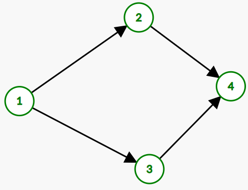

# 图论

## 基础定义


## 图的存储


## 图的遍历与图的连通性

遍历图的 **全部顶点**：
- DFS
- BFS

连通性：任选一个点，开始BFS或DFS，如果能够遍历所有顶点，那么该图是联通的，否则不联通。  

非联通图的遍历：设想一个虚拟顶点v与该图的每一个顶点都相邻，从点v开始DFS或BFS。    
**代码**
```cpp
// DFS
for(int i=1;i<=n;i++)
    dfs(i);

// BFS
for(int i=1;i<=n;i++)
    bfs(i);

// 记得用vis数组记录，避免重复访问
```

**遍历的模板**  
```cpp
// DFS
bool dfs(int u)
{
    vis[u] = 1    // 该顶点顺利访问
    {...} return true;   // 顺利结束
    {...} return false;   // 出现错误（根据优先级可以与前面颠倒过来）
    {
        for(auto to: graph[u])
        {
            if(!vis[to])
            {
                ...
                return dfs(to);
            }
        }
    } 
    {...}   // 搜索完后的一些操作
}

// BFS


```

## 拓扑排序

### 概念

背景：例如一些事件有优先级或有依赖性，如 1 -> (2,3) -> 4,即事件1高于时间2、3，事件2、3高于事件4, 转化为图语言有  
  

**可以拓扑排序的充要条件：**  DAG（有向无环图）  
相关结论：  
- 如果一个有向图没有入度为0的点，那么必不可能为DAG **（反证法即可）**   


- - - - - -

### 基于BFS
**伪代码**  
```cpp
add vertices with no incoming edge to queue Q
while !Q.empty // Q is a normal queue
  u = Q.front, Q.pop, add u to the front of list
  for each neighbor v of u
    delete edge u → v
    if v has no incoming edge, add v to queue
```
**代码示例**
```cpp
bool bfs()
{
    int tot = 0;
    queue<int> q;
    for(int u=1;u<=n;u++)
        if(!in[u])  q.push(u);   // 入度为0的点入队
    while(!q.empty())
    {
        int u = q.front();
        q.pop();
        a[++tot] = u;  // 一般以出队序为拓扑序
        for(auto v:g[u])
        {
            in[v]--;
            if(!in[v])  q.push(v);
        }
    }
    // 如果一定为DAG，则下面的代码不需要
    // 用于判定是否是 DAG
    if(tot==n)
        return true;   // 是DAG
    else    return false;   // 不是DAG
}
```

### 基于DFS  

### 一些思考   

