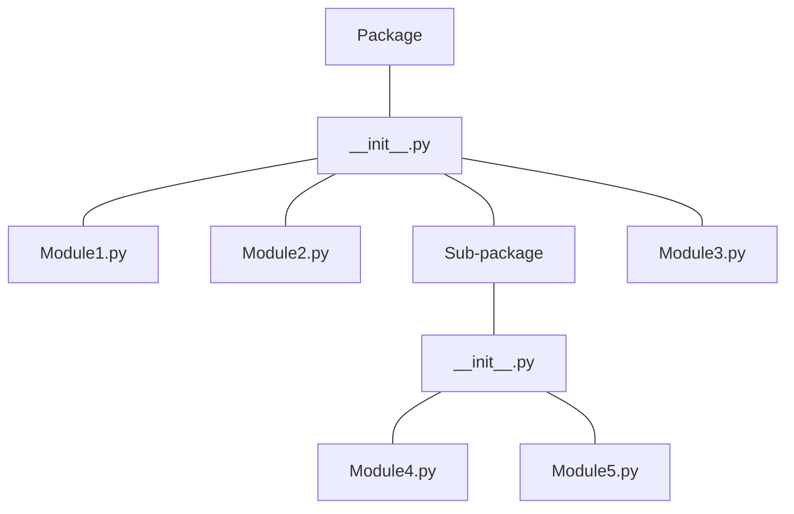

# python 多文件

## package & module

一个模块 module 是以一个 `.py` 文件为载体：

- 内部包含很多函数（function），类（class）

一个包 package 是以一个文件目录为载体：

-  内部包含很多模块（都是 `.py` 文件） 
-  包目录下一定要有 `__init__.py` 文件（可以为空文件），这是包的标识性文件

## 基本框架

一种结构：

- project 01
    - main.py
    - module 01.py
        - class m1c1
        - class m2c2
        - function 1
        - ...
    - module 02.py
        - class m2c1
        - class m2c2
        - function 1
        - ...
    - ...

更加标准的结构

**Structure of Packages**

### 基础知识

- python `import` 一个包的时候，会自动按照顺序执行这个包的内容（并不是并行，就如同调用函数一般）

- `import` 只能导入包或者模块

## 合集

> [Python中“if __name__=='__main__':”详细解析 - 知乎 (zhihu.com)](https://zhuanlan.zhihu.com/p/340997807)
>

