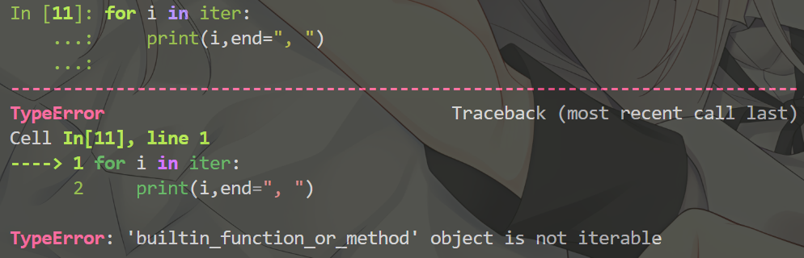
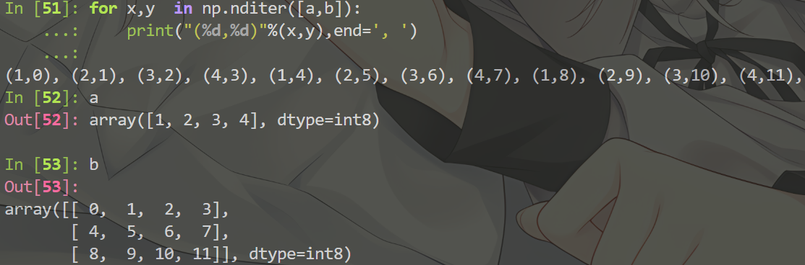

# Numpy 教程

>[教程](https://www.runoob.com/numpy/numpy-tutorial.html)

## Ndarray 对象

### 梗概

调用`numpy.array()`函数创建一个 ndarray 对象
函数原型：
`numpy.array(object, dtype = None, copy = True, order = None, subok = False, ndmin = 0)`

|名称 |描述 |
|:-----|:----|
| object  | 数组或嵌套的数列 |
|dtype|数组元素的数据类型，可选|
|copy| 对象是否需要复制， 可选|
|order|创建数组的样式，C为行方向，F为列方向，A为任意方向（默认）|
|subok|默认返回一个与基类类型一致的数组|
|ndmin|指定生成数组的最小维度|

**最小维度ndim：**
```py
# 最小维度  
import numpy as np 
a = np.array([1, 2, 3, 4, 5], ndmin =  2)  
print (a)
```
输出结果如下：
```py
[[1 2 3 4 5]]
```

**dtype参数：**
```py
# dtype 参数  
import numpy as np 
a = np.array([1,  2,  3], dtype = complex)  
print (a)
```
输出结果：
```py
[1.+0.j 2.+0.j 3.+0.j]
```

### 属性

|属性|说明|
|:---|:---|
|ndarray.ndim|秩，即轴的数量或维度的数量|
|ndarray.shape|形状，元组形式储存|
|ndarray.size|元素的总个数|
|ndarray.dtype|元素的数据类型|
|ndarray.itemsize|元素的大小，以字节为单位|
|ndarray.flags|对象的内存信息|
|ndarray.real|元素的实部|
|ndarray.imag|元素的虚部|
|ndarray.data|包含实际数组元素的缓冲区，由于一般通过数组的索引获取元素，所以一般不需要使用该属性|

#### ndarray.flags


### 创建

1. 创建一个指定形状(shape)、数据结构(dtype)且未初始化的数组
`numpy.empty(shape, dtype = float, order = 'C')`
数组元素为随机值，因为它们没有被初始化

2. 创建指定大小的数组，元素用0来填充
`numpy.zeros(shape, dtype= float , order = 'C')`

3. 创建指定大小的数组，元素用1来填充
`numpy.ones(shape, dtype= None, order = 'C')`

4. 创建一个与给定数组具有相同的形状的数组，数组用0来填充
`numpy.zeros_like(a, dtype=None, order='K', subok=True, shape=None)`
order 默认为 'K' (保留输入数组的储存顺序)
subok 是否允许返回子类，如果为 True ， 则返回一个子类对象，否则返回一个与 a 数组具有相同数据类型和存储顺序的数组
shape 创建的数组的形状，如果不指定，则默认为 a 数组的形状

5. 同上
`numpy.ones_like(a, dtype=None, order='K', subok=True, shape=None)`

### 从已有数组创建数组
1. `numpy.asarray()` 类似于 `numpy.array()` ，但是只有三个参数，比后者少两个，并且更加常用
`numpy.asarray(a, dtype = None, order = None)`

2. `numpy.frombuffer()` 实现动态数组
   `numpy.frombuffer()`接受buffer输入参数，以流的形式读入转换为 ndarray 对象`numpy.frombuffer(buffer, dtype = float, count = -1, offset = 0)`
   
   > 注意：buffer 是字符串的时候，Py3 默认 str 是 Unicode 类型， 所以要转成 bytestring 在原字符串前加上 b

实例：
```py
import numpy as np 
 
s =  b'Hello World' 
a = np.frombuffer(s, dtype =  'S1')  
print (a)
```
输出结果：
```py
[b'H' b'e' b'l' b'l' b'o' b' ' b'W' b'o' b'r' b'l' b'd']
```

3. `numpy.fromiter()` 从可迭代对象中建立 ndarray 对象，返回**一维数组**
   `numpy.fromiter(iterable, dtype, count=-1)`

实例：
```py
import numpy as np 

# 使用 range 函数创建列表对象  
list=range(5)
it=iter(list)

# 使用迭代器创建 ndarray 
x=np.fromiter(it, dtype=float)
print(x)
```
输出结果：
```py
[0. 1. 2. 3. 4.]
```

### 从数值范围创建数组

1. `numpy.arange(start, stop, step, dtype)` $[start,stop)$范围，$step$为步长，默认为1

2. `np.linspace(start, stop, num=50, endpoint=True, retstep=False, dtype=None)`endpoint 为 True 时，为闭区间，否则为左闭右开区间；num为等步长的样本个数；retstep 为 True 时，生成的数组中会显示间距，反之不显示

3. `np.logspace(start, stop, num=50, endpoint=True, base=10.0, dtype=None)` base 为底数；序列的起始值为 base\*\*start ,终止值为 stop\*\*stop

### 切片和索引

大部分与 py 的索引和切片相同

### 高级索引

1. 整数数组索引
```python
import numpy as np 
 
x = np.array([[1,  2],  [3,  4],  [5,  6]]) 
y = x[[0,1,2],  [0,1,0]]  
print(y)
```
输出结果为
```python
[1  4  5]
```

**注意**：`x[1, :]` 与 `x[1][:]` 的效果并不相同，请使用前者

2. 布尔索引

案例1：
```python
import numpy as np 
 
x = np.array([[  0,  1,  2],[  3,  4,  5],[  6,  7,  8],[  9,  10,  11]])  
print ('我们的数组是：')
print (x)
print ('\n')
# 现在我们会打印出大于 5 的元素  
print  ('大于 5 的元素是：')
print (x[x >  5])
```
输出为
```python
我们的数组是：
[[ 0  1  2]
 [ 3  4  5]
 [ 6  7  8]
 [ 9 10 11]]


大于 5 的元素是：
[ 6  7  8  9 10 11]
```

案例2：
```python
import numpy as np 
 
a = np.array([np.nan,  1,2,np.nan,3,4,5])  
print (a[~np.isnan(a)])
```
输出为：
```python
[ 1.   2.   3.   4.   5.]
```

3. 花式索引

### Broadcast 特性

pass

### 数组操作

1. `a.reshape(newshape , order='C')` 对nadarray对象使用reshape方法,**返回副本**
   `numpy.reshape(arr , newshape , order='C')` np库函数，也是**返回副本**
2. `a.astype()`  更改nadarray对象的数据类型，并且返回副本，所以要使用 `a=a.astype(newtype)` 进行更新
3. `a.copy()` 返回a的副本
   如果直接使用 `b = a` 进行赋值，那么只是赋值了一个指针而已，操作b等价于操作a，而 copy 方法会新建一个内存块，并且返回对象指针
   故使用 `b = a.copy()` 或 `b = a[...]` 或 `b = a[:]` 进行赋值
4. `a.flat` 是一个数组元素迭代器 

实例：
```python
import numpy as np
 
a = np.arange(9).reshape(3,3) 
print ('原始数组：')
for row in a:
    print (row)
 
#对数组中每个元素都进行处理，可以使用flat属性，该属性是一个数组元素迭代器：
print ('迭代后的数组：')
for element in a.flat:
    print (element)
```
输出结果：
```python
原始数组：
[0 1 2]
[3 4 5]
[6 7 8]
迭代后的数组：
0
1
2
3
4
5
6
7
8
```

5. `a.flatten(order='C')` & `numpy.ravel(a, order='C')` & `a.ravel(a, order='C')` 返回一份展开的数组副本

实例：
```python
import numpy as np
 
a = np.arange(8).reshape(2,4)
 
print ('原数组：')
print (a)
print ('\n')
# 默认按行
 
print ('展开的数组：')
print (a.flatten())
print ('\n')
 
print ('以 F 风格顺序展开的数组：')
print (a.flatten(order = 'F'))
```
输出结果：
```python
原数组：
[[0 1 2 3]
 [4 5 6 7]]


展开的数组：
[0 1 2 3 4 5 6 7]


以 F 风格顺序展开的数组：
[0 4 1 5 2 6 3 7]
```

6. 翻转数组 
   ...(未完)

7. 修改数组维度
   
8. 连接数组

9. 分割数组

10. 数组元素的添加和删除
    |函数|元素及描述|
    |:---|:-------|
    |numpy.resize(arr, newshape)|返回指定形状的新数组（同reshape）|
    |numpy.append(arr, values, axis=None)||
    |numpy.insert(arr, obj, values, axis)||
    |numpy.delete(arr, obj, axis)||
    |numpy.unique(arr, return_index, return_inverse, return_counts)||


### ndarray对象 迭代器

ndarray对象无法使用py自带的迭代器函数`iter()`


`numpy.nditer(a)` 函数返回ndarray对象的 a 的迭代器
`numpy.nditer(nadarrayObj, order='K', op_flags=['read_only'],flags=)`
|属性|说明|
|:----|:----|
|order|规定遍历顺序，'K'是默认原对象的存储顺序，可选'C'行顺序 & 'F'列顺序|
|flags|...|
|op_flags|默认['read-only'],可选['onlywrite'] & ['readwrite'],选择后两者，可以修改ndarray对象|


**广播迭代：**

**也可以对更多对象同时迭代**
**多对象也可以使用元组传入**

### 位运算

### 字符串函数

### Numpy 数学函数

`np.around(a,decimals)`  同math库的round函数
`np.floor()  np.ceil()`  两类高斯函数
`np.sin()` 和 `np.arcsin()` 等一系列三角函数、反三角函数，都是用弧度制进行运算
使用 `np.degrees()` 和 `np.radians()` 来转换弧度制和角度制 

### Numpy 算术函数

`np.add(a,b)`  可以直接用 `a+b` 代替
`np.subtract(a,b)`  可以直接用 `a-b` 代替
`np.multiply(a,b)`  可以直接用 `a*b` 代替
`np.divide(a,b)`  可以直接用 `a/b` 代替  （这个除法是c风格的！）
`np.power(a,b)`  可以直接用 `a**b` 代替
`np.mod(a,b)`  可以直接用 `a%b` 代替
`np.reciprocal(a,b)`  可以用 `1/a` 或 `1./a` 代替 （这个函数还是c风格的！）


### Numpy 统计函数

`numpy.amin(a, axis=None, out=None, keepdims=<no value>, initial=<no value>, where=<no value>)`
计算数组中的元素沿指定轴的最小值
关于参数：
- a 输入的数组，可以为 ndarray 或 类似与ndarray的对象
- axis 可选参数，用于指定在哪个轴上计算最小值，如果不提供此值，则返回真个数组的最小值。可以是一个整数表示轴的索引，也可以是一个元组表示多个轴（轴从0开始计数）
- out 可选参数，可以指定结果的存储位置
- keepdims 可选参数，如果为True，将会保持结果数组的维度数目与输入数组相同。如果为False（默认） 则会取出计算后维度为1的轴
- initial 可选参数，用于指定一个初始值，然后在数组的元素上计算最小值
- where 可选参数，一个布尔数组，用于指定仅考虑满足条件的元素

实例：
```python
import numpy as np 

a = np.array([[3,7,5],[8,4,3],[2,4,9]])  
print ('我们的数组是：')
print (a)
print ('\n')
print ('调用 amin() 函数：')
print (np.amin(a,1))
print ('\n')
print ('再次调用 amin() 函数：')
print (np.amin(a,0))
print ('\n')
print ('调用 amax() 函数：')
print (np.amax(a))
print ('\n')
print ('再次调用 amax() 函数：')
print (np.amax(a, axis =  0))
```
输出结果：
```python
我们的数组是：
[[3 7 5]
 [8 4 3]
 [2 4 9]]


调用 amin() 函数：
[3 3 2]


再次调用 amin() 函数：
[2 4 3]


调用 amax() 函数：
9


再次调用 amax() 函数：
[8 7 9]
```
`numpy.amax()` 同上
`numpy.ptp()`  计算数组中元素最大值和最小值的差（极差） ，使用方法同上
`numpy.median()` 计算中位数，使用方法基本同上
`numpy.median(a, axis=None, out=None, overwrite_input=False, keepdims=<no value>)`
但是一个参数 overwrite_input 如果为True，则允许在计算中使用输入数组的内存，可以提高效率，但是可能修改输入数组的内容
`numpy.mean()` 计算算术平均值,使用方法基本同上
`numpy.mean(a, axis=None, dtype=None, out=None, keepdims=<no value>)`
参数dtype指定输出的数据类型，如果不提供，则会自动选择合适的类型


`numpy.percentile(a, q, axis)` 
- a 输入数组
- q 要计算的百分位数， 在 0~100 之间
- axis 沿着他计算百分位数的轴
实例：
```python
import numpy as np 
 
a = np.array([[10, 7, 4], [3, 2, 1]])
print ('我们的数组是：')
print (a)
 
print ('调用 percentile() 函数：')
# 50% 的分位数，就是 a 里排序之后的中位数
print (np.percentile(a, 50)) 
 
# axis 为 0，在纵列上求
print (np.percentile(a, 50, axis=0)) 
 
# axis 为 1，在横行上求
print (np.percentile(a, 50, axis=1)) 
 
# 保持维度不变
print (np.percentile(a, 50, axis=1, keepdims=True))
```
输出结果：
```python
我们的数组是：
[[10  7  4]
 [ 3  2  1]]
调用 percentile() 函数：
3.5
[6.5 4.5 2.5]
[7. 2.]
[[7.]
 [2.]]
```


`numpy.average(a, axis=None, weights=None, returned=False)` 平局值函数
weights 可选参数，用于指定对应数据点的权重，如果不提供，则默认为等权重
returned 可选参数，如果为True，将同时返回加权平均值的权重总和（以元组形式）
实例：
```python
import numpy as np 
 
a = np.array([1,2,3,4])  
print ('我们的数组是：')
print (a)
print ('\n')
print ('调用 average() 函数：')
print (np.average(a))
print ('\n')
# 不指定权重时相当于 mean 函数
wts = np.array([4,3,2,1])  
print ('再次调用 average() 函数：')
print (np.average(a,weights = wts))
print ('\n')
# 如果 returned 参数设为 true，则返回权重的和  
print ('权重的和：')
print (np.average([1,2,3,  4],weights =  [4,3,2,1], returned =  True))
```
结果：
```python
我们的数组是：
[1 2 3 4]


调用 average() 函数：
2.5


再次调用 average() 函数：
2.0


权重的和：
(2.0, 10.0)
```

标准差 `numpy.std()`  
方差 `numpy.var()`  


### 排序、条件筛选

> [资料](https://www.runoob.com/numpy/numpy-sort-search.html)

`numpy.sort(a, axis, kind, order)`  返回排好序的**副本**
- a 要排序的数组
- axis 沿着它排序数组的轴，如果没有则会被展开，沿着最后的轴排序， axis=0 按列排序， axis = 1 按行排序
- kind 默认 'quicksort'
- order 如果包含字段，则是要排序的字段

`numpy.argsort()` 返回排好序后的索引值的**副本**
`numpy.lexsort()` 不知道，艾草（

条件筛选
`numpy.where()` 返回输入数组中满足给定条件的元素的索引
`numpy.extract()` 根据某个条件从数组中抽取元素，返回满足条件的元素


## 矩阵库

`numpy.matlib` 库
`numpy.matlib.empty(shape, dtype, order)`  
`numpy.matlib.zeros(shape, dtype, order)`
`numpy.matlib.ones(shape, dtype, order)`
`numpy.matlib.eye(n, M, k, dtype)`  返回一个对角线上全是1，其余位置全为0的矩阵
- n 返回矩阵的行数
- M 返回矩阵的列数，默认为n
- k 对象线的索引
- dtype 数据类型
`numpy.matlib.identity(n, dtype)` 返回n阶单位方阵
`numpy.matlib.rand(shape, dtype)` 给定大小的矩阵，数据是随机填充的,每个位置都是0~1浮点数的随机值

`np.matrix(a)` 返回一个matrix对象，转换函数

## Linear Algebra

[线性代数相关库](https://www.runoob.com/numpy/numpy-linear-algebra.html)

