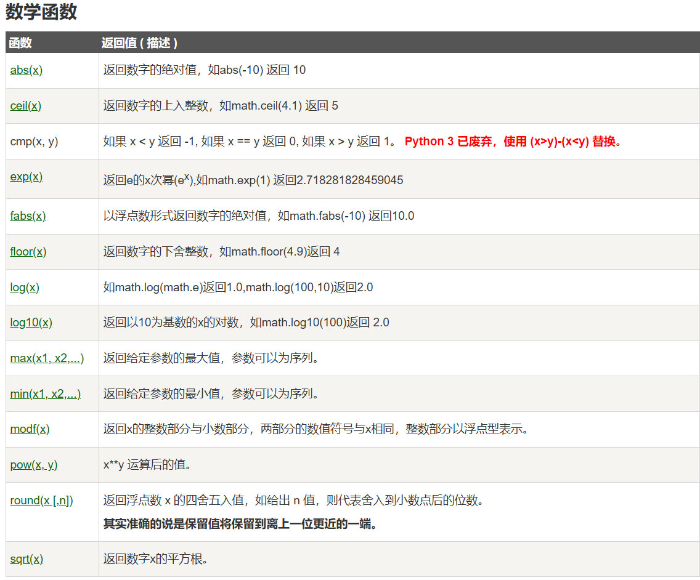
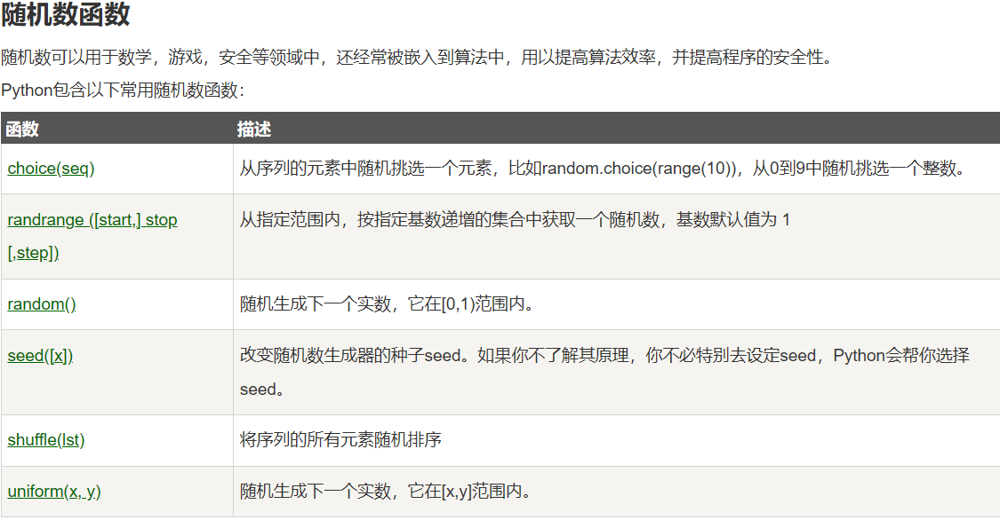
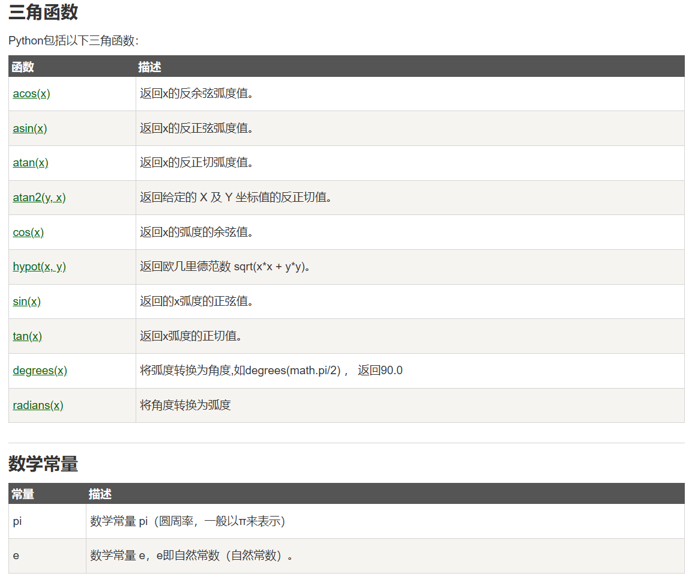

# python 3

[基础教程 3.11.5 官方docs](https://docs.python.org/zh-cn/3/tutorial/index.html)

## 基础语法

### 一个用的很多的东西 —— sorted

`sorted(iterable, cmp=None, key=None, reverse=False)`
对于所有可迭代对象多可以排序！！ 并且返回一个**副本**
使用实例：
```python
>>>a = [5,7,6,3,4,1,2]
>>> b = sorted(a)       # 保留原列表
>>> a 
[5, 7, 6, 3, 4, 1, 2]
>>> b
[1, 2, 3, 4, 5, 6, 7]
 
>>> L=[('b',2),('a',1),('c',3),('d',4)]
>>> sorted(L, cmp=lambda x,y:cmp(x[1],y[1]))   # 利用cmp函数
[('a', 1), ('b', 2), ('c', 3), ('d', 4)]
>>> sorted(L, key=lambda x:x[1])               # 利用key
[('a', 1), ('b', 2), ('c', 3), ('d', 4)]
 
 
>>> students = [('john', 'A', 15), ('jane', 'B', 12), ('dave', 'B', 10)]
>>> sorted(students, key=lambda s: s[2])            # 按年龄排序
[('dave', 'B', 10), ('jane', 'B', 12), ('john', 'A', 15)]
 
>>> sorted(students, key=lambda s: s[2], reverse=True)       # 按降序
[('john', 'A', 15), ('jane', 'B', 12), ('dave', 'B', 10)]
>>>
```


### py保留字 & 注释 & 缩进

```python
import keyword
print(keyword.kwlist)

#['False', 'None', 'True', 'and', 'as', 'assert', 'async', 'await', 'break', 'class', 'continue', 'def', 'del', 'elif', 'else', 'except', 'finally', 'for', 'from', 'global', 'if', 'import', 'in', 'is', 'lambda', 'nonlocal', 'not', 'or', 'pass', 'raise', 'return', 'try', 'while', 'with', 'yield']
```

```python
# 这是一个单行注释
'''
这里是
一个多行注释
本质是一个字符串字面量
'''
```

**缩进**：
python 使用缩进表示代码块，**所以对于缩进的要求十分严格**

**多行语句**：
语句很长，可以使用反斜杠`\`来实现多行语句
```python
total = item_one + \
        item_two + \
        item_three
```

**同一行显示多条语句**
使用分号`;`来分隔

```python
#!/usr/bin/python3
 
import sys; x = 'runoob'; sys.stdout.write(x + '\n')
```

### basic data type of py & variable

七个常见数据类型：
- Number
- String
- bool
- List
- Tuple
- Set
- Dictionary

六个标准数据类型：
- **不可变** : Number , String , Tuple
- **可变** : List , Dictionary , Set

一些高级数据类型 ： 如 bytes

数据类型的判断函数： 
`type(x)` output the type of x
`isinstance(varname,typename)` to check whether the type of var is equal to typename , output True or False

- `type()`不会认为子类是一种父类类型
- `isinstance()`会认为子类是一种父类类型

变量的删除
`del`关键字
一个实例：
```python
x = 1
y = 10
del x,y
```

#### Number

##### 基础类型和转化

- **int** 整数类型，表示长整形
- **bool** 布尔类型，True or False
- **float** 浮点数，例如： 1.23 , 1E-2 等
- **complex** 复数, 例如： 1+2j , 2+2.2j 等

`int(a)`  返回a的整数形式
`bool(a)` `float(a)`  同理
`complex(a)` 返回一个以a为实部，0为虚部的复数
`complex(a,b)` 返回一个以a为实部，b为虚部的复数
`x.real x.imag` 分别获取复数的实部和虚部

进制整数：
- 二进制`0b`或`0B`开头
- 八进制`0o`或`0O`开头
- 十六进制`0x`或`0X`开头

##### 数值运算
一个实例（交互式环境下）：
```python
>>> 5 + 4  # 加法
9
>>> 4.3 - 2 # 减法
2.3
>>> 3 * 7  # 乘法
21
>>> 2 / 4  # 除法，得到一个浮点数
0.5
>>> 2 // 4 # 整数除法，得到一个整数
0
>>> 17 % 3 # 取余 
2
>>> 2 ** 5 # 乘方
32
```
**注意：**`//`不一定得到整数类型，和分母和分子的数据类型相关
```python
>>> 7//2
3
>>> 7.0//2
3.0
>>> 7//2.0
3.0
>>> 
```

`pow(x,y[,z])`:  x**y % z
`divmod(x,y)` : 返回 (x//y,x%y)


##### 数学函数

**标准库`math`和自带的数学函数**


##### 随机数函数


##### 三角函数和数学常量


#### String

先来一点吐槽：
`'str' object does not support item assignment`
nnd 字符串竟然是不可变类型，byd 只能用你封装的方法来改，也tmd弱智了吧


- py中`'`和`"`完全相同、
- 转义符为`\`
- 三单引号和三双引号可以指定**多行字符串**
- `r`来表示原生字符串，不会发生转义
- py中一个字符就是长度为$1$的字符串

```python
word = '字符串'
sentence = "这是一个句子。"
paragraph = """这是一个段落，
可以由多行组成"""
```

**字符串的索引和打印**:
py字符串支持**逆向索引**
```python
#!/usr/bin/python3
 
str='123456789'
 
print(str)                 # 输出字符串
print(str[0:-1])           # 输出第一个到倒数第二个的所有字符
print(str[0])              # 输出字符串第一个字符
print(str[2:5])            # 输出从第三个开始到第六个的字符（不包含）
print(str[2:])             # 输出从第三个开始后的所有字符
print(str[1:5:2])          # 输出从第二个开始到第五个且每隔一个的字符（步长为2）
print(str * 2)             # 输出字符串两次
print(str + '你好')         # 连接字符串
 
print('------------------------------')
 
print('hello\nrunoob')      # 使用反斜杠(\)+n转义特殊字符
print(r'hello\nrunoob')     # 在字符串前面添加一个 r，表示原始字符串，不会发生转义
```

**字符串操作符**：
`+`用于连接
`*`用于倍增
`x in s` 若x为s的子串，则返回True，否则返回False

##### 字符串函数和方法

**一些基本函数**:
- `len(s)`返回字符串长度
- `str(s)`转换为字符串类型
- `hex(x) oct(x) bin(x)`将x转换为对应进制的字符串
- `chr(x)`x为unicode编码，返回对应的字符
- `ord(ch)`ch为字符，返回对应的unicode编码

**一些基本方法**：
- `s.lower() s.upper()`返回字符串的大写或小写的副本

- `s.split(seq=none)` 返回一个**列表**，由s根据seq分隔的部分组成（如果没有seq，则默认为空格）
  （但是默认的空格，也不完全等于空格）
  
- `s.join(li)`字符串s作为分隔符，将可迭代对象li中所有的元素连接起来，并且返回该字符串副本

- `s.count(sub)`返回子串sub在s中出现的次数

- `s.replace(old,new)`返回字符串副本，当中的所有的old子串都被替换为new子串

    ```python
    # 针对多个子串的替换 
    # 法一
    for ch in " \n\r\t":
        s = s.replace(ch, '')
    # 法二 （更快）
    s = s.translate(str.maketrans({"\n": '', '\t': '', ' ':'', '\r': ''}))
    ```

    

- `s.center(width[,fillchar])`字符串s根据width**居中**，填充字符fillchar可以自选，默认为空格

- `s.strip(t)` 删除行首行尾的多余字符（多余字符是字符串t中含有的所有字符），并且返回副本

**字符串格式化**
c风格：
```python
print("my name is %s, %d years old" % ('Xue',10))
```
python string 的 **format方法**
关键字format    槽{ }
一个字符串的槽按照顺序从0开始编号，但也可以通过加序号来决定填充顺序  （可以同时有多个相同的序号）
槽内部的格式化： 序号 + ：（冒号为引导符）+ <填充> + <对齐> + <宽度> + <,>(数字的千位分隔符）+ <.精度> + <类型>
<填充>为填充用的单个字符；<对齐>有<左对齐，>右对齐，^居中对齐；<宽度>为槽设定的输出宽度
<精度>为浮点小数的精度 或 字符串的最大输出长度 ； <类型>有整数类型：b,c,d,o,x,X  和  浮点数类型e,E,f,%
b二进制，c为unicode编码，d十进制，o八进制，x用小写字母的十六进制，X用大写子母的十六进制
e用小写字母的科学计数法，E用大写字母的科学计数法，f浮点数，%百分数


#### List

py的列表类型不要求所有元素都是相同类型,**并且这辈子都不会越界**
**初始化**：
- `li = [1,2,'bul']`使用中括号括起来
- `li = list((1,2,3,4))`将其他数据类类型转化为列表类型

**操作符**
- `+`把列表连接
- `*`倍增列表
- `x in li` 判断x是否在列表中
- `del li[2]`删除列表的第三个元素

**一些常用函数**：
同字符串
`len(li)` `max(li)` `min(li)` `list(othertype)`

**一些常用的方法**：
- `li.append(obj)`在列表的末尾添加新的对象
- `li.count(obj)`统计某个元素在列表中出现的次数
- `li.extend(seq)`用序列seq在li的末尾添加元素
- `li.index(obj)`从列表中找出某个值第一个匹配相的索引位置
- `li.insert(index,obj)`将元素插入索引指示的位置
- `li.clear()`
- `li.reverse()`
- `li.copy()`返回副本（的指针）
- `li.remove(obj)`移除列表中某个值的第一个匹配项
- `li.pop([index=-1])`移除列表中的一个元素（默认最后一个元素），并且返回该元素的值
- `li.sort(key=None,reverse=False)`对**原列表**进行排序
  - key 可选参数，输入一个函数指针，函数较简单时也可以用 `lambda` 关键字生成一个单行函数
  - reverse 都懂捏

#### Tuple

[元组](https://www.runoob.com/python3/python3-tuple.html)

创建空元组`tup1=()` 
初始化元组`tup1=(2,)`  单元素的时候一定要有逗号

#### Set

创建一个空集合必须使用 `s=set()`
非空集合初始化可以使用 `s=set(othertype)` 或 `s={1,2,3}`

**基本运算符**:
```python
>>> basket = {'apple', 'orange', 'apple', 'pear', 'orange', 'banana'}
>>> print(basket)                      # 这里演示的是去重功能
{'orange', 'banana', 'pear', 'apple'}
>>> 'orange' in basket                 # 快速判断元素是否在集合内
True
>>> 'crabgrass' in basket
False

>>> # 下面展示两个集合间的运算.
...
>>> a = set('abracadabra')
>>> b = set('alacazam')
>>> a                                  
{'a', 'r', 'b', 'c', 'd'}
>>> a - b                              # 集合a中包含而集合b中不包含的元素
{'r', 'd', 'b'}
>>> a | b                              # 集合a或b中包含的所有元素
{'a', 'c', 'r', 'd', 'b', 'm', 'z', 'l'}
>>> a & b                              # 集合a和b中都包含了的元素
{'a', 'c'}
>>> a ^ b                              # 不同时包含于a和b的元素
{'r', 'd', 'b', 'm', 'z', 'l'}
```
**集合推导式**
```python
>>> a = {x for x in 'abracadabra' if x not in 'abc'}
>>> a
{'r', 'd'}
```

**一些基本方法**：
- `s.add(x)`将单个元素x添加到集合s中
- `s.update( x )`如果x是序列，那么将x中的元素都添加到s中，否则和add效果一样
```python
>>> thisset = set(("Google", "Runoob", "Taobao"))
>>> thisset.update({1,3})
>>> print(thisset)
{1, 3, 'Google', 'Taobao', 'Runoob'}
>>> thisset.update([1,4],[5,6])  
>>> print(thisset)
{1, 3, 4, 5, 6, 'Google', 'Taobao', 'Runoob'}
>>>
```
- `s.remove(x)`将元素x从s中移除，如果x不存在，那么会发生错误
- `s.discard(x)`将元素x从s中移除，就算x不存在，也不会发生错误
- `s.pop()`集合s中随机删除一个元素，并且返回该元素的值
- `s.clear()`
其他：
[其他的介绍](https://www.runoob.com/python3/python3-set.html)


#### Dictionary(Map)

[详细介绍](https://www.runoob.com/python3/python3-dictionary.html)

键值对储存，键必须唯一，但是值不要求唯一
`d = {}` 或 `d = dict()` 创建空字典
初始化字典： `tinydict = {'name': 'runoob', 'likes': 123, 'url': 'www.runoob.com'}
` 

### function 函数

#### def 定义普通函数

**只介绍新特性：**
关于多参数：
`*` 后的参数以元组形式传入
`**` 后的参数以字典形式传入

关于函数几个自带属性：
`__doc__` 可以返回函数注释


sample:
```python
def test(*names,**addrs):
    '只是一个测试函数'    # 作为 test.__doc__()调用
    for name in names:
        print("hello world "+name)
    for name in addrs:
        print("{}:{}".format(name,addrs[name]))
    return
def main():
    test("Sam","Joy","Xue",Sam="2345@qq.com",Joy="Joylikejoy@gmail.com",Xue="nene465suki@foxmail.com")
    print(test.__doc__)
   
main()

'输出为：'
'''
hello world Sam
hello world Joy
hello world Xue
Sam:2345@qq.com
Joy:Joylikejoy@gmail.com
Xue:nene465suki@foxmail.com
只是一个测试函数
'''
```


#### lambda 匿名函数

> **<函数引用> = lambda <参数列表> : <返回值>**

示例：

```python
func = lambda x,y : x+y
```


