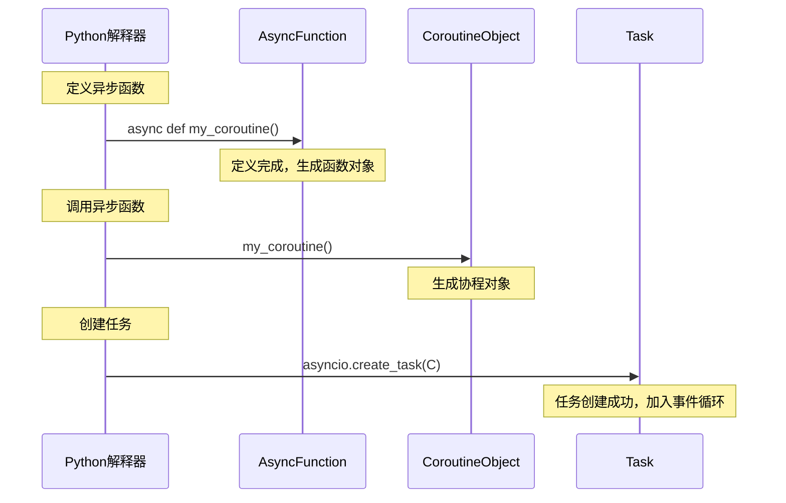
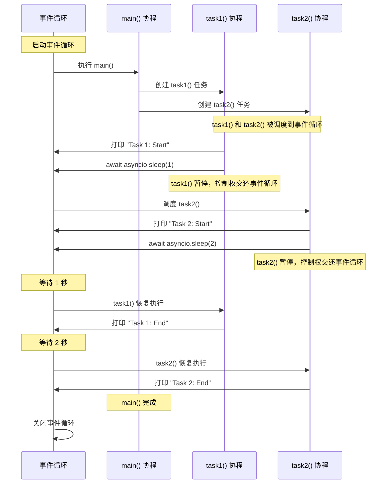

# 异步编程

## 协程 （Coroutine）

协程是异步编程的基本构建块。它是一个可以暂停和恢复的**函数**，使用`async def`定义。


## python 中的异步编程




## 异步程序编写基础

> 使用以下 api 可以编写基本的异步程序

### `await` & `async def` & `asyncio.run()`

python3.7 以后的异步标准库

```python
import asyncio

async def say_hello():
    print("Hello")
    await asyncio.sleep(1)  # 模拟I/O操作
    print("World")
import asyncio
import time
async def say(content1, content2, delay):
    print(content1)
    await asyncio.sleep(delay)
    print(content2)
    
async def test1():
    start = time.perf_counter()
    await say('hello', 'world', 1)
    await say('goodbye', 'world', 1)
    print('It took', time.perf_counter() - start, 'seconds.')
    
async def test2():
    start = time.perf_counter()
    await asyncio.gather(say('hello', 'world', 1), say('goodbye', 'world', 1))
    print('It took', time.perf_counter() - start, 'seconds.')
    
asyncio.run(test1())
asyncio.run(test2())
```


以上两段测试会分别运行 **2s 和 1s**

- **对于`async def`：**定义了一个协程（可以理解成一种特殊的函数）。调用 `main()` **只会返回一个协程对象**(类似于生成器对象)，而不会直接执行**协程任务**。

- **对于 `await` 语句：**  当一个协程运行到 `await` 语句时，会阻塞当前协程直到当前等待的协程完成并且接收其返回的结果。在当前协程阻塞的同时，执行权交回**事件循环**，会执行其他的协程任务（在任务队列中的）。

- `asyncio.run(main()) ` 是一个简易接口 ( **python 3.7+**)：
  1. **创建事件循环**：自动创建一个新的事件循环。
  2. **运行主协程**：将传入的协程（如 `main()`）作为程序的入口点，运行该协程。
  3. **关闭事件循环**：在协程运行完成后，自动关闭事件循环。


也可以**手动创建事件循环并且管理事件循环**：

```python
import asyncio

async def my_coroutine():
    print("Coroutine started")
    await asyncio.sleep(1)
    print("Coroutine ended")

async def main():
    task = asyncio.create_task(my_coroutine())
    await task

# 手动创建和管理事件循环
loop = asyncio.new_event_loop()
asyncio.set_event_loop(loop)
loop.run_until_complete(main())
loop.close()
```


### `asyncio.create_task()`

这个函数会将一个**协程对象**包装成一个任务（并返回），并且**立刻调度到事件循环中**。

```python
import asyncio

async def task1():
    print("Task 1: Start")
    await asyncio.sleep(1)  # 模拟I/O操作，暂停1秒
    print("Task 1: End")

async def task2():
    print("Task 2: Start")
    await asyncio.sleep(2)  # 模拟I/O操作，暂停2秒
    print("Task 2: End")

async def main():
    # 创建任务
    t1 = asyncio.create_task(task1())
    t2 = asyncio.create_task(task2())
    
    # 等待任务完成
    await t1
    await t2

# 运行事件循环
asyncio.run(main())
```


最后输出为：

```shell
Task 1: Start
Task 2: Start
（等待1秒）
Task 1: End
（等待1秒）
Task 2: End
```


执行示意图(理解 `await` 机制和 **协程任务创建时刻** 和 **事件循环调度机制**)：




### 异步上下文管理器 `async with`


### 异步迭代器 `async for`


### 并发接口`asyncio.gether()` & `asyncio.wait()`

这两个函数用于并发执行多个协程任务，但它们的行为有所不同。

### `asyncio.gather()`

- 用于并发执行多个协程，并等待所有协程完成。
- 返回一个包含所有结果的列表。

### `asyncio.wait()`

- 用于并发执行多个协程，并可以设置超时或等待条件。#
- 返回两个集合：已完成的任务和未完成的任务。

```python
import asyncio

async def task(name, delay):
    print(f"Task {name} started")
    await asyncio.sleep(delay)
    print(f"Task {name} finished")

async def main():
    # 使用 asyncio.gather
    await asyncio.gather(task("A", 1), task("B", 2))

    # 使用 asyncio.wait
    tasks = [task("C", 1), task("D", 2)]
    done, pending = await asyncio.wait(tasks, timeout=1.5)
    print(f"Done: {len(done)}, Pending: {len(pending)}")

asyncio.run(main())
```


### 异步队列 `asyncio.Queue`


### 异步锁和信号量

