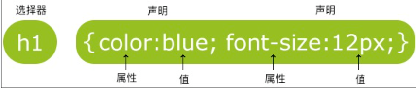

# CSS

## CSS 盒子模型 (BOX Model)


- **Margin(外边距)** - 清除边框外的区域，外边距是透明的。
- **Border(边框)** - 围绕在内边距和内容外的边框。
- **Padding(内边距)** - 清除内容周围的区域，内边距是透明的。
- **Content(内容)** - 盒子的内容，显示文本和图像。

tips: 指定的 width 和 height 都是描述内容（content）的


## 基本语法



**注释：**使用 `/* */` 类似 C 语言


## 选择器 (selector)*

### 通用选择器

`*` 用于选定 html 页面的所有元素


### 元素选择器

```css
p {
  color: blue;
}
```

### id 选择器

采用  `#`

```css
/* 可以选择所有 id = “para1” 的元素 */
#para1
{
    text-align:center;
    color:red;
}
```


### class 选择器

采用 `.`

```css
.center {text-align:center;}
p.center {text-align:center;}
```


### 属性选择器

使用 `[]`

```css
[type="text"] {
  border: 1px solid gray;
}
```


### 后代选择器

**后代指所有的儿子、孙子 ...**

使用空格 ` `

```css
div p {
  font-weight: bold;
}
```

### 子元素选择器 (child selector)

**子元素特指儿子**

通过指定元素的直接子元素关系选择 HTML 元素。子元素选择器使用 `>` 符号分隔父元素和子元素。例如，`ul > li` 选择器将选择所有 `<ul>` 元素的直接子元素中的 `<li>` 元素。


### 相邻兄弟选择器 (Adjacent Sibling Selector)

通过指定元素之间的相邻兄弟关系选择 HTML 元素。相邻兄弟选择器使用 `+` 符号分隔两个相邻元素。例如，`h2 + p` 选择器将选择紧接在 `<h2>` 元素后的 `<p>` 元素。


