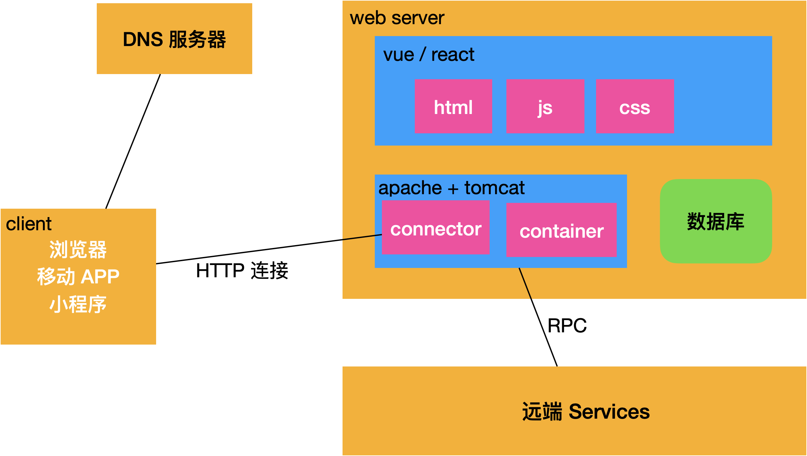

# 前后端交互

## 演变历程

### 1. 早期的 Web 应用

在 Web 应用的早期，所有的交互都是通过页面刷新来完成的。用户在表单中输入数据，提交表单后，整个页面会被刷新，服务器处理请求并返回一个新的页面。这种方式简单直接，但用户体验较差，因为每次交互都需要重新加载整个页面。

### 2. XMLrequest 的出现

随着 Web 技术的发展，XMLHttpRequest (XHR) 出现了。它允许网页在不重新加载页面的情况下与服务器通信，从而实现了异步数据加载和更新。这大大提高了用户体验，因为页面可以动态更新而无需刷新。

**XMLHttpRequest 的基本使用方法**：
```javascript
var xhr = new XMLHttpRequest();
xhr.open('GET', '/api/data', true);
xhr.onreadystatechange = function() {
    if (xhr.readyState === 4 && xhr.status === 200) {
        console.log(xhr.responseText);
    }
};
xhr.send();
```

### 3. Ajax 的兴起

Ajax (Asynchronous JavaScript and XML) 是一种使用 JavaScript 和 XMLHttpRequest 来创建异步 Web 应用的技术。它允许在不重新加载整个页面的情况下与服务器交换数据并更新部分网页。Ajax 的出现使得 Web 应用更加动态和交互性强。

**Ajax 的基本使用方法**：
```javascript
function loadData() {
    var xhr = new XMLHttpRequest();
    xhr.open('GET', '/api/data', true);
    xhr.onreadystatechange = function() {
        if (xhr.readyState === 4 && xhr.status === 200) {
            document.getElementById('result').innerHTML = xhr.responseText;
        }
    };
    xhr.send();
}
```

### 4. fetch API 的引入

随着 ES6 的引入，fetch API 成为了一种更现代、更简洁的 HTTP 请求方式。fetch API 基于 Promise，提供了更简洁的语法和更强大的功能，如支持请求和响应的流处理。

**fetch API 的基本使用方法**：
```javascript
fetch('/api/data')
    .then(response => response.json())
    .then(data => {
        console.log(data);
        document.getElementById('result').innerHTML = JSON.stringify(data);
    })
    .catch(error => console.error('Error:', error));
```

### 5. Axios 的流行

Axios 是一个基于 Promise 的 HTTP 客户端，用于浏览器和 node.js。它在 fetch API 的基础上进一步封装，提供了更多的功能，如拦截请求和响应、转换请求和响应数据、取消请求等。Axios 的使用更加简洁和灵活，成为了现代前端开发中非常流行的 HTTP 客户端。

**Axios 的基本使用方法**：
```javascript
axios.get('/api/data')
    .then(response => {
        console.log(response.data);
        document.getElementById('result').innerHTML = JSON.stringify(response.data);
    })
    .catch(error => console.error('Error:', error));
```


### 6. Comet 和 WebSocket

#### Comet

Comet 是一种服务器推送技术，允许服务器将数据推送到客户端，而无需客户端显式请求。Comet 通过长轮询或流式传输实现，使得客户端能够实时接收服务器端的更新。

**长轮询示例**：
```javascript
function startLongPolling() {
    var xhr = new XMLHttpRequest();
    xhr.open('GET', '/api/data?timestamp=' + new Date().getTime(), true);
    xhr.onreadystatechange = function() {
        if (xhr.readyState === 4 && xhr.status === 200) {
            console.log(xhr.responseText);
            // 重新开始长轮询
            startLongPolling();
        }
    };
    xhr.send();
}
```

#### WebSocket

WebSocket 是一种在单个 TCP 连接上进行全双工通信的协议。它允许服务器和客户端之间的实时双向通信，适用于需要频繁数据交换的应用，如**聊天应用**、**实时游戏**等。

**WebSocket 示例**：
```javascript
var socket = new WebSocket('ws://example.com/socket');

socket.onopen = function(event) {
    console.log('Connection established');
};

socket.onmessage = function(event) {
    console.log('Message from server:', event.data);
};

socket.onclose = function(event) {
    console.log('Connection closed');
};

// 发送消息
socket.send('Hello, Server!');
```

### 7. Server-Sent Events (SSE)

Server-Sent Events (SSE) 是一种**允许服务器向客户端发送单向消息**的技术。与 WebSocket 不同，SSE 只支持服务器到客户端的通信，适用于只需要服务器推送数据的场景，如实时更新、通知等。

**SSE 示例**：

```javascript
var eventSource = new EventSource('/api/stream');

eventSource.onmessage = function(event) {
    console.log('New message:', event.data);
};

eventSource.onerror = function(event) {
    console.error('Error:', event);
};
```

### 8. GraphQL

随着前端应用复杂性的增加，传统的 RESTful API 在处理复杂查询和数据关系时显得不够灵活。GraphQL 提供了一种更高效、更灵活的查询语言，允许客户端指定需要的数据，从而减少不必要的数据传输。

**GraphQL 示例**：
```javascript
fetch('/api/graphql', {
    method: 'POST',
    headers: {
        'Content-Type': 'application/json',
    },
    body: JSON.stringify({
        query: `
            query {
                user(id: "1") {
                    name
                    posts {
                        title
                        content
                    }
                }
            }
        `
    })
})
.then(response => response.json())
.then(data => console.log(data))
.catch(error => console.error('Error:', error));
```

### 总结

前后端交互技术的演变历程如下：

1. **早期 Web 应用**：页面刷新。
2. **XMLHttpRequest (XHR)**：异步数据加载和更新。
3. **Ajax**：异步 JavaScript 和 XML，动态更新页面。
4. **Comet**：服务器推送技术，长轮询实现实时更新。
5. **WebSocket**：全双工通信，实时双向数据传输。
6. **Server-Sent Events (SSE)**：单向服务器推送，适用于实时更新场景。
7. **fetch API**：基于 Promise 的现代 HTTP 请求方式。
8. **Axios**：基于 Promise 的 HTTP 客户端，功能更强大，使用更灵活。
9. **GraphQL**：灵活的查询语言，减少不必要的数据传输。

这些技术的演进使得 Web 应用更加动态、交互性强，能够满足日益复杂的用户需求和应用场景。


## 目前的主流

### 现代 web 技术




### 前端 frontend

- > [Axios](./axios.md)


### 后端 backend

- > [Flask (Python)](../Python/flask/使用flask构建api.md)
