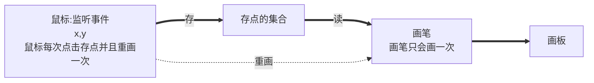

[toc]

# GUI 编程

## 前言

------

组件：

- 窗口
- 弹窗
- 面板
- 文本框
- 列表框
- 按钮
- 图片
- 监听事件 listener
- 事件
    - 鼠标事件
    - 键盘事件
- 破解工具


## 简介

----

GUI ，Graphics User Interface   **图形用户界面**

Java GUI 的核心技术 ：  Swing  AWT

Java GUI 的缺点 ：

- 运行需要 JRE 环境
- 页面不美观

为什么要学习 Java GUI ？

- 写小工具
- MVC 框架的逻辑基础 了解监听！
- 工作时可能要维护 swing 界面


## GUI 编程范式（自己总结---持续更新）

--------


## AWT

-----


### 1.1 Awt 介绍

包含很多类和接口~

学习的过程就是学习**类和接口**的过程


 

哪里不会？ **直接看源码！**

> IDEA 中 `ctrl + 鼠标点击对应class可以转到源码文件`


### 1.2 组件和容器

#### 1. Frame

**单个窗口**

```java
import java.awt.*;

// GUI 的第一个界面
public class TestFrame {
    public static void main(String[] args){
        // Frame对象 看源码！
        Frame myframe = new Frame();
        // 需要设置可见性
        myframe.setVisible(true);
        // 设置窗口大小
        myframe.setSize(800,800);
        // 设置背景颜色
        myframe.setBackground(new Color(124, 69, 69));
        // 弹出的初始位置
        myframe.setLocation(200,200);
        // 设置不可拉伸
        myframe.setResizable(false);
    }
}
```

ps: 但是此时的 frame 窗口关不掉，需要直接退出java程序


**多个窗口** **封装！**

```java
import java.awt.*;
public class TestFrame2 {
    public static void main(String[] args){
        // 展示多个窗口
        MyFrame myFrame1 = new MyFrame(100,100,200,200,Color.WHITE);
        MyFrame myFrame2 = new MyFrame(300,100,200,200,Color.RED);
        MyFrame myFrame3 = new MyFrame(500,100,200,200,Color.YELLOW);
        MyFrame myFrame4 = new MyFrame(700,100,200,200,Color.BLUE);
    }
}
class MyFrame extends Frame{   // 继承自 java.awt.Frame
    static int id = 0;

    public MyFrame(int x,int y,int w,int h,Color color){  // 构造方法与类同名，返回一个对象
        super("MyFrame"+(++id));   // 调用父类的构造方法
        setBounds(x,y,w,h);
        setBackground(color);
        setResizable(false);
        setVisible(true);
    }
}
```

使用 `extends` 关键字进行继承

使用 `super` 调用父类方法


#### 2. Panel

**Panel** 可以看成是一个空间，但是不可以单独存在

Panel 的方法和 Frame 大体一致，但是可以加组件，并且依附于 Frame


tips： 窗口监听实现窗口可关闭 ， 23 种设计模式之一： **适配器模式** 

使用 `WindowListener` 则需要写很多种事件响应方法，但是**我们只需要一种**

使用 `WindowAdapter` 写我们需要的事件响应方法！！！

```java
import java.awt.*;
import java.awt.event.WindowAdapter;
import java.awt.event.WindowEvent;

// Panel 可以看成是一个空间，但是不可以单独存在
public class TestPanel {
    public static void main(String[] args) {
        Frame frame = new Frame();
        // 布局的概念
        Panel panel = new Panel();

        // 设置布局
        frame.setLayout(null);

        // 坐标
        frame.setBounds(100,100,500,500);
        frame.setBackground(new Color(40,161,35));

        // Panel 设置坐标,相对于 frame
        panel.setBounds(50,50,400,400);
        panel.setBackground(new Color(156, 24, 24));

        // frame.add 添加布局
        frame.add(panel);
        frame.setVisible(true);

        // 利用 窗口监听事件 来实现窗口可关闭
        // 使用 适配器模式
        frame.addWindowListener(new WindowAdapter() {
            // 窗口关闭所需要的响应
            @Override
            public void windowClosing(WindowEvent e) {
                // 结束程序
                System.exit(0);
            }
        });
    }
}
```


#### 3. 布局管理器

- 流式布局 FlowLayout

    ```java
    import java.awt.*;
    
    public class TestFlowLayout {
        public static void main(String[] args) {
            Frame frame = new Frame();
    
            // 组件-按钮
            Button button1 = new Button("1");
            Button button2 = new Button("2");
            Button button3 = new Button("3");
    
            // 设置为流式布局
            frame.setLayout(new FlowLayout());
    
            // 常规操作
            frame.setBounds(100,100,500,500);
            frame.setResizable(false);
            frame.setVisible(true);
    
            // 添加组件
            frame.add(button1);
            frame.add(button2);
            frame.add(button3);
        }
    }
    ```

    效果图：

    


- 东西南北中  BorderLayout

    ```java
    import java.awt.*;
    
    public class TestBorderLayout {
        public static void main(String[] args) {
            Frame frame = new Frame("TestBorderLayout");
    
            Button east = new Button("East");
            Button west = new Button("West");
            Button south = new Button("South");
            Button north = new Button("North");
            Button center = new Button("Center");
    
            frame.setLayout(new BorderLayout());
            frame.add(east,BorderLayout.EAST);
            frame.add(west,BorderLayout.WEST);
            frame.add(north,BorderLayout.NORTH);
            frame.add(south,BorderLayout.SOUTH);
            frame.add(center,BorderLayout.CENTER);
    
            frame.setResizable(false);
            frame.setBounds(100,100,800,800);
            frame.setVisible(true);
        }
    }
    ```

    

- 表格布局  GridLayout

    ```java
    import java.awt.*;
    
    public class TestGridLayout {
        public static void main(String[] args) {
            Frame frame = new Frame();
    
            frame.setBounds(100,100,400,400);
            frame.setLayout(new GridLayout(2,2));
            frame.setResizable(false);
            frame.setVisible(true);
    
            Button bt1 = new Button("button1");
            Button bt2 = new Button("button2");
            Button bt3 = new Button("button3");
            Button bt4 = new Button("button4");
    
            frame.add(bt1);
            frame.add(bt2);
            frame.add(bt3);
            frame.add(bt4);
    
            // frame.pack();   // 自适应，此处不需要
        }
    }
    ```


#### 4. 事件监听

##### 按钮监听 & 定制监听器（通过继承）

```java
import java.awt.*;
import java.awt.event.ActionEvent;
import java.awt.event.ActionListener;
import java.awt.event.WindowEvent;
import java.awt.event.WindowListener;

public class TestActionEvent {
    public static void main(String[] args) {
        // 按下按钮，触发事件
        Frame frame = new Frame();
        Button bt = new Button();

        // addActionListener() 需要一个 ActionListener, 所以我们需要构造一个 ActionListener
        MyActionListener myActionListener = new MyActionListener();
        bt.addActionListener(myActionListener);

        // 实现窗口关闭
        MyWindowListener myWindowListener = new MyWindowListener();
        frame.addWindowListener(myWindowListener);    // 子类比父类包含更广 ！ 当然可以输入子类对象 ！

        frame.add(bt,BorderLayout.CENTER);
        frame.setBounds(100,100,400,400);
        frame.setResizable(false);
        frame.setVisible(true);
    }
}

class MyWindowListener implements WindowListener{

    static int closing_id = 0;
    @Override
    public void windowOpened(WindowEvent e) {

    }

    @Override
    public void windowClosing(WindowEvent e) {
        if(closing_id++<10){
            System.out.println("你不能关闭窗口");
        }
        else {
            System.out.println("好吧，让你走");
            System.exit(0);
        }
    }

    @Override
    public void windowClosed(WindowEvent e) {

    }

    @Override
    public void windowIconified(WindowEvent e) {

    }

    @Override
    public void windowDeiconified(WindowEvent e) {

    }

    @Override
    public void windowActivated(WindowEvent e) {

    }

    @Override
    public void windowDeactivated(WindowEvent e) {

    }
}

class MyActionListener implements ActionListener{  // 实现按钮按下效果

    @Override
    public void actionPerformed(ActionEvent e) {
        System.out.println("hello world");
    }
}
```

tips: 

- 实现了按下按钮响应 `ActionListener`

- 实现窗口退出的响应 `WindowListener`

- 以上两点都采用继承的方式 自制了自己的**专属监听器**

- 对于实现窗口退出的监听器，也可以向前面一样使用 `WindowAdaptor` 来实现只编写需要的响应

- 在我们的 `TestActionEvent` 类内自制方法实现窗口关闭监听（更为常用）

    ```java
    import java.awt.*;
    import java.awt.event.ActionEvent;
    import java.awt.event.ActionListener;
    import java.awt.event.WindowEvent;
    import java.awt.event.WindowListener;
    
    public class TestActionEvent {
        public static void main(String[] args) {
            // 按下按钮，触发事件
            Frame frame = new Frame();
            Button bt = new Button();
    
            // addActionListener() 需要一个 ActionListener, 所以我们需要构造一个 ActionListener
            MyActionListener myActionListener = new MyActionListener();
            bt.addActionListener(myActionListener);
    
            // 实现窗口关闭
            windowClose(frame);
    
            frame.add(bt,BorderLayout.CENTER);
            frame.setBounds(100,100,400,400);
            frame.setResizable(false);
            frame.setVisible(true);
        }
        
        // 只在类内使用，故为 private 
        private static void windowClose(Frame frame){
            frame.addWindowListener(new WindowAdapter(){
               @Override
               public void windowClosing(windowEvent e){
                   System.exit(0);
               }
            });
        }
    }
    class MyActionListener implements ActionListener{  // 实现按钮按下效果
    
        @Override
        public void actionPerformed(ActionEvent e) {
            System.out.println("hello world");
        }
    }
    ```


##### 多按钮监听

可以使用一个监听器，监听多个按钮

```java
import java.awt.*;
import java.awt.event.ActionEvent;
import java.awt.event.ActionListener;

public class TestActionEvent2 {
    public static void main(String[] args) {
        // 两个按钮，同一个监听
        // 开始 停止
        Frame frame = new Frame("开始-停止");
        Button bt1 = new Button("start");
        Button bt2 = new Button("stop");

        // 设置按钮按下后发出的命令(包含在 事件对象中并传给监听器)
        // 可以让一个监听器监听 多个按钮
        bt1.setActionCommand("bt1-start");
        bt2.setActionCommand("bt2-stop");

        MyActionListener2 myActionListener2 = new MyActionListener2();
        bt1.addActionListener(myActionListener2);   // bt1 被监听
        bt2.addActionListener(myActionListener2);   // bt2 被监听

        frame.add(bt1,BorderLayout.WEST);
        frame.add(bt2,BorderLayout.EAST);
        frame.setBounds(100,100,100,100);
        frame.setVisible(true);
        frame.setResizable(false);
    }
}
class MyActionListener2 implements ActionListener{

    @Override
    public void actionPerformed(ActionEvent e) {
        // e.getActionCommand() 获取该事件得到的命令
        System.out.println("按钮被点击了 command: "+e.getActionCommand());
    }
}
```


##### 文本框监听

###### 场景一：获取文本框的文本输入

```java
import java.awt.*;
import java.awt.event.ActionEvent;
import java.awt.event.ActionListener;

public class TestText {
    public static void main(String[] args) {
        // 只要启动就好了
        new MyFrame();
    }
}
class MyFrame extends Frame{
    public MyFrame(){
        TextField textField = new TextField();
        add(textField);

        // 监听文本框中输入的文字
        MyActionListener3 myActionListener3 = new MyActionListener3();
        textField.addActionListener(myActionListener3);    // 按下enter键，就会触发这个输入框的事件

        setVisible(true);
        setBounds(100,100,200,200);
    }
}
class MyActionListener3 implements ActionListener{

    @Override
    public void actionPerformed(ActionEvent e) {
        TextField field = (TextField) e.getSource();   // e.getSource() 返回一个 Object 是万物的起源，可以向下转换成任何一个对象
        System.out.println(field.getText());    // 返回文本框中的 text
    }
}
```

tips:

- 程序设计范式：主类的 main 方法中只要负责**启动和主循环**即可 `new MyFrame()` ，剩下的事交给其他的类来实现
- `e.getSource()` 的使用
- 对于 TextField对象 ，按下 enter 键后就会触发输入框的事件


###### 场景二：输入密码用 `'*'` 代替

```java
import java.awt.*;
import java.awt.event.ActionEvent;
import java.awt.event.ActionListener;

// 获取文本框的输入！！！！ && 密码输入场景
public class TestText {
    public static void main(String[] args) {
        // 只要启动就好了
        new MyFrame();
    }
}
class MyFrame extends Frame{
    public MyFrame(){
        TextField textField = new TextField();
        add(textField);

        // 监听文本框中输入的文字
        MyActionListener3 myActionListener3 = new MyActionListener3();
        textField.addActionListener(myActionListener3);    // 按下enter键，就会触发这个输入框的事件

        // 密码场景 ， 设置回显
        textField.setEchoChar('*');

        setVisible(true);
        setBounds(100,100,200,200);
    }
}
class MyActionListener3 implements ActionListener{

    @Override
    public void actionPerformed(ActionEvent e) {
        TextField field = (TextField) e.getSource();   // e.getSource() 返回一个 Object 是万物的起源，可以向下转换成任何一个对象
        System.out.println("输入的密码为: "+field.getText());    // 返回文本框中的 text
        field.setText("");   // 清空文本框 , 由此可见 e.getSource() 返回的是 引用
    }
}
```

tips: 

- `field.setText("")` 清空文本框的操作，由此可见 `e.getSource()` 返回的 Object 引用！！ 即 此处的 field 就是上面的 textField 
- 思考： **那么怎么获取每次输入的字符呢？**


#### 5. 画笔 Java.awt.Graphics类

这是一个抽象类

很多方法里面都有一个**奇怪**的参数， `Graphics g` 这个 g 就是一个抽象对象（没法实例化）

只能通过重写 `paint()`等方法（函数） 的方法来自定义绘画

通过调用 `repaint()` 等方法（函数） 的方法来画图

<font size=5 color="Green">鼠标监听的第一个实例可以参考</font>


一些踩坑：

- 当创建一个 Frame 或者 JFrame 时，实际上创建了一个新的线程，并且是**并行运行**

- 这个 Frame 首先会自动调用一次 paint() 方法（**想要自定义就重写方法**）； 之后想要再次调用，就要调用 repaint() 方法

- 以下代码可以显示 创建一个JFrame是开启一个新的线程!

    ```java
    import java.awt.*;
    import java.awt.event.ActionEvent;
    import java.awt.event.ActionListener;
    import java.awt.event.WindowAdapter;
    import java.awt.event.WindowEvent;
    import javax.swing.*;
    
    public class TestThread1 {
        public static void main(String[] args) {
            new MyClass();
            for (int i = 0; i < 100; i++) {
                System.out.println("这里是主线程 "+i);
            }
        }
    }
    class MyClass extends Frame {
        int id = 0;
        Timer timer = new Timer(2000, new ActionListener() {
            @Override
            public void actionPerformed(ActionEvent e) {
                repaint();
                id = 1^id;
            }
        });
        public MyClass() {
            setVisible(true);
            setBounds(100,100,500,500);
            setBackground(Color.BLUE);
            addWindowListener(new WindowAdapter() {
                @Override
                public void windowClosing(WindowEvent e) {
                    System.exit(0);
                }
            });
            setResizable(false);
            timer.setRepeats(true);
            timer.start();
    
        }
    
        @Override
        public void paint(Graphics g) {
            // timer.start();
            System.out.println("这里是paint ");
            if(id==1){
                System.out.println("kk");
            }
            else {
                System.out.println("oo");
            }
        }
    }
    ```

    输出为:

    ```shell
    这里是paint
    oo
    这里是paint
    kk
    这里是paint
    oo
    这里是paint
    kk
    ......
    ```

    

    


#### 6. 鼠标监听

**项目1**

要求：

- 实现一个窗口
- 每次点击就在鼠标点击处画一个圆，并且可以叠加

逻辑图



```java
import java.awt.*;
import java.awt.event.*;
import java.util.ArrayList;

public class TestMouseListener {
    public static void main(String[] args) {
        new MyFrame("TestMouseListener");
    }
}

// 自己的类，本来应该放在另个 class内
class MyFrame extends Frame {
    private Color color = new Color(44, 29, 167);
    private ArrayList<MyPoint> myPoints = new ArrayList<MyPoint>();   // 一定要记得初始化
    // 画画需要画笔。需要监听当前的位置，需要集合来存储这个点
    public MyFrame(String title){
        super(title);
        setBounds(200,200,400,300);
        setBackground(new Color(0,0,0));
        setVisible(true);

        // 鼠标监听器，正对着这个窗口
        MyMouseListener myMouseListener = new MyMouseListener();
        this.addMouseListener(myMouseListener);

        // 窗口关闭功能
        MyWindowListener myWindowListener = new MyWindowListener();
        addWindowListener(myWindowListener);
        
    }

    // Graphics 是抽象类，没办法实例化，想要画图，只能通过覆写  paint 方法来画图！！！
    @Override
    public void paint(Graphics g) {
        g.setColor(color);
        for(int i=0;i<myPoints.size();++i) {
            g.drawOval(myPoints.get(i).x, myPoints.get(i).y, 30, 30);   // java里面没有了 [] 访问方式
        }
        g.setColor(null);
    }

    // 适配器模式，用的是 extends 关键字进行继承
    private class MyMouseListener extends MouseAdapter {
        @Override
        public void mousePressed(MouseEvent e) {   // 鼠标单击
            MyFrame frame = (MyFrame) e.getSource();
            myPoints.add(new MyPoint(e.getX(),e.getY()));
            repaint();
        }
    }

    // 实现窗口可退出
    private class MyWindowListener extends WindowAdapter {
        @Override
        public void windowClosing(WindowEvent e) {
            System.out.println("Bye");
            System.exit(0);
        }
    }

    // 实现二维坐标点的类
    class MyPoint {
        int x,y;
        public MyPoint(int x,int y){
            this.x = x;
            this.y = y;
        }
    }
}
```


**鼠标事件：**

>
>
>


#### 7. 窗口监听

一个实例解释一切：

```java
import java.awt.*;
import java.awt.event.WindowAdapter;
import java.awt.event.WindowEvent;
import java.util.Scanner;

public class TestWindow {
    public static void main(String[] args) {
        WindowFrame frame = new WindowFrame();
        Scanner scan = new Scanner(System.in);
        while(scan.hasNextLine()){
            String cmd = scan.nextLine();
            if(cmd.equals("visable")&&frame != null) {
                frame.setVisible(true);
            }
            else if(cmd.equals("del")&&frame != null){
                frame.dispose();
                System.out.println("window is deleted");
                frame = null;  // java 中通过将对象赋值为 null 来删除一个对象
            }
            else if(cmd.equals("create")&&frame == null){
                frame = new WindowFrame();
                System.out.println("a new window is created");
            }
            else if(cmd.equals("exit")){
                System.out.println("程序结束");
                System.exit(0);
            }
            else {
                System.out.println("Invalid command");
            }
        }

    }
}

class WindowFrame extends Frame {
    private static int id = 0;
    public WindowFrame() {
        setBackground(Color.blue);
        setBounds(100,100,300,300);
        setVisible(true);
        setResizable(false);
        // 添加监听器
        MyWindowListener myWindowListener = new MyWindowListener();
        addWindowListener(myWindowListener);

    }
    private class MyWindowListener extends WindowAdapter {
        @Override
        public void windowClosing(WindowEvent e) {
            if(id++<5) {
                System.out.println("You can't close this window");
            }
            else {
                System.out.println("Window inVisable");
                WindowFrame frame = (WindowFrame) e.getSource();
                frame.setVisible(false);  // 设置窗口不可见，但是线程还是在的
                // 本程序中，可以在终端输入 "reset" 来重现窗口
            }
        }
        @Override
        public void windowActivated(WindowEvent e) {
            id = 0;
            System.out.println("Window Activated");
        }
    }
}
```


**窗口事件**

>
>
>


#### 8. 键盘监听

一个实例解释一切:

```java


```


**键盘事件：**

>
>
>


**KeyEvent 使用**

>e.getKeyCode()
>
>e.getKeyChar()
>
>


## Swing

### 2.1 简介

Awt 是底层，Swing 是封装了的 awt，能够画更多的图形和效果

Swing 仍然是原生 Java，更进一步要学习 JavaFX 工具


### 2.2 一些新特点

> `JFrame` 窗体使用，是在 `awt.frame` 类的基础上封装得到  
>
> `WindowConstants.EXIT_ON_CLOSE`

```java
 // 一键设置 窗口的关闭
JFrame jf = new JFrame();
jf.setDefaultCloseOperation(WindowConstants.EXIT_ON_CLOSE);
```


### 2.2 组件和容器

#### 1. JFrame

java.swing.JFrame 继承自 java.awt.Frame

但是也有些许的不同逻辑

`JFrame jf = new JFrame()` 后 jf 作为顶级窗口，但是窗口的内容物不是 jf 而是 jf自带的容器

例如设置背景颜色就要以以下的方式来设置

```java
import javax.swing.*;
import java.awt.*;

public class JFrameDemo {
    public static void main(String[] args) {
        init();
    }
    private static void init(){
        JFrame jf = new JFrame();
        jf.setVisible(true);
        jf.setBounds(100,100,500,500);
        jf.setResizable(false);
        // 获取主容器panel ， 然后修改他的背景色
        Container container = jf.getContentPane();
        container.setBackground(new Color(0,0,0));
        // 一键设置 窗口的关闭
        jf.setDefaultCloseOperation(WindowConstants.EXIT_ON_CLOSE);
    }
}
```

另一种方法： 把 **主panel** 隐藏，然后直接修改 **jf** （顶级窗口） 

```java
private static void init(){
        JFrame jf = new JFrame();
        jf.setVisible(true);
        jf.setBounds(100,100,500,500);
    	// 隐藏 panel //
        Container container = jf.getContentPane();
        container.setVisible(false);
    	//           // 
        jf.setBackground(new Color(0,0,0));
        jf.setResizable(false);
        // 一键设置 窗口的关闭
        jf.setDefaultCloseOperation(WindowConstants.EXIT_ON_CLOSE);
    }
```


#### 2. JDialog

JDialog 用来被弹出 

- 默认就有关闭事件,没有必要再设置
- JDialog 没有主容器，我们直接看到就是**顶级窗口控件**
- JDialog 有从属关系，从其实例化方法中的 owner 参数可以指定

**一个实例**

```java
import javax.swing.*;
import java.awt.*;
import java.awt.event.ActionEvent;
import java.awt.event.ActionListener;

public class JDialogDemo {
    private  static int id=0;
    public static void main(String[] args) {
        JFrame frame = new JFrame();
        frame.setVisible(true);
        frame.setBounds(100,100,500,500);
        Container mainpanel = frame.getContentPane();
        mainpanel.setBackground(new Color(17, 105, 183));

        JButton bt = new JButton("显示Dialog");
        mainpanel.setLayout(new FlowLayout());
        mainpanel.add(bt);

        bt.addActionListener(new ActionListener() {
            @Override
            public void actionPerformed(ActionEvent e) {
                if(id<3){
                    System.out.println(String.format("这是你第%d次按按钮", ++id));
                }
                else {
                    new MyDialog(frame,"don't press any more");
                }
            }
        });
    }
}
class MyDialog extends JDialog{
    public MyDialog(JFrame f,String text) {
        super(f, "warning:");
        setBackground(Color.BLUE);    // JDialog 里面没有容器

        add(new Label(text));
        pack();   // 自适应
        setVisible(true);
    }
}
```


