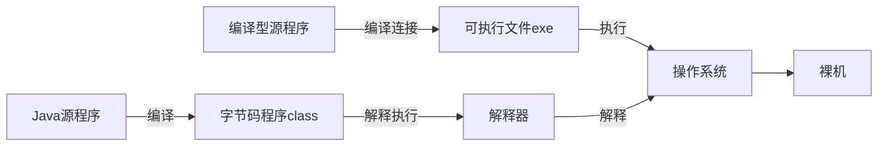
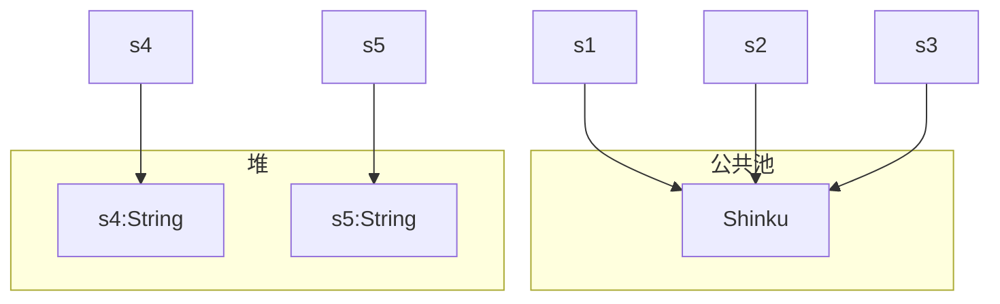

[Toc]

# JAVA

## Tutorial

> [Tutorial 菜鸟教程](https://www.runoob.com/java/java-tutorial.html)
>
> [Java 从入门到精通到全栈 (yuque.com)](https://www.yuque.com/gorit/learnjava/)

## Java 的层次结构

----


## basic introduction

-----

- 注释： 与C完全一致

- 控制字符： 与C基本一致

- 循环语句： 与C++完全一致

- 条件语句： 与C完全一致

- switch case: 与C完全一致

- 运算符： C语言有的 Java 都支持(包括**三目运算符**)

    extra： 

    `instanceof()` 运算符，该运算符用于操作对象实例，检查该对象是否是一个特定类型（类类型或接口类型）

    使用格式： 

    ```java
    ( Object reference variable ) instanceof  (class/interface type)
    ```

    一个使用的实例：

    ```java
    String name = "James";
    boolean result = name instanceof String; // 由于 name 是 String 类型，所以返回真
    ```

    下面的程序仍然返回 `true`

    ```java
    class Vehicle {}
     
    public class Car extends Vehicle {
       public static void main(String[] args){
          Vehicle a = new Car();
          boolean result =  a instanceof Car;
          System.out.println( result);
       }
    }
    ```

- 其他：


## Java 的运行

-----

Java 与其他编程语言的区别

以图式解释：




## Basic

-----

### 一些命名规则

- 类名：对于所有类名来说，首字母都要**大写**。如果一个类名包含多个单词，则每个单词的首字母都要大写 `MyFirstJavaClass`

- 方法名： 所有方法名都应该以**小写字母**开头。如果方法名包含若干单词，则后面的每个单词都应该大写

- 源文件名：源文件名必须和类名相同。当保存文件的时候，应该使用类名作为文件名保存，文件后缀名为 `.java`

- 主方法入口：所有的 Java 程序都是由 `public static void main(String [] args)` 方法开始

    **tips:** Java 中没有了函数的概念，只剩下对象中的方法了

### 基本的 I/O

#### Input

**Java的标准输入流** `System.in` 

**Scanner 类来读取输入**

```java
import java.util.Scanner;
...
    Scanner scan = new Scanner(System.in);  // 创建一个Scanner对象，读取标准输入
```

几个方法：

1. `scan.next()`
    - 一定要读取到有效字符后才可以结束输入
    - 对输入的有效字符之前遇到的空白，会直接将其去掉
    - 只有输入有效字符后才将其后面输入的空白符座位分隔符或结束符
    - next() 不能得到带有空格的字符串
2. `scan.nextLine()`
    - 以 Enter 为结束符，也就是说 nextLine() 方法返回的是输入回车之前的所有字符
    - 可以获得空白

3. 如果要获得 int 或这 float 类型的数据， Scanner 对象也有对应的方法支持，但是建议首先用 hasNextXXX() 方法来验证是否有相应的数据，否则很容易出错


**示例代码**

```java
import java.util.Scanner;
 
public class ScannerDemo {
    public static void main(String[] args) {
        Scanner scan = new Scanner(System.in);
        // 从键盘接收数据
        int i = 0;
        float f = 0.0f;
        System.out.print("输入整数：");
        if (scan.hasNextInt()) {
            // 判断输入的是否是整数
            i = scan.nextInt();
            // 接收整数
            System.out.println("整数数据：" + i);
        } else {
            // 输入错误的信息
            System.out.println("输入的不是整数！");
        }
        System.out.print("输入小数：");
        if (scan.hasNextFloat()) {
            // 判断输入的是否是小数
            f = scan.nextFloat();
            // 接收小数
            System.out.println("小数数据：" + f);
        } else {
            // 输入错误的信息
            System.out.println("输入的不是小数！");
        }
        scan.close();
    }
}
```


#### Output

**Java 标准输出流**  `System.out`

**使用流的输出方法** 

1. stream.println()  输出自带一个换行符，并且接受**零参数**
2. stream.print()   输出不带换行符，而且必须有输出内容
3. stream.printf()  用于格式化输出，类似于 C 语言，但是又不完全相同


### basic datatype


### Java String 类

#### 创建

String 创建的字符串储存在公共池中，而 new 创建的字符串对象储存在堆上

```java
String s1 = "Shinku";              // String 直接创建
String s2 = "Shinku";              // String 直接创建
String s3 = s1;                    // 相同引用
String s4 = new String("Shinku");   // String 对象创建
String s5 = new String("Shinku");   // String 对象创建
```




> String 对象的本质是一个指针，且**内存是不可变**的（即没法用该指针去修改 String 对象）
>
> 如果需要对字符串做很多修改，那么应该使用 `StringBuffer & StringBuilder` 类 （ buffer 缓冲区，C++ 也有）


tips：除此之外还有很多用来创建 String 对象的方法，例如提供一个字符串数组参数等

```java
public class StringDemo{
   public static void main(String args[]){
      char[] helloArray = { 'S', 'h', 'i', 'n', 'k', 'u'};
      String helloString = new String(helloArray);  
      System.out.println( helloString );
   }
}

// 输出为：
// Shinku
```


#### 方法

1. 长度： str.length() 

2. 连接字符串：str1.concat(str2)  返回一个新的字符串常量

    一般使用 `+` 来连接字符串 ，例如： `"Shinku" + "suki"`

3. 格式化字符串： String.format() 方法

    ```java
    String fs;
    fs = String.format("浮点型变量的值为 " +
                       "%f, 整型变量的值为 " +
                       " %d, 字符串变量的值为 " +
                       " %s", floatVar, intVar, stringVar);
    ```

4. 其他方法

    > [Java String 类 | 菜鸟教程 (runoob.com)](https://www.runoob.com/java/java-string.html)

    表格：...


### Java Character 类

#### 前言

Character 类用于对单个字符进行操作

Character 类在对象中包装一个基本类型 **char** 的值

示例：

```java
char ch = 'a';
 
// Unicode 字符表示形式
char uniChar = '\u039A'; 
 
// 字符数组
char[] charArray ={ 'a', 'b', 'c', 'd', 'e' };
```

但是实际开发过程中，我们经常会遇到需要使用对象，而不是内置数据结构的情况，为了解决这个问题， Java 为内置数据结构 char 提供了包装类 Character 类

#### 创建

```java
Character ch = new Character('a');
```

在某些情况下，Java 编译器会自动创建一个 Character 对象。

例如，将一个 char 类型的参数传递给需要一个 Character 类型参数的方法时，那么编译器会自动地将 char 类型参数转换为 Character 对象。 这种特征称为装箱，反过来称为拆箱

```java
// 原始字符 'a' 装箱到 Character 对象 ch 中
Character ch = 'a';
 
// 原始字符 'x' 用 test 方法装箱
// 返回拆箱的值到 'c'
char c = test('x');
```


#### 方法

| 方法              | 描述                                 |
| ----------------- | ------------------------------------ |
| ch.isLetter()     | 是否是一个字母                       |
| ch.isDigit()      | 是否是一个数字                       |
| ch.isWhitespace() | 是否是一个空白字符                   |
| ch.isUpperCase()  | 是否是大写字母                       |
| ch.isLowerCase()  | 是否是小写字母                       |
| ch.toUpperCase()  | 返回指定字母的大写字母               |
| ch.toLowerCase()  | 返回指定字母的小写字母               |
| ch.toString()     | 返回指定字符的字符串形式，长度仅为 1 |


### Java 数组

基本和 C/C++ 的数组相同，都是 **静态存储** （相当于 C/C++ 中的 **VLA** 变长数组） 

#### 创建

```java
datatype[] array;       // 首选方法 java 正统
datatype array[];       // 也可以，继承于 C/C++ 的数组声明方法， 但是有时候会造成歧义(in java)
```


**一维数组的创建及初始化（以 int 举例）**

```java
int[] a = new int[5];    // 初始值全为 0 
int[] b = new int[]{1,2,3};   // 创建并且初始化

int[] c = {1,2,3};
```


**二维数组的创建及初始化**

```java
int[][] a = new int[5][5];    // 初始值为 0
int [][] b = new int[][] {{1,2,3},{4,5,6},{7,8,9}};

int [][] c = {{1,2,3},{4,5,6},{7,8,9}};
```


tips： 

- Java 数组，本质还是指针，**可以操作值改变，指针指向的值也可以改变**

- 上述举例的 2、3 有区别 （乐）（本质还是内存的事情，字面量啊字面量）（大概，我也不确定）


#### Java Arrays 类

`java.util.Arrays` 类能方便地操作数组，提供的方法均为**静态方法** (无需创建对象就可以直接调用的方法)

一些方法：

| Method                                                | Description                                                  |
| ----------------------------------------------------- | ------------------------------------------------------------ |
| public static int binarySearch(Object[] a,Object key) | 二分查找给定数组中搜索给定值的对象，如果查找对象在数组内，直接返回索引，否则返回 key 可以插入的位置的索引。**先排序，再二分查找！！** |
| public static boolean equals(int[] a,int[] b)         | 其他基本数据类型也可以使用。**判断两个数组是否完全相同（长度相同 + 元素对应相同）** |
| public static void fill(int []a, int val)             | 其他基本数据类型也可以使用。**将val赋给整个数组**            |
| public static void sort(Object[] a)                   | **对指定对象数组将其元素升序排列，直接在内存上操作！！**     |

tips: `sort` 是一切查找的基础 <font color="blue">（sort 之神！！）</font>

### Java 日期与时间


## Advance

-----

### Java ArrayList 类

Java 中的动态数组，几乎可以与 C++ 中的 vector 容器等效

#### 创建

```java
import java.util.ArrayList;   // 导入 ArrayList 类

ArrayList<String> urls = new Array<String>();  // 初始化一个对象
```

tips: 

- 上面的 String 可以改成其他 **Object 类**，或者其他**基本数据结构**
- 上面的 urls 本质是一个指针?

#### 方法

##### 添加元素

`array.add()` 方法

```java
import java.util.ArrayList;

public class RunoobTest {
    public static void main(String[] args) {
        ArrayList<String> sites = new ArrayList<String>();
        sites.add("Google");
        sites.add("Runoob");
        sites.add("Taobao");
        sites.add("Weibo");
        System.out.println(sites);
    }
}
```


##### 访问元素

`array.get()` 方法

**注意：** Java 不采用 `array[i]`  的访问方式，是为了避免内存泄露，C++ 中也有 `vec.at(i)` 方法来访问 vec[i] , 如果索引越界，会抛出错误

```java
import java.util.ArrayList;

public class RunoobTest {
    public static void main(String[] args) {
        ArrayList<String> sites = new ArrayList<String>();
        sites.add("Google");
        sites.add("Runoob");
        sites.add("Taobao");
        sites.add("Weibo");
        System.out.println(sites.get(1));  // 访问第二个元素
    }
}
```


##### 删除元素

`array.remove()` 方法


##### 其他方法


### Java Set 类

Java 中的集合类数据结构，对标 C++ 中的 set 

> 详细的笔记 [Link](./初识java/Set)


### Java Map 类

Java 中的映射类数据结构，对标 C++ 中的 map 

> 详细的笔记 [Link](./初识java/Map)


### Java 可变参数的传参(语法糖属于是)

> [Java 可变参数 | 菜鸟教程 (runoob.com)](https://www.runoob.com/w3cnote/java-varargs-parameter.html)

```java
void foo(String... args);   
void foo(String[] args);
```

- 本质还是由数组来实现 
- 以上两种的调用方式不同
- String 可以改成其他类!!


### Java 高精度运算

#### 讲在前面

其实实现一个自己的高精度计算类也不是难事，在 C++ 中也实现过

用字符串存储，加法、减法（两数） **只需注意进位即可** ； 乘法 可以当做多项式乘法（卷积）, 可以使用 FFT 进行优化运算

Java 的高精度类提供了基本的方法，很多时候也还是很有用（至少不用自己写了，但是一定要自己会写）

不用学的很仔细，也不用记忆太多内容，大部分事情交给 **IDE & Baidu & Bing & Google** 即可


#### BigInteger 类

##### 构造方法

目前只支持 通过字符串 String 转换为 BigInteger

``` java
BigInteger integer1 = new BigInteger("12345678901111112222");
BigInteger integer2 = BigInteger.valueOf(100);
BigInteger integer2 = BigInteger.ZERO;
BigInteger integer2 = BigInteger.ONE;
```

**反正，看源码！！！**

##### 运算方法

`a.compareTo(b)` 方法比较大小

> 如果 a > b , 取值为 1； a == b , 取值为 0； a < b , 取值为 -1 ;

`a.add(b)` `a.subtract(b)` `a.multiply(b)` `a.divide(b)` 等方法来实现四则运算

`a.and(b)` `a.or(b)` `a.xor(b)` 等 按位运算


#### BigDecimal 类
