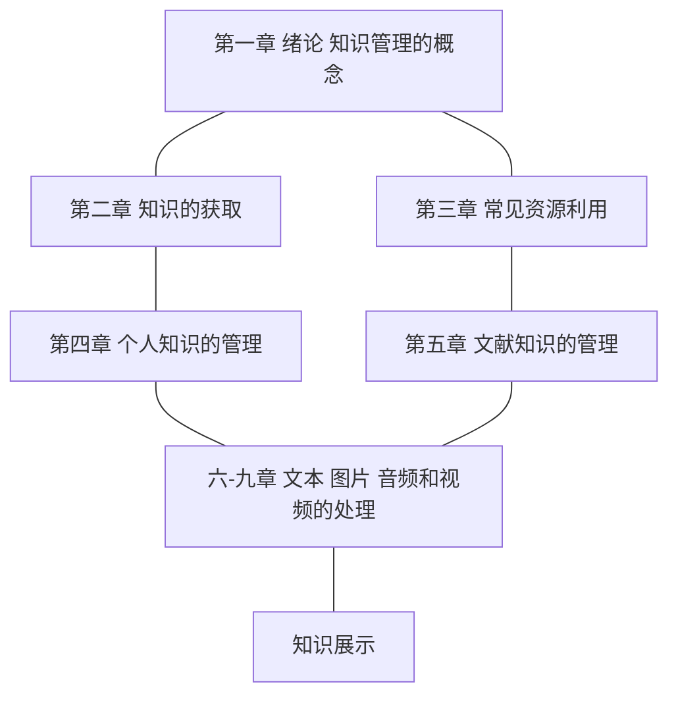

## 前言


$搜索 \Rightarrow 整理 \Rightarrow 展示$

搜商 SQ —— search quotient

- $SQ = M(s) \cdot IQ \cdot EQ$

​		




# Search Engine

## 基本检索

- \+ AND 与
    `北京理工大学 AND 北京航空航天大学`
- \* OR 或
    `北京理工大学 OR 机械和车辆学院`
- \- NOT 非
    `北京理工大学 -计算机学院`    *（NOT前有空格）*
- `" "` 双引号内容扩起来，表示完全匹配
- 通配符： `?` 一个字符  `*` 一个单词 

## 高级检索

命令搜索

- filetype:
    示例： `大学物理 filetype:pdf` 不要空格，英文输入
- site:
    示例： `五彩斑斓的世界 site:pan.baidu.com`
- intitle:
- inurl:
- link:
- related:


## 搜索方式

- 以图搜图
- 听歌识曲
- 视频检索

### 以图搜图


### 听歌识曲


### 视频检索


 

## 自定义搜索

实现域名筛选，广告过滤，编程式搜索


### Programmable Search Engine

> [for Google](https://programmablesearchengine.google.com/about/)
>
> [for Edge]
>
> [for Firefox]


Google 日常编程

[https://cse.google.com/cse?cx=1058e3091ca5e41e1](https://cse.google.com/cse?cx=1058e3091ca5e41e1)  用该网址访问即可

```html
<script async src="https://cse.google.com/cse.js?cx=1058e3091ca5e41e1">
</script>
<div class="gcse-search"></div>
```


Google 算法刷题


