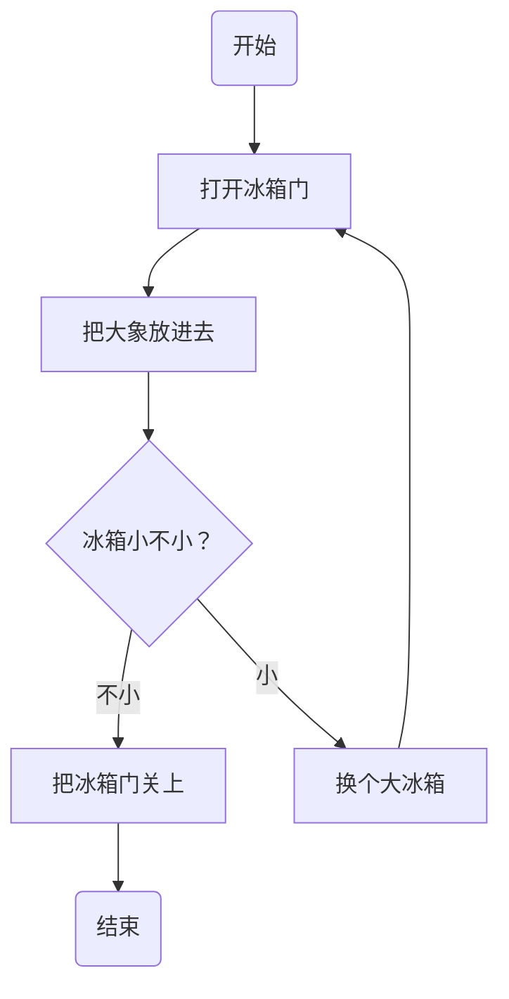
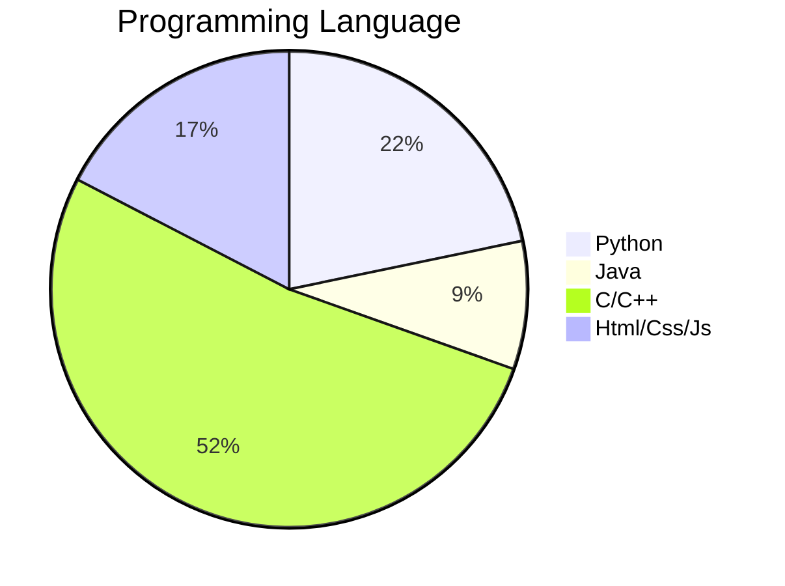

# begin

## 合集

> [简书 比较全面](https://www.jianshu.com/p/65b514ecad9e)
>
> [知乎 有点深度](https://zhuanlan.zhihu.com/p/596847931)
>
> [快捷键合集](https://blog.csdn.net/zywvvd/article/details/109457257)
>
> link 方式 <https://www.typora.net/431.html>

- `:emoji:` 来打出emoji表情，图片等

**例如**：

> :hugs: :hocho:  :email: :united_arab_emirates: 等

- `[ ^number]` 来实现脚注    

typora图片 [^1]

typora图片 [^2]

## 字体和排版

### 字体颜色

> [Typora字体颜色设置的3种方案](https://blog.csdn.net/liulei952413829/article/details/114670380)

推荐使用： 使用font标签 + color 属性更改字体颜色

其次推荐： $\textcolor{skyblue}{使用latex内联公式，例如使用textcolor标签}$

### typora 中使用 html元素

常用的有：

- `img`
- `font`    可以调整字体大小和颜色等
- `video`
- `span`

### 目录生成

文章开头添加 `[Toc]` 即可

## 数学公式

### 一般使用

- 行内公式

`$ $` 括起来

$ a^2 = b^2 + c^2 $

$ h_\theta = \theta_0 + \theta_1x $

- 行间公式 & 数学公式环境

`$$ $$` 括起来 ，同 $\mathit{LATEX}$
$$
\lim_{n \rightarrow +\infty} \frac{n!\cdot e^n}{\sqrt{2\pi n}\cdot n^n} = 1 \tag{1.1}
$$

$$
\oiint_{\Sigma} P\mathit{dydz}+Q\mathit{dzdx}+R\mathit{dxdy} = \iiint_{V} (\frac{\partial P}{\partial x}+\frac{\partial Q}{\partial y}+\frac{\partial R}{\partial z}) \mathit{dxdydz} \tag{1.2}
$$

### 公式美化

### 复合公式

**矩阵**
$$\begin{matrix}
0&1&1\\
1&1&0\\
1&0&1\\
\end{matrix}$$

$$\begin{pmatrix}
0&1&1\\
1&1&0\\
1&0&1\\
\end{pmatrix}$$

$$\begin{bmatrix}
0&1&1\\
1&1&0\\
1&0&1\\
\end{bmatrix}$$

$$\begin{Bmatrix}
0&1&1\\
1&1&0\\
1&0&1\\
\end{Bmatrix}$$

$$\begin{vmatrix}
0&1&1\\
1&1&0\\
1&0&1\\
\end{vmatrix}$$

$$\begin{Vmatrix}
0&1&1\\
1&1&0\\
1&0&1\\
\end{Vmatrix}$$

$$\begin{bmatrix}
{a_{11}}&{a_{12}}&{\cdots}&{a_{1n}}\\
{a_{21}}&{a_{22}}&{\cdots}&{a_{2n}}\\
{\vdots}&{\vdots}&{\ddots}&{\vdots}\\
{a_{m1}}&{a_{m2}}&{\cdots}&{a_{mn}}\\
\end{bmatrix}$$

**阵列**
$$\begin{array}{c|lll}
{↓}&{a}&{b}&{c}\\
\hline
{R_1}&{c}&{b}&{a}\\
{R_2}&{b}&{c}&{c}\\
\end{array}$$

**方程组**
$$\begin{cases}
a_1x+b_1y+c_1z=d_1\\
a_2x+b_2y+c_2z=d_2\\
a_3x+b_3y+c_3z=d_3\\
\end{cases}
$$

### ocr 软件

没用上收费的 mathpix

但是用上了开源的 pix2tex

- `x` 以退出 `h` 为帮助

- `latexocr` 唤出 gui 界面
- `pix2tex` 唤出命令行操作方式

## 画图

### 合集

>[知乎 typora支持的绘图](https://zhuanlan.zhihu.com/p/168050791?utm_id=0)
>
>[知乎 mermaid绘图的各种美化技巧 含子图技巧](https://zhuanlan.zhihu.com/p/481032338?utm_id=0)
>
>

### 流程图 flow

----

> [知乎教程 mermaid绘制flow](https://zhuanlan.zhihu.com/p/69495726)

typora自带的 `mermaid` 块可以用来画流程图

### 饼图 Pie

### 状态图 Stategraph

## 伪代码 -- 代码块

`pseudocode` (伪代码 pseudocode)

但是没有什么实用价值，只有高亮而不支持符号

建议使用 **Latex** 编写

