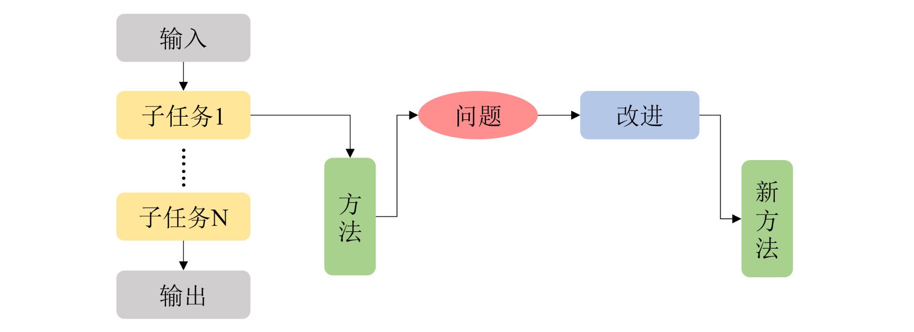

# 课题调研

 **reference**

> [科研指南(1)——如何从零开始调研一个课题（2023.4.24更新） - 知乎](https://zhuanlan.zhihu.com/p/468255795)

## 调研的目标

**调研是就是为了掌握课题的子任务以及解决子任务的现有方法，是找到问题、进行改进、提出新方法的前置任务。**因为几乎所有发表的论文都遵从着“任务、方法、问题、解决”的逻辑，所以阅读文献的过程中也能够了解到课题的子任务以及现有解决方法。

我们这里使用了“子任务”和“问题”两个不同的词。“子任务”指的是从输入到输出一系列流程中的某一具体步骤；“问题”指的是子任务现有解决方法的不足，也就是经常被提到的“痛点”。以 ResNet 论文的 Abstract 为例：

> Deeper neural networks are more difficult to train. We present a residual learning framework to ease the training of networks that are substantially deeper than those used previously. We explicitly reformulate the layers as learning residual functions with reference to the layer inputs, instead of learning unreferenced functions. ····· On the ImageNet dataset we evaluate residual nets with a depth of up to 152 layers---8x deeper than VGG nets but still having lower complexity. ······

这里的“子任务”就是“从图片到类别中间的深度神经网络结构”，“现有方法”是 VGG 这种单路卷积网络，“问题”是层数一深就难以训练，“改进”是添加一个学习残差函数的支路。而之后也有论文指出 ResNet 这种“现有方法”的“支路设计对于轻量化和并行不友好”这一“问题”。

## 如何调研一个课题？

**先去读一篇综述，去大概了解这个课题以及现有文献，然后再读综述中提到的论文。** 目的是快速了解课题，所以没有必要读英文 survey，选择综述可以按照以下优先级：

1. 中文综述文章/博客/专栏，搜索 “[课题关键字] + 综述/入门”
2. 英文综述博客，搜索 “[subject keywords] + guide”
3. 英文综述论文，搜索 “[subject keywords] + survey” , 在谷歌学术上搜最新的，发表在顶会上的综述论文

**综述**就是前人调研的总结，如果课题有一篇非常好的综述，我们花费非常少的时间就可以对课题有不错的掌握。如果是一个很大的课题，看综述就可以了解到有哪些小课题；如果是小课题，看综述就可以了解课题大概是一个什么任务，输入输出是什么，现存方法大概有哪些流派，每个流派从输入到输出大致的流程。

综述只能让我们大致地了解一个课题，接下来还得进行更加细致深入的阅读。综述中提到的论文一般都是经典的或者有重要贡献的论文，所以可以从这些论文开始扩展。

## 如何读论文？

### 在调研时读论文

**在调研中读论文，往往只需要略读。**

1. 阅读 Abstract，将任务描述用颜色A高亮，将现有方法与问题用颜色B高亮，将论文提出的改进用颜色C高亮。大致了解论文提出的方法。
2. 阅读 Introduction，将任务描述用颜色A高亮，将现有方法与问题用颜色B高亮，将论文提出的改进用颜色C高亮。尝试理解论文提出的方法。
3. 阅读 Related Work，将提到的任务和其对应的现有论文高亮。

**如果 Introduction 阅读过程中还不理解论文提出的方法，也很正常**，这时候就需要判断论文需不需要精读。可以有以下几个判断角度：

1. 论文质量。通过引用量、相关解读文章的数量、有无开源代码、开源代码 Star 数，和阅读时论文语言表述质量来判断。比如姿态估计的 RLE 论文是 ICCV 2021的论文，而我2021年阅读的时候，就能搜到相关的论文解读，并且开源代码已经有了很多 Star，是一篇值得精读的论文；刚开始单阶段姿态估计调研，看 FCPose的时候，论文一堆细节都说“详见FCOS(论文作者的目标检测工作)”，就不适合精读。
2. 方法价值。通过方法性能提升的大小、与研究方向的相关程度来判断。再拿 RLE 举例，读论文前我就有一个有了很长时间的疑惑：“热图回归的热图为什么一定是高斯分布？”，而这篇论文就有关这个问题，并且该方法第一次让坐标回归性能超过了热图回归，提升很大，值得精读。

### 下一篇读什么？

## 总结与输出

