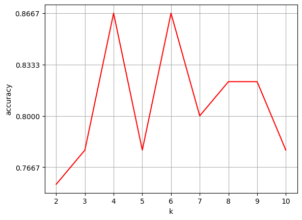
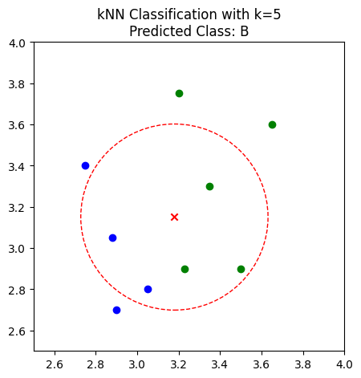

# K近邻(KNN)算法学习笔记

---

## 1. KNN算法的基本思想

**K近邻（K-Nearest Neighbors, KNN）**是一种基本且直观的监督学习算法，可用于分类和回归任务。其核心思想是：一个样本的类别由其在特征空间中最近的K个邻居的类别决定。

### 1.1 从最近邻到K近邻

* **最近邻算法 (Nearest Neighbor)**：将未知样本的类别判定为其最近的单个训练样本的类别。这种方法非常简单，但极易受到噪声或异常点的影响。
* **K近邻算法 (K-Nearest Neighbors)**：为了解决最近邻算法的鲁棒性问题，KNN算法选择未知样本周围一定范围内的**K个**最近的样本。然后，根据这K个邻居的类别，通过某种决策规则来确定未知样本的类别。

---

## 2. KNN算法流程

KNN的实现流程主要分为以下四个步骤：

1.  **数据准备**：对数据进行预处理，如清洗、缺失值处理、特征工程等，将每条数据整理成特征向量。**（补充）** 对KNN而言，最重要的一步是**特征缩放（标准化或归一化）**，因为该算法基于距离计算，不同特征的量纲会严重影响距离的真实性。
2.  **计算距离**：计算待预测的测试样本与所有训练样本之间的距离。常用的距离度量有欧氏距离和曼哈顿距离。
3.  **寻找K个邻居**：根据计算出的距离，找到与测试样本距离最近的K个训练样本。
4.  **决策分类**：根据这K个邻居的类别，使用决策规则来确定测试样本的最终类别。

### 2.1 决策规则

最常用的决策规则有两种：

* **多数表决法 (Majority Voting)**：这是最简单的方法。K个邻居中哪个类别的样本数量最多，测试样本就被判定为哪个类别。
* **加权表决法 (Weighted Voting)**：为了避免距离远近不同的邻居拥有相同的话语权，可以引入权重。基本思想是：**距离越近的邻居，其权重越大**。一个常见的加权方式是使用“距离的倒数”作为权重。

    例如，对于某个邻居 $i$，其与测试样本的距离为 $d_i$，则其权重 $w_i$ 可以设为：
    $$w_i = \frac{1}{d_i + \epsilon}$$
    
    （其中 $\epsilon$ 是一个很小的常数，防止距离为0时分母出错）。然后，将每个类别的权重相加，最终选择总权重最大的类别作为预测结果。

---

## 3. KNN的优缺点

| 优点 | 缺点 |
| :--- | :--- |
| 理论简单，容易实现。 | 对于大样本数据集，计算量非常大，因为每次预测都要计算与所有训练点的距离。 |
| 是一种在线技术，新数据可以直接加入数据集，无需重新训练。 | **维度灾难**：在高维空间中，点之间的距离会变得非常大且相近，使得“邻近”这个概念失去意义。 |
| 对异常值和噪声有较高的容忍度（相比于单个最近邻）。 | **样本不平衡**问题影响大：如果某类样本数量远多于其他类，那么它在投票中会占据天然优势。 |
| 支持多分类任务。 | **K值的选择**非常关键，需要依靠经验或交叉验证来确定。 |


### K值的选择

K值的选择是KNN模型的核心，它直接影响模型的性能：

* **较小的K值**：模型会变得复杂，容易学习到数据集中的噪声，导致**过拟合**。模型的方差会较大。
* **较大的K值**：模型会变得简单，可能会忽略数据中局部的、有用的模式，导致**欠拟合**。模型的偏差会较大。

寻找最佳K值最常用的方法是**交叉验证**。例如，可以尝试一系列K值（如从2到10），对每个K值都进行一次交叉验证，计算其平均准确率，然后选择使准确率最高的那个K值。


*上图展示了在丁香花数据集上，准确率随K值变化的曲线，可以看出K=4或K=6时模型表现较好。*

---


## 4. knn 实验部分


### 实验一：自定义KNN函数实现分类

#### 1. 数据创建
```python
import numpy as np
def create_data():
    features = np.array([[2.88, 3.05], [3.1, 2.45], [3.05, 2.8], [2.9, 2.7], [2.75, 3.4],
                         [3.23, 2.9], [3.2, 3.75], [3.5, 2.9], [3.65, 3.6], [3.35, 3.3]])
    labels = ['A', 'A', 'A', 'A', 'A', 'B', 'B', 'B', 'B', 'B']
    return features, labels

features, labels = create_data()
```

#### 2. 距离度量函数
```python
# 曼哈顿距离
def d_man(x, y):
    d = np.sum(np.abs(x - y))
    return d

# 欧氏距离
def d_euc(x, y):
    d = np.sqrt(np.sum(np.square(x - y)))
    return d
```

#### 3. 投票函数（多数表决）
```python
def majority_vote(class_count):
    # 输入为字典，对输入的各种标签投票总数从大到小排序
    sorted_class_count = sorted(
        class_count.items(), key=lambda x: x[1], reverse=True
    )
    return sorted_class_count
```

#### 4. KNN分类器主函数
```python
# 实现 knn 算法
def knn_cls(test_data, train_data, labels, k):
    distances = np.array([d_eu(test_data, train_data[i]) for i in range(len(train_data))])
    sorted_indices = np.argsort(distances)
    nearest_indices = sorted_indices[:k] # 获取前 k 个最近邻的索引
    
    # r 用于画出大致的分类边界
    r = (distances[sorted_indices[k]] + distances[sorted_indices[k-1]]) / 2
    
    nearest_labels = [labels[i] for i in nearest_indices] # 获取前 k 个最近邻的标签
    class_count = {}
    for label in nearest_labels:
        if label not in class_count:
            class_count[label] = 0
        class_count[label] += 1 # 统计每个标签的出现次数
    sorted_class_count = majority_vote(class_count) # 对标签进行投票
    return sorted_class_count, r
```

#### 5. 测试
```python
test_data = np.array([3.18, 3.15])
final_label, r = knn_cls(test_data, features, labels, 5)
print(final_label)
# 输出: [('B', 3), ('A', 2)]
```

#### 6. 画图

```python
# 画图
plt.figure(figsize=(5, 5))
plt.xlim(2.5, 4.0)
plt.ylim(2.5, 4.0)    

# 画出分类边界
circle_patch = plt.Circle((test_data[0], test_data[1]), r, color='r', fill=False, linestyle='--')
ax = plt.gca()
ax.add_patch(circle_patch)

# 画出数据点
x_features = list(map(lambda x: x[0], features))
y_features = list(map(lambda x: x[1], features))
plt.scatter(x_features[:5], y_features[:5], marker='o', color='b')
plt.scatter(x_features[5:], y_features[5:], marker='o', color='g')
plt.scatter([test_data[0]], [test_data[1]], c='r', marker='x')
plt.Circle((test_data[0], test_data[1]), r, color='r', fill=False, linestyle='--')
plt.title(f'kNN Classification with k={5}\nPredicted Class: {final_label[0][0]}')
plt.show()
```




### 实验二：使用Scikit-learn对丁香花数据集分类

#### 1. 数据导入与划分

```python
import pandas as pd
from sklearn.model_selection import train_test_split

# 导入数据
lilac_data = pd.read_csv("./syringa.csv")
# 划分特征和标签
feature_data = lilac_data.iloc[:, :-1]
label_data = lilac_data['labels']
# 70%作训练集, 30%作测试集
X_train, X_test, y_train, y_test = train_test_split(feature_data, label_data,
                                                    test_size=0.3, random_state=2)
```

#### 2. 构建KNN分类函数
```python
from sklearn.neighbors import KNeighborsClassifier

def sklearn_classify(train_data, label_data, test_data, k_num):
    # 使用KNeighborsClassifier构建KNN模型
    knn = KNeighborsClassifier(n_neighbors=k_num)
    # 训练模型
    knn.fit(train_data, label_data)
    # 预测
    predict_label = knn.predict(test_data)
    return predict_label
```

#### 3. 寻找最优K值
```python
import numpy as np
from matplotlib import pyplot as plt

# 准确率计算函数
def get_accuracy(test_labels, pred_labels):
    correct = np.sum(test_labels == pred_labels)
    n = len(test_labels)
    accur = correct / n
    return accur

normal_accuracy = []
k_value = range(2, 11) # k值从2到10

for k in k_value:
    y_predict = sklearn_classify(X_train, y_train, X_test, k)
    accuracy = get_accuracy(y_test.values, y_predict) # .values将pandas.Series转为numpy.ndarray
    normal_accuracy.append(accuracy)

# 绘制准确率随k值变化曲线
plt.xlabel("k")
plt.ylabel("accuracy")
plt.plot(k_value, normal_accuracy, c='r')
plt.grid(True)
plt.show()
```
