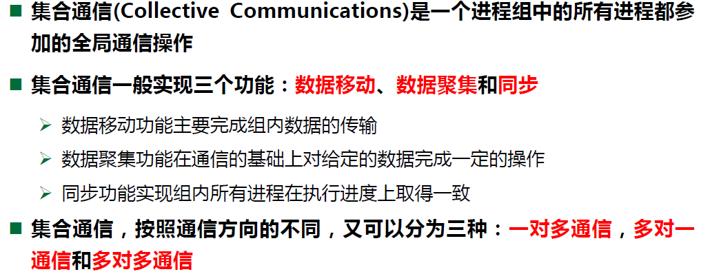

# MPI

## 简介

MPI(Message Passing Interface)是一种**进程间**信息的传输标准，无关具体的编程语言。


## 基本编程（C++）

> 基于**多进程**的并行编程方法

### MPI程序的编译与运行

```bash
# 编译时仍然使用 g++， 但是要指明头文件和lib的地址，还要加上 -l msmpi
g++ ./hello.cpp -l msmpi -I "G:\codeTools\mySDKs\MIcrosoft SDKs\MPI\Include" -L "G:\codeTools\mySDKs\MIcrosoft SDKs\MPI\Lib\x64" -o hello.exe

# 使用 mpiexec 运行相关程序， -n 参数指明创建的进程数
mpiexec -n 4 ./hello.exe
```


### MPI相关名词

1. 进程组（process group）
    - 是全部MPI进程的有限、有序子集。进程组中每个进程被赋于一个在该组中唯一的序号(rank)，用于在该组中标识该进程。序号的取值范围是 $[0,进程数-1]$
2. 通信域（communicator）
    - 通信域包括进程组和通信上下文等内容，用于描述通信进程间的通信关系
    - 通信域分为组内通信域和组间通信域，分别用来实现MPI的组内通信和组间通信，多数 MPI用户只需进行组内通信
    - MPI中通信上下文如同系统设计的超级标签，用于安全地区别不同的通信，以免相互干扰
    - MPI包括几个预定义的通信域。 例如，MPI_COMM_WORLD是所有MPI进程的集合，在执行了MPI_Init函数之后自动产生，MPI_COMM_SELF是每个进程独自构成的、仅包含自己的通信域
    - 任何MPI通信函数均必须在某个通信域内发生


### 基本函数

#### 初始化与结束

```cpp
int MPI_Init(const int* argc, char *** argv);
int MPI_Finalize();
```

> 二者之间是可并行代码，二者之外只能串行运行


#### 获取 rank 和 进程数

```cpp
// 获取指定通信域的进程总数， 值存在 &size 里， 返回值为错误码(下同)
int MPI_Comm_size(MPI_Comm comm, int *size);

// 获取本进程在指定通信域内的进程编号
int MPI_Comm_rank(MPI_Comm comm, int *rank);
```


#### 发送消息

```cpp
int MPI_Send(void *buf, int count, MPI_Datatype datatype, int dest, int tag, MPI_Comm comm);
```


> **为什么还要消息标签？**
>
> - 当发送者连续发送两个相同类型消息给同一个接收者，如果没有消息标签，接收者将无法区分这两个消息
> - Client/server模式中，服务进程可通过消息标签区分客户进程


#### 接收消息

```cpp
int MPI_Recv(void *buf, int count, MPI_Datatype datatype, int source, int tag, MPI_Comm comm, MPI_Status *status);
```


## 点对点通信

>Point-to-Point Communication :
>
>- 两个MPI进程之间的通信
>- 源进程发送消息到目标进程
>- 目标进程接收消息
>- 通信发生在同一个通信域内


### MPI通信函数术语

- Blocking（阻塞）：发送/接收函数调用等待操作完成才返回，返回后用户才可以重新使用调用中所占用的资源
- Non-blocking（非阻塞）：函数调用不必等待操作完成便可返回，但这并不意味着调用中所占用的资源可被重用
- Local（本地）：函数调用的完成不依赖于其它进程
- Non-local（非本地）：函数调用的完成依赖于其它进程，例如：消息发送进程等待接收进程完成接收才返回
- Collective（集合）：进程组里的所有进程都参与通信


### MPI点对点通信函数相关

- 两种**通信机制**：阻塞 与 非阻塞

- 通信模式（communication Mode）指的是缓冲管理以及发送方和接收方之间的同步方式。

    MPI支持四种**通信模式**：

    - 同步(synchronous)通信模式
    - 缓冲(buffered)通信模式
    - 标准(standard)通信模式
    - 就绪(ready)通信模式

- **通信机制和通信模式组合，产生对应的通信函数**


### 阻塞 vs. 非阻塞


## 集合通信(Collective)

### 梗概




> 集合通信的语句必须是每个进程都可以运行地到的地方


### 数据移动


### 数据聚集


### 相关api

> 数据移动 api

1. **Broadcast -- 数据广播**

    ```cpp
    int MPI_Bcast ( void *buffer, int count, MPI_Datatype datatype, int root, MPI_Comm comm);
    ```

    

    

    

2. **Gather -- 数据收集**

    ```cpp
    int MPI_Gather ( void *sendbuf, int sendcnt, MPI_Datatype sendtype, void *recvbuf, int recvcnt, MPI_Datatype recvtype, int root, MPI_Comm comm );
    ```

    

    

3. **Scatter -- 数据分散**

    ```cpp
    int MPI_Scatter ( void *sendbuf, int sendcnt, MPI_Datatype sendtype, void *recvbuf, int recvcnt, MPI_Datatype recvtype, int root, MPI_Comm comm );
    ```

    


> 数据聚集 api

4. **Reduce -- 数据归约**

    ```cpp
    int MPI_Reduce ( void *sendbuf, void *recvbuf, int count, MPI_Datatype datatype, MPI_Op op, int root, MPI_Comm comm );
    ```

    

    

    **预定义归约操作 vs. 用户自定义归约操作**

    

    


> 数据同步 api

5. Barrier -- 栅栏同步

    ```cpp
    int MPI_Barrier(MPI_Comm comm);
    ```

    


### 注意事项


## 进程组和通信域管理


## 用户定义数据类型

### MPI预定义数据类型


### MPI派生数据类型

