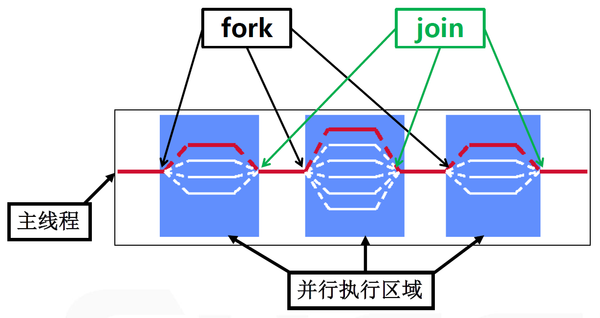
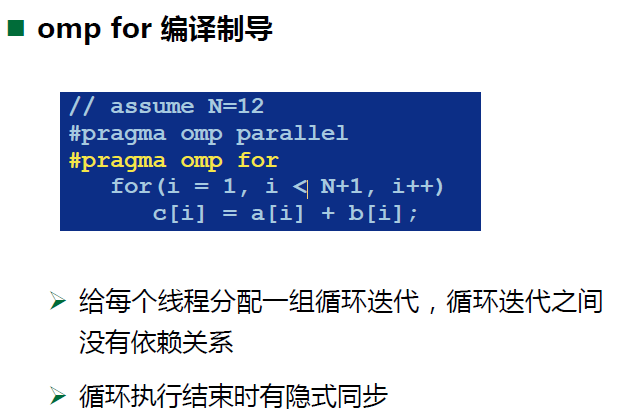
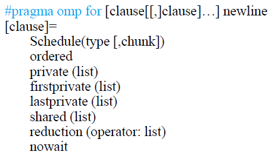
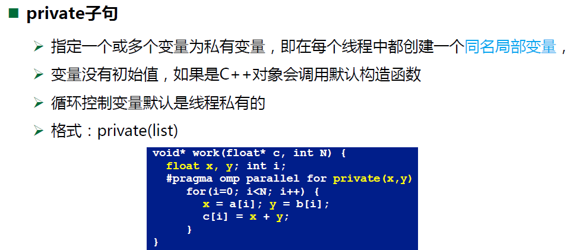
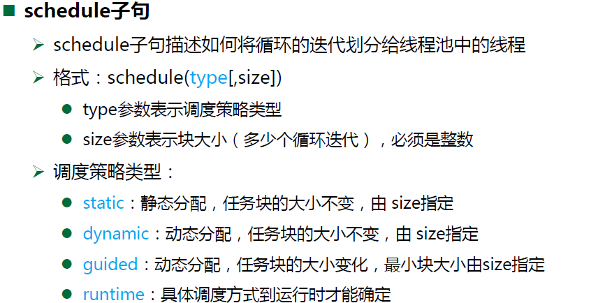
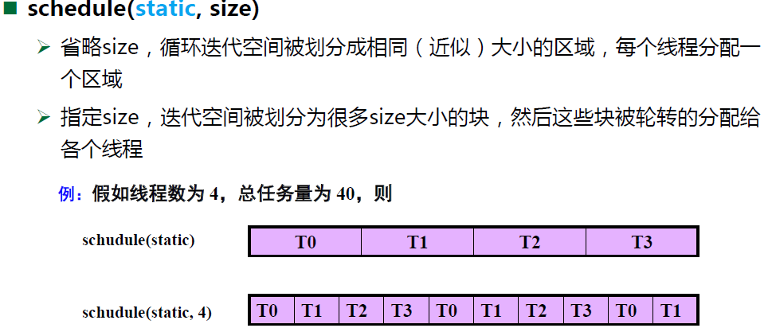
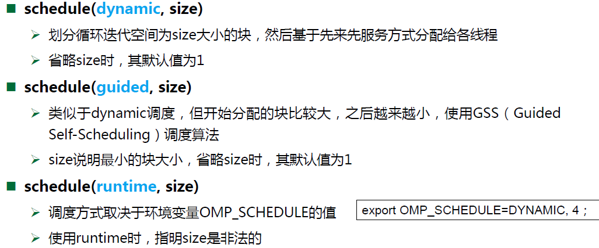
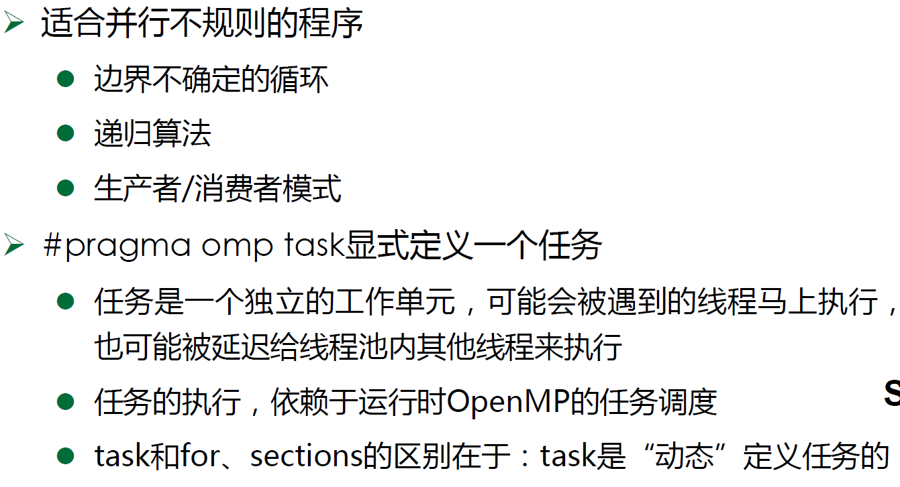

# openMP

## 简介

> - 串行程序最耗时的地方多在于循环，可以使用openMP来并行化循环代码
>
> - openMP的API采用**编译引导式指令**

### 执行模式

> - 基于线程的并行编程模式
> - 采用 fork-join 模式（如下图）  -->  一个入口，一个出口，否则难以管理




### 使用与编译

**包含头文件**

`include<omp.h>`  gcc自带，无需配置环境


**编译：**

```bash
# C： 二选一
gcc -fopenmp main.c -o main.exe
icc -openmp main.c -o main.exe

# C++ 编译器改为 g++ 即可
```


## 并行域指令

### 并行域指令

```cpp
#pragma omp parallel [clause[[,]clause]…]
{   
     ...  // 并行域执行的代码   
}
```

其中clause（子句）具体为：

```cpp
clause= if (scalar_expression) private (list) shared (list) default (shared | none) firstprivate (list) reduction (operator: list) copyin (list)
```


### **注意事项：**

- 花括号不能与上面的命令同行
- 并行域结尾有一个隐式同步 (barrier)
- 多个clause用空格隔开
- **并行域可以嵌套**  （具体如何操作？对应怎么样的多线程行为？）


## 工作共享指令

> 工作共享(work-sharing)指令分为三类：
>
> - omp for：负责循环任务的划分和分配
> - omp sections：指定一个并行区域，其中包含多个可并行执行的结构块
> - omp task：显式定义任务，放入任务对待等待执行


### omp for

> 只能在循环迭代**没有顺序依赖**的循环中，否则会出现未知错误

#### 使用举例




#### 具体格式



#### 几个常用参数











### omp sections

> 实行静态的任务划分


### omp task

> omp3.0 之后的新特性， 能够动态地进行任务划分，弥补sections的不足



#### 具体格式


### 注意事项

- 工作共享指令得在**并行域内**使用,否则只会被一个线程串行执行
- 结尾处有隐式barrier同步（也可以不同步，需用nowait子句）
- 可以与并行域指令组成复合指令， 如: `#pragma omp parallel for`


## 数据环境指令


## 同步指令


## 常用库函数


