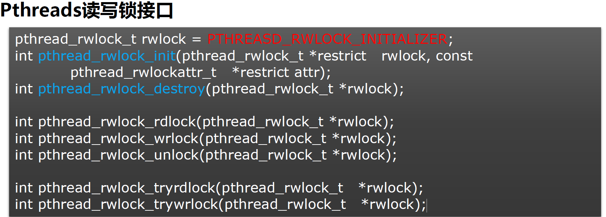

# pthread


> 无线程池的API，需要自己手动造轮子


## 线程管理


## 线程同步\资源同步


### 互斥锁

> mutex互斥量 --> 有两种状态，只要要有 0/1 表示两个状态即可
>
> - 无锁
> - 加锁


#### 创建与销毁

创建有两种方式： <font color="blue">静态创建</font> 和 <font color="orange">动态创建</font>

- mutex: 互斥量， 类型为 `pthread_mutex_t`
- attr: 设置互斥量的属性，通常可采用默认属性，即 `NULL`

```cpp
pthread_mutex_t mutex = PTHREAD_MUTEX_INITIALIZER;    // 静态创建

int pthread_mutex_init(pthread_mutex_t *restrict mutex, const pthread_mutexattr_t *restrict attr);    // 动态创建
```


如果是静态创建，无需销毁；而动态创建需要销毁

```cpp
int pthread_mutex_destroy(pthread_mutex_t *mutex);    // 销毁动态创建的mutex
```


> **创建与销毁函数成功都返回0，出错时返回错误码**

#### 加锁与解锁

```cpp
int pthread_mutex_lock(pthread_mutex_t *mutex);   // 如果无法加锁，就会进入线程阻塞状态

int pthread_mutex_unlock(pthread_mutex_t *mutex);   // 有锁解锁，没锁跳过

int pthread_mutex_trylock(pthread_mutex_t *mutex);  // 如果无法加锁。则不进行加锁，接着开始运行下面的代码（线程非阻塞）
```


### 读写锁

> 读写锁三种状态 
>
> - 读模式下加锁状态
> - 写模式下加锁状态
> - 不加锁状态
>
> **一次只有一个线程可以占有写模式的读写锁、但多个线程可以同时占用读模式的读写锁**


#### 接口（同互斥锁）




### 条件变量

> - 条件变量是另一种同步机制。多个线程可以等待同一个条件，条件满足时被唤醒。可以唤醒一个线程，也可以唤醒所有等待的线程
> - 互斥变量可以实现对一个共享数据的独占性访问，条件变量可以实现基于某个特定数值的停等-通知同步
> - 没有条件变量，程序员可用使用轮询某个变量来实现停等-通知同步，但是非常消耗系统资源
> - 条件变量可以使线程处于等待状态而不消耗资源
> - 条件变量跟互斥量mutex一起使用
> - 条件变量的类型是pthread_cond_t


#### 创建与销毁


具体解释同上


#### 条件变量等待（暂未理解）


#### 给条件变量发信号（暂未理解）


