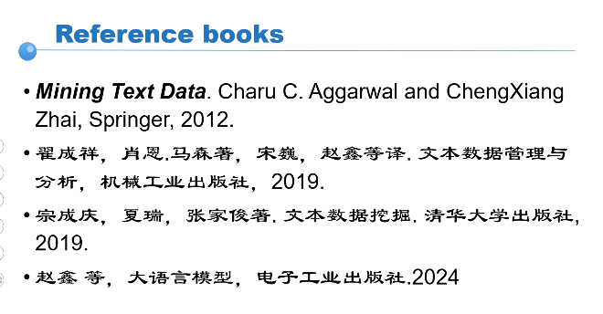

# introduction

## text mining 文本挖掘

- recommendation

## LM

### 预训练语言模型

- ELMo 2018年
  - 上下文相关
- BERT
- GPT

### LLM

语言是人类对认知和经验的总结，是人类对自己知识的压缩。

LLM只要能够词语接龙，就可以学习人类的所有知识？ （存疑）

LLM有创造能力吗？LLM学习人类以外的知识吗？

## 大模型

人类所能使用的数据总量 百万亿级别的 tokens

百亿级别 tokens = 1TB

预训练数据来源

- 通用数据
  - 网络文本
  - 书籍文本
  - 
- 专用数据
  - 科技文本
  - 代码数据

