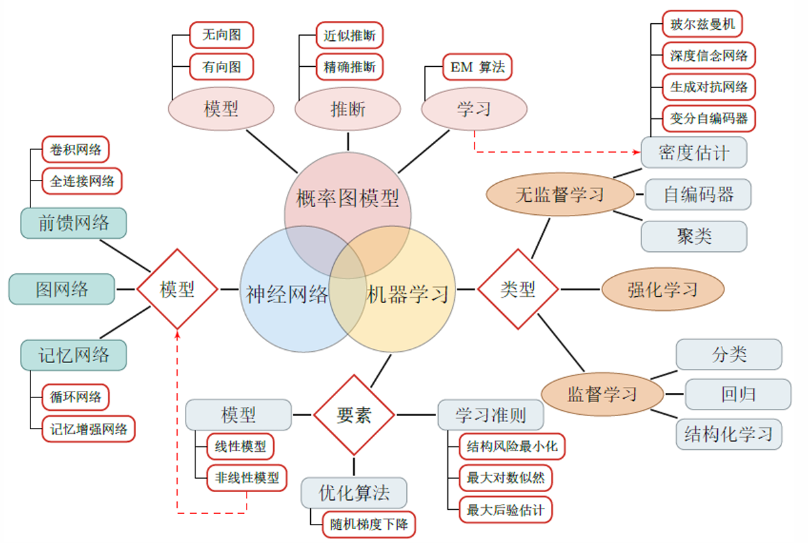
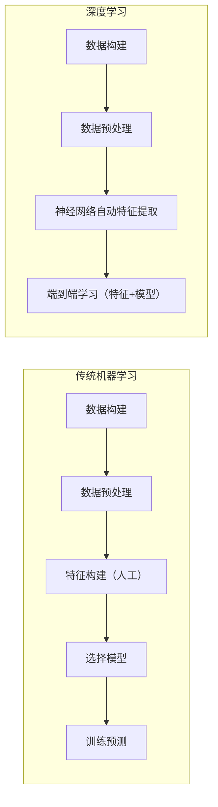

# 深度学习先导课

> **框架**：
>
> 


## 一、人工智能基础概念

### 1.1 图灵测试（Turing Test）
- **核心思想**：判断机器是否具有人类水平的智能
- **测试方法**：人类测试者通过文字与黑箱中的机器/人类进行交流，若无法区分二者则通过测试
- **现代意义**：成为评价对话系统的重要参考标准

### 1.2 人工智能发展脉络
#### 技术演进路线


#### 方法论演变
|   阶段   |  方法论  |   代表技术    |         特点          |
| :------: | :------: | :-----------: | :-------------------: |
| 理性主义 | 符号逻辑 |   专家系统    |     人工定义规则      |
| 经验主义 | 统计学习 | SVM, 随机森林 | 数据驱动+人工特征工程 |
| 连接主义 | 表示学习 |   神经网络    |     自动特征提取      |

## 二、机器学习体系解析

### 2.1 传统 vs 深度学习对比




#### 关键差异点

- 特征处理：人工设计 vs 自动学习
- 数据依赖：小数据 vs 大数据
- 计算需求：CPU计算 vs GPU加速

### 2.2 学习范式分类
#### 1. 监督学习（Supervised Learning）
- 典型应用：图像分类、语音识别
- 数据要求：带标签的样本对 (X,Y)

#### 2. 无监督学习（Unsupervised Learning）
- 典型应用：聚类分析、降维
- 子领域：自监督学习（伪标签生成）

#### 3. 强化学习（Reinforcement Learning）
- 核心机制：环境交互 + 奖励反馈
- 典型应用：游戏AI（如AlphaGo）、机器人控制

### 2.3 表示学习（Representation Learning）

$$
\text{原始数据} \xrightarrow{f_\theta} \text{低维表征} \xrightarrow{g_\phi} \text{预测结果}
$$
- **优势**：
  1. 缓解语义鸿沟（低层特征与高层语义的差异）
  2. 实现特征可迁移（如BERT的预训练机制）

## 三、神经网络基础

### 3.1 Hebb学习规则（1949）

> *"Neurons that fire together, wire together"*

- **数学表达**：$\Delta w_{ij} = \eta \ x_i x_j$
- **现代延伸**：**反向传播算法**的生物学基础

### 3.2 记忆机制类比
| 生物神经系统 |     人工神经网络     |
| :----------: | :------------------: |
|   短期记忆   | 激活值（Activation） |
|   长期记忆   | 权重参数（Weights）  |
|  突触可塑性  |     梯度下降优化     |

### 3.3 现代发展

1. **记忆增强网络**：LSTM/GRU的门控机制
2. **注意力机制**：Transformer中的key-value记忆
3. **持续学习**：灾难性遗忘问题的解决方案


## 四、关键问题思考
1. 为什么深度学习需要大数据？
   - 高容量模型需要大量数据防止过拟合
   - 特征自动发现依赖数据多样性

2. 如何理解"端到端"学习？
   
   - 消除人工处理环节，让梯度贯穿整个网络
   
   ```mermaid
   graph LR
   A[原始输入] --> B[模型提取特征并处理特征] --> C[生成最终输出] 
   ```
   
   
   
3. 深度学习与传统机器学习的本质区别？
   - 特征工程的自动化程度
   - 模型复杂度和表征能力
   - 对硬件算力的依赖程度


## others

应该还有一些不能体现在文字中的智能，动物没有文字但是有智能，人类曾经也没有文字

**文字和语言的关系？**

只通过学习文字就能学习到足够多的智能？  --> 大语言模型展示了这一点

多模态大模型（MLLM）本质上仍然是在依靠语言模型的智能，这条道路是否正确？
