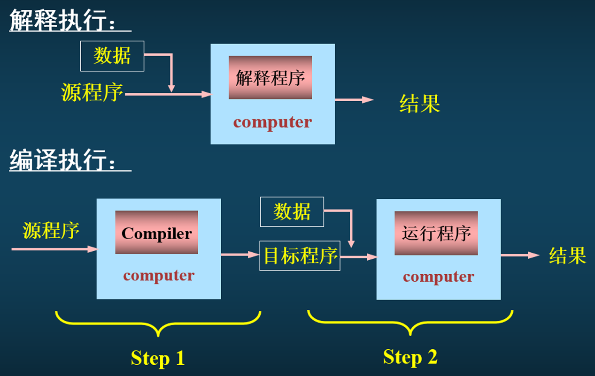

# compiler introduction

## 编程语言分类

### 使用方式

#### 命令式

- **面向过程**：强调解题过程，先考虑解决问题的步骤和具体的操作，然后将这些步骤和操作归结为一组过程（函数），再考虑如何调用这些过程以实现所需的功能，像C语言中的函数定义和调用。
- **面向对象**：将程序中的各种实体（数据和操作）视为对象，使用类来组织和管理对象，通过对象之间的交互来实现程序功能，例如Java中的类定义、对象创建和方法调用。

#### 声明式

- **函数式编程**：以数学函数为基础，把计算视为求值，避免状态及可变数据，以及命令式编程风格中对数据改变的操作。其语汇只包含表达式，没有语句，典型代表有Haskell 和 Mathematica。
- **逻辑编程语言**：基于数理逻辑的编程，将逻辑作为计算形式的依据，使用一阶逻辑来表示问题，由逻辑系统自动推导出问题的解，例如Prolog中的逻辑规则和查询。

### typing

- **静态类型**：在编译时进行类型检查，如C、C++ 和 Java。这类语言要求在程序运行前，所有变量的类型必须确定，并且在程序运行过程中，变量的类型不会改变。
- **动态类型**：在运行时进行类型检查，如Python、Ruby等。这类语言允许变量在运行过程中改变类型，变量的类型由其当前存储的值决定。
- **强类型**：不允许隐式数据类型转换，例如Python，在进行不同数据类型的运算时，必须显式进行类型转换，否则会报错。
- **弱类型**：允许隐式数据类型转换，如JavaScript，可以自动将字符串和数字进行隐式转换，例如将字符串 “123” 和数字 456 相加（在 JavaScript 中，这会先将数字转换为字符串再进行拼接）。

### 执行方式

- **编译型语言**：源代码在运行之前会被编译器翻译成机器代码，然后存储在可执行文件中。编译型程序通常执行速度比解释型程序快，占用的系统资源少。典型的编译型语言包括C、C++ 和 Fortran。
- **解释型语言**：源代码在执行时由解释器逐行读取、分析并执行。解释型语言不需要显式的编译步骤来将代码转换为机器指令，它们的代码以源代码形式存在，并且在每次运行时都需要解释器。这使得解释型语言在开发过程中调试更方便，但执行速度通常比编译型语言慢。典型的解释型语言包括Python、Ruby和JavaScript。

## 编译器

### 编译器定义

**定义**：编译器是一种程序，它接受用特定编程语言（源语言）编写的程序作为输入，并将其转换为另一种语言（目标语言）的等价程序。源程序经过编译后生成的目标程序可以在特定的计算机系统上运行。

**描述：**

- *Grune et al., 2000*：编译器是一个程序，它接受源程序的文本作为输入，并生成一个目标程序的文本作为输出，同时保留文本的语义。
- *Aho et al*.: 编译器是一个程序，它读取用源语言编写的程序，并将其翻译成一个等价的目标语言程序。

**分类：**

- **编译执行**：是由编译程序生成一个与源程序等价的目标程序，可以完全替代源程序，该目标程序可以运行任意次。
- **解释执行**：不生成目标程序，仅仅对源程序逐句解释逐句执行。
- 编译执行类似于自然语言翻译的 **笔译**；解释执行类似自然语言的 **口译**。

### 编译器表示

#### 函数表示

*T*=*C*(*S*)

- *T*：目标程序
- *C*：编译程序
- *S*：源程序

#### T 型图表示

**T 型图的联立表示**：

#### 符号表示

### 编译器的基本组成

#### 总览

- **逻辑结构（经典划分）**：

  

> - [词法分析（Lexical Analysis）](./Lexical Analysis)
> - [语法分析（Syntactic Analysis）](./Syntactic Analysis)

#### 表格管理（Table Management）

在编译过程中，需要维护多种表格来记录和管理各种信息，如符号表（用于存储标识符的相关信息，如类型、作用域等）、常数表（用于存储常数值）、字符串表等。表格管理是编译器的重要组成部分，它为各个阶段的操作提供数据支持。

#### 出错处理（Error Handling）

编译器在处理源程序时，可能会遇到各种错误，如语法错误、语义错误等。出错处理模块负责检测这些错误，并生成相应的错误信息。同时，它还需要采取适当的措施来限制错误的影响范围，以便编译器能够尽可能地继续工作，完成对源程序的处理。

#### 遍（pass）

对源程序后源程序的中间形式从头到尾扫描一遍扫描，并且做有关的分析工作， 生成新的源程序的中间形式后者生成目标程序。

