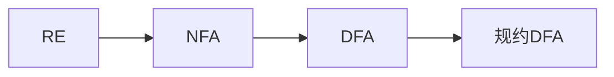

# Lexical Analysis

## introduction

### 基本功能

接收字符串形式的源程序，按照源程序输入的次序 **依次扫描** 源程序，在扫描的同时根据语言的词法规则识别出具有独立意义的单词，并产生与源程序等价的属性字（Token）流.

- 完成词法分析任务的程序称为 **词法分析程序 / 词法分析器 / 扫描器**

> 就是 **”分词！”**

### 关于词法分析程序

一般词法分析程序会作为一个 **独立的子程序**：

- 只要不修改接口，则词法分析器所作的修改不会 影响整个编译器，且词法分析器易于维护 

具体形式：

- 完全独立 -- *执行完词法分析再执行后面的步骤*
- 相对独立
- 协同程序  -- *执行词法分析的同时执行其他的步骤： 语法分析， 语义处理等*

### 两个关键问题

- 如何定义语言的词法规则？  -- **正规式**
- 如何识别输入字符串中的单词？-- **有限状态机 DFA**

## 一些前置知识

### 1. 正规式与正规集

词法规则的定义通常使用 **正规式**，其对应的数学模型是 **正规集**。正规式和正规集之间的关系如下表所示：

| 正规式      | 正规集         | 可能的 Token 示例                              |
| :---------- | :------------- | :------------------------------------------- |
| $\epsilon$  | $\{\epsilon\}$ | 空字符串（通常不作为独立 Token）              |
| $\emptyset$ | $\emptyset$    | 不可能的 Token（空集）                        |
| a           | $\{a\}$        | 单个字符                                     |
| $r | s$     | $R \cup S$     | 或运算，表示属于 R 或 S 的字符串                 |
| $r \cdot s$ | $R \circ S$    | 连接运算，表示 R 中的字符串后面连接 S 中的字符串 |
| $r^*$       | $R^*$          | 克林闭包，表示零次或多次重复 R 中的字符串      |

其中，$R \circ S$ 或 $RS$ 表示连接运算。

**一些运算的例子**：

- 正规式 $01$ 的正规集为 $\{0, 1\}$ 
- 正规式 $0 \cdot 1$ 的正规集为 $\{01\}$ 
- 正规式 $10$ 的正规集为 $\{10\}$ 
- 正规式 $0^*$ 的正规集为 $\{\epsilon, 0, 00, 000, \ldots\}$ 
- 正规式 $1^*$ 的正规集为 $\{\epsilon, 1, 11, 111, \ldots\}$ 
- 正规式 $(0  |  1)0^*$ 的正规集为 $\{0, 1, 00, 000, \ldots, 10, 100, 1000, \ldots\}$ 

> 正规式运算优先级从高到低  $()、*、\cdot、 | $ 

**正规式运算的相关性质：**

| 性质名称                     | 公式表达                                                 |
| ---------------------------- | -------------------------------------------------------- |
| 可交换律                     | $s |t=t |s$                                          |
| 可结合律                     | $s | (t | r) = (s | t) | r$                              |
| 连接的可结合律               | $(s \cdot t) \cdot r = s \cdot (t \cdot r)$              |
| 连接对“或”的分配律（左分配） | $s \cdot (t | r) = s \cdot t | s \cdot r$                |
| 连接对“或”的分配律（右分配） | $(t | r) \cdot s = t \cdot s | r \cdot s$                |
| ε 是连接的恒等元素            | $\varepsilon \cdot s = s$  &&  $s \cdot \varepsilon = s$ |
| 克林闭包与 ε 的关系            | $s^* = (s | \varepsilon)^*$                              |
| 克林闭包的幂等律             | $(a^*)^* = a^*$                                          |

### 2. 有限状态自动机

有限状态自动机（FA）分为确定的 **有限自动机（DFA）** 和 **非确定的有限自动机（NFA）**

#### 确定的有限自动机（DFA）

一个 DFA 可以定义为一个五元组 $M = (S, \Sigma, f, S_0, Z)$，其中：

- $S$ 是状态的有限集合
- $\Sigma$ 是输入字符的有限集合（或有穷字母表）
- $f$ 是状态转换函数，$f: S \times \Sigma \to S$ 
- $S_0$ 是初始状态，$S_0 \in S$ 
- $Z$ 是终态集合，$Z \subseteq S$ 

DFA 的初始状态 $S_0$ 必须唯一

DFA 的状态转换函数必须是确定的，即对于每个状态和输入字符，下一个状态是**唯一**的。

#### 非确定的有限自动机（NFA）

一个 NFA 也可以定义为一个五元组 $M = (S, \Sigma, f, S_0, Z)$，其中：

- $S, \Sigma, S_0, Z$ 的定义与 DFA 相同。
- $f$ 是状态转换函数，$f: S \times \Sigma \to 2^S$，即可以有多个可能的下一个状态。

NFA 的初始状态 $S_0$ 必须唯一

NFA 的状态转换函数是**多值**的，因此允许在一个输入字符下有多个可能的下一个状态。

### 3. 正规式与 FA 等价性

- 定理：字母表上的 **确定的有限自动机** M 所接受的语言 $L(M)$ 是该字母表上的一个正规集；对于每个正规式 $r$，存在一个非确定有限自动机 M，使得 $L(M) = L(r)$。
- 对于正规式 $r$，可以构造一个 NFA，然后将该 NFA 转换为等价的 DFA，从而实现词法分析。

## 有限自动机

### NFA 确定化算法

#### 子集法

- 状态集 $I$ 的 $\epsilon $ 闭包表示为 $\epsilon - closure(I)$ 
- $J$ 是 $I$ 中节点通过一条弧 a 能到达的节点组成的状态集, 则记 $J = move(I, a)$ 
- 假设 $I \subset S$ , $a \in \Sigma$ , 则令 $I_a = \epsilon - closure(J)$   其中， $J = move(I, a)$ 

 

#### 子集法算法流程

- 第一行由 **起始点** 构成集合 $I$  
- 对于每一行的集合 $I$ , 计算 $I_{\Sigma_0}, \ I_{\Sigma_1} \dots  \ I_{\Sigma_{n-1}}$, 找到之前没有出现过的集合，作为之后行的集合 $I$
- 直到没有新的集合出现，算法终止

**tips：**

- 每一个集合 $I$ 都对应 DFA 的一个状态

- 如果一个集合 $I$ 包含终态，则作为 DFA 的终态

### DFA 的化简

#### DFA 的化简思想

1. 删除无关状态
2. 合并等价状态

#### 划分法

DFA 最小化算法: **划分法**

- **无关状态**：对于 DFA(M)， **从初态开始输入任何字符串都不能到达的状态** 或者 **从该状态输入任何字符串都到不了终态的状态** 称为 **无关状态**。 
- **等价状态**：设 DFA(M)的两个不同状态 $q_1$，$q_2$，如果对于任意输入字符串 $\omega$，从 $q_1$，$q_2$ 状态出发，总是同时到达**接收状态或拒绝状态**之中，称 $q_1$，$q_2$ 是等价的。  
- 如果 DFA(M)既没有无关状态，且没有彼此等价的状态，则称 M 是规约的(即最小的 DFA)

#### 划分法流程

- 先删除无关状态
- 再进行下面的流程合并等价状态

1. 如何形成初始划分？
   - 分成 **终态集合 Z** 和 **非终态集合 S - Z**
2. 如何考察一个状态集 $I$ 是否可区分?
   - 对于状态集 $I = \{ s_1, s_2, \dots, s_m\}$ , 每两个状态都判断是否等价，等价则划分到同一子集，不等价则划分到不同集合
3. 对于最后的重新命名：划分的子集如果包含原 NFA的终态，则在新的 DFA中为终态；如果包含原NFA的初态，则为DFA中的初态

### 正规式与 FA 的等价性

#### FA 转 RE

**转换规则：**

#### RE 转 FA

- 先将 RE 转换为 NFA

- 再将 NFA 转化为 DFA 并且进行化简：子集法 + 划分法

**转换规则：**

