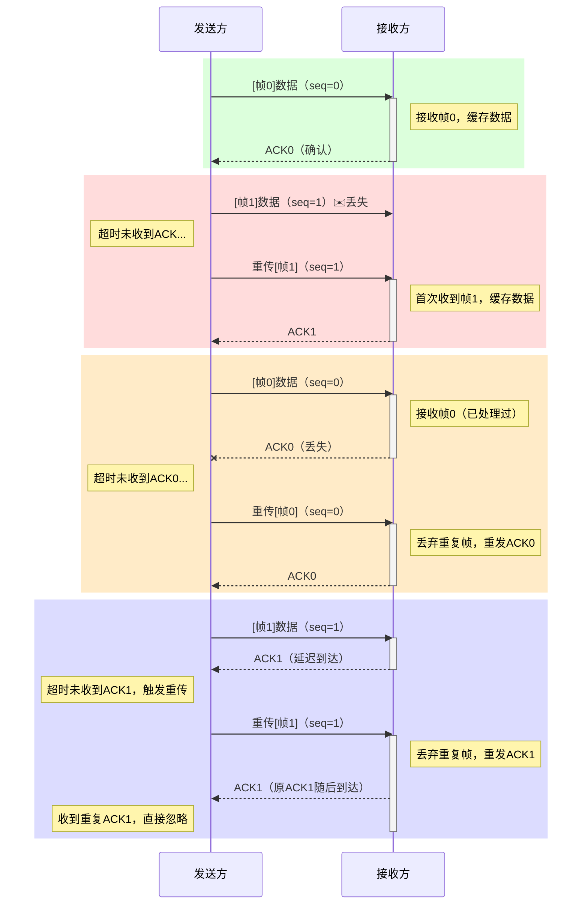

# Data Link Layer

## 功能总览

## 组帧（Framing）

每一帧添加 **首部** 和 **尾部**，还可能对 **数据报** 进行一定变换

 

### 字符计数法（Character Count）

**帧长 = 计数字段长度 + 帧的数据部分长度**

缺点： 任何一个字段出错，都会导致后续所有的帧都无法定界。 **健壮性较差**

### 字符填充法（Character Stuffing）

- **转义字符方案**

  

  如果数据报部分也有转义字符怎么办？再加转义字符即可

- **零比特填充法(0-bit stuffing)**

  现代计算机网络体系中常用的方法，因为其编解码的方法很容易使用硬件实现

  比如： **HDLC 协议， PPP 协议** 就是使用的该方法

  

  - **发送方** 需要对帧的数据报部分进行处理，每当遇到 5 个 1，就填充一个 0
  - **接收方** 需要对帧进行逆处理，每当遇到连续 5 个 1，就删除后面的 0

### 违规编码法 （coding violations）

**需要物理层的配合**

## 错误检测和纠正（Error Detection and Correction）

> 主要是校验码的知识，同《计算机组成原理》

### 奇偶校验码

**奇校验码**：整个校验码（有效信息位和校验位）中的“1”个数为奇数

**偶校验码**：整个校验码（有效信息位和校验位）中的“1”个数为偶数

若选择 **偶校验码**，对于校验码 11010111, **机器** 会使用 **异或（模 2 加法）** 来检测
$$
1 \oplus 1 \oplus 0 \oplus 1 \oplus 0 \oplus 1 \oplus 1 \oplus 1  = 0
$$

- 若结果为 0， 则数据大概率不出错
- 若结果为 1， 数据出错
- 能 **检测**，但是 **没有纠错能力**

### 循环冗余校验（CRC， Cyclic Redundancy Check） (考点)

#### 引入

**生成多项式 $x^3 + 1$ , 原始信息位为 10011101，求 CRC 校验码**

生成多项式对应 1001，故校验位为 3 位。在后面补上 3 个 0，得 10011101000，对 1001 进行除法，得到余数为 101

因此传输的比特串为 **10011101101** （保证了是 1001 的倍数）

#### 用于纠错

#### 一些生成多项式及其应用（了解）

| CRC Standard  | Generator Polynomial                                         | Application/Remark             |
| ------------- | ------------------------------------------------------------ | ------------------------------ |
| **CRC-8**     | x⁸ + x² + x¹ + 1                                             | ATM header                     |
| **CRC-10**    | x¹⁰ + x⁹ + x⁵ + x⁴ + x¹ + 1                                  | ATM AAL                        |
| **CRC-12**    | x¹² + x¹¹ + x³ + x² + 1                                      | -                              |
| **CRC-16**    | x¹⁶ + x¹⁵ + x² + 1                                           | -                              |
| **CRC-CCITT** | x¹⁶ + x¹² + x⁵ + 1                                           | HDLC                           |
| **CRC-32**    | x³² + x²⁶ + x²³ + x²² + x¹⁶ + x¹² + x¹¹ + x¹⁰ + x⁸ + x⁷ + x⁵ + x⁴ + x² + x¹ + 1 | LAN (Ethernet, ZIP, PNG, etc.) |

### 海明码（Hamming code）

#### 简介

**Hamming Code:** 

- **发明人：Richard Hamming**
- **设计思路：将信息位分组进行偶校验**

- 信息位 n 位，校验位 k 位，共有 n + k 位，需要保证 $2^k \ge n + k + 1$
- **1 位纠错能力，2 位检错能力**

#### 海明码求解步骤

对于信息位 1010，将其封装位海明码：

1. **确定海明码位数**：$2^k \ge n + k + 1 \Rightarrow k = 3$

   设信息位 $D_4D_3D_2D_1$, 校验位 $P_3P_2P_1$, 对应的海明码为 $H_7H_6H_5H_4H_3H_2H_1$

2. 确定海明码中 **校验位的分布**

   - 将校验位 $P_i$ 放到海明码编号为 $2^{i-1}$ 的位置上

   - 信息位按照顺序放到剩余位置

   | H₇   | H₆   | H₅   | H₄     | H₃   | H₂     | H₁     |
   | ---- | ---- | ---- | ------ | ---- | ------ | ------ |
   | D₄   | D₃   | D₂   | **P₃** | D₁   | **P₂** | **P₁** |
   | 1    | 0    | 1    | 0      | 0    | 1      | 0      |

3. **求校验码的值**

   将海明码中的信息位拿出，按照下面的方法计算： **每个校验码实质上是对海明码的位置信息的二进制编码**

   

   计算结果：
   $$
   P_1 = D_1 \oplus D_2 \oplus D_4 = 0 \oplus 1 \oplus 1 = 0  \\
   P_2 = D_1 \oplus D_3 \oplus D_4 = 0 \oplus 0 \oplus 1 = 1  \\
   P_3 = D_2 \oplus D_3 \oplus D_4 = 1 \oplus 0 \oplus 1 = 0  \\
   $$

4. **校验方程（纠错）**
   $$
   S_1 = P_1 \oplus D_1 \oplus D_2 \oplus D_4   \\
   S_2 = P_2 \oplus D_1 \oplus D_3 \oplus D_4   \\
   S_3 = P_3 \oplus D_2 \oplus D_3 \oplus D_4  \\
   $$
   偶校验，如果数据全部没有出错，则会接收到 000

   如果不是 000：则海明码的第 $S_3S_2S_1$ 位出错  （默认只出错 1 位）

#### 海明码补充

在上面提到的海明码的基础上再添加一个 **全校验位**，对整体进行偶校验 （默认错误位数不超过 2 位）

## 可靠传输(Reliable Transfer)与流量控制（Flow Control）

**相关术语：** 

- ACK, Acknowledgement Frame, 确认帧
- NAK，Negative Acknowledgement Frame，否认帧
- sliding window protocols，滑动窗口协议，常指 GBN 协议 和 SR 协议
- ARQ 协议，常指 SW 协议 和 GBN 协议 和 SR 协议
- 连续 ARQ 协议，常指 GBN 协议 和 SR 协议

### 停止等待协议（SW, Stop-and-Wait Protocol）

| 场景类型       | 处理机制                                                     |
| -------------- | ------------------------------------------------------------ |
| **正常传输**   | 接收方返回 ACK 后，发送方继续发送下一帧                        |
| **数据帧丢失** | 发送方超时未收到 ACK，自动重传相同帧                          |
| **ACK 丢失**    | 接收方检测到重复帧时，丢弃数据但重发 ACK（避免发送方无限等待） |
| **ACK 延迟**    | 发送方对重复 ACK 直接忽略（序列号匹配已处理帧时丢弃）          |
| **重复帧检测** | 接收方通过序列号判断是否为重复帧（0/1 交替）                  |

**缺点：** 效率低下

### 后退 N 帧协议 （GBN, Go-Back-N Protocol）

GBN 的特殊规则决定了：当收到连续几个帧（一般是 sending window 的大小）时，接收方只会返回最后一个确认帧，这时发送方会 **自动确认该帧以前的所有帧**。

当然如果这个确认帧在传播的途中出错了，发送方的 **0 号帧会最先超时**，然后会重发 0 及其之后的帧。 （后退 n 帧的含义）

此时如果我们用来编号帧的 bit 数不满足 $W_{sender} + W_{receiver} \le 2^n$  （如下图所示），则会在重发数据帧的时候，接收方不报错，从而 **导致该数据帧重复**。

**缺点：** 

- 如果接收方接受帧的速度很慢，或者在信道误码率很高，可能会导致反送方经常需要后退重传，导致传输效率低下

### 选择重传协议 (SR, Selective Repeat Protocol)

- 对于 **“接收窗口不能大于发送窗口”** 这条规则，其实不会引发错误，只是接收窗口大于发送窗口的部分并不能被充分利用。
- 我们一般选择让发送窗口和接收窗口的大小相等

对于数据帧丢失和确认帧丢失，还是利用 **超时重传机制**。

对于“接收方检测到数据帧出错而丢弃”的情况，接收方会发送一个 NAK，**即请求重传机制**。该机制无需等待超时，提高了选择重传协议的传输效率。

### 三种协议的信道利用率分析

$$
Effective bandwidth = efficiency \times  bandwidth
$$

#### SW 协议

在没有出现错误的理想情况下( 忽略处理时延 $t_{pr}$ )
$$
\eta = \dfrac{T_d}{T_d + 2\times T_p + T_a}
$$

**假设：**

- ACK frame 足够小，所以 ACK 的传输时间 $T_a$ 可以忽略不记
  $$
  \eta = \dfrac{T_d}{T_d + 2\times T_p } = \dfrac{1}{1 + 2 \alpha}, \quad 其中 \ \alpha = \frac{T_{p}}{T_{d}}
  $$
  

#### GBN 协议

理想情况下（忽略处理时延 $T_{pr}$ 和 ACK 传输时延 $T_{a}$ ）：
$$
\eta = \dfrac{N \cdot T_d}{T_d + 2\times T_p } = \dfrac{N}{1 + 2 \alpha}
$$
结合 **边界情况** 有公式:
$$
\eta = min(\frac{N}{1 + 2 \alpha}, 1)
$$
其中， N 为发送窗口；一次所能传输的 frame 数量（一般为发送窗口大小，可能受到其他因素影响）

## 媒介访问控制（MAC， Medium Access Control）

### 引入 -- MAC 子层

### 基于信道划分

#### 总览

- **时分复用(TDM, Time Division Multiplexing)**

- **统计时分复用(STDM, Statistic Time Division Multiplexing)**

- **频分复用（FDM, Frequency Time Division）**

  

  将一个信道的总频带划分为多个子频带，每个子频带作为一个子信道，每对用户使用一个子信道通信

  **缺点：** 只能用于传播 **模拟信号**，因为只有模拟信号有频率属性 

- **波分复用（WDM，Wavelength Division Multiplexing）**

  即光的频分复用

  **优点：** 光的频带很大，并且很适合光纤使用

#### 码分复用 （CDM，Code Division Multiplexing）

**在 2G，3G 时代使用广泛**

无须多盐

### 基于随机访问

#### 纯 ALOHA

关键点：发送失败后 **随机等待一段时间**

 

#### 时隙 ALOHA （Slotted ALOHA）

- 时隙是固定大小的
- 每一个帧都可以在一个时隙内传输完成

- **一个帧准备好之后，会在下一个时隙的开头发送该帧**

> 避免了用户的发送数据的随意性，降低了冲突概率，提高了信道利用率

####  CSMA（Carrier Sense Multiple Access） 载波监听多路访问协议

CSMA 协议在 ALOHA 协议的基础上改进： 在发送数据之前，先监听信道是否空闲，在信道空闲时，才会尝试发送

- 1-坚持 CSMA 协议

  

  - **优点**：空了就发，信道利用率高
  - **缺点**：一旦信道空闲会有一堆节点同时发出数据帧，冲突率高

- 非坚持 CSMA 协议

  

  - **优点**：随机推迟一段时间再尝试监听，降低了冲突概率
  - **缺点**：信道刚恢复空闲时，可能不会被立刻利用，导致信道利用率低下

- p-坚持 CSMA 协议

  折中方案：再一个关键的选择分支上加一个概率 p （rl 中的 $\epsilon$ 探索）

  

#### CSMA/CD

- 'CD' means 'Collision Detection'

- **用于早期的有线以太网（总线型）** (IEEE 802.3, Ethernet)

- **重点 + 难点**

##### 对于 Contention Period 的解释

$$
争用期（Contention \ Period） = 2 \times 最远单向传播时延
$$

考虑一条总线上的两端的两个节点 A 与 B，以最极限的情况为例，节点A向B传输的数据串经过一个传播时延即将到达节点B，此时节点B尚未检测到信道冲突，并且传输了一点数据串给A，并且立刻检测到了冲突，从而停止发送数据。考虑B已经发送的数据串，会经过一个传播时延才会到达A并且被A检测到，所以：**A从开始向信道发送数据到检测到冲突，花费了 2*最大单向传播时延** （也即 Contention Period）

##### 对于最短帧长 (Minimum Frame Length) 的解释

$$
MFL = 2 \times 最淡单向时延 \times 信道带宽
$$

如果一个节点的发送的数据帧长度小于 MFL，则可能会导致该节点**误以为**发送过程中没有发生冲突（但是实际上已经发生了冲突）

##### 最长帧长

> 规定最长帧长可以防止某些节点一直占用信道，这个数值一般取决于设计者

**以太网规定： （作为常识）** 

- 最短帧长 = 64 B
- 最长帧长 = 1518 B

#### CSMA/CA

- 'CA' means 'collision avoidance'
- 应用于无线网络 如IEEE 802.11 。标准的无线网络技术 WiFi
- **难点（但不是重点）**

