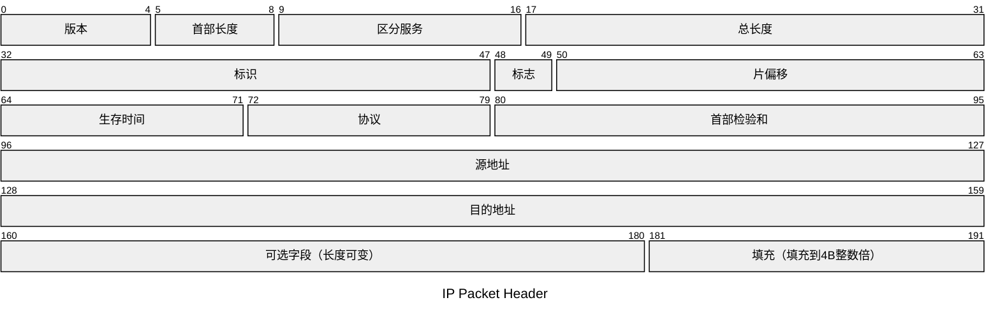

# Network Layer

## introduction

### 需要实现的功能

- 异构网络的互连

  - 异构即网络内部的实现方式各异，物理层和数据链路层实现不同，主机类型也不同
  - 重要的设备： 路由器 (Router)
  - tips: 在 TCP/IP 中，路由器也成为网关（Gateway）

- 路由和转发

  - 路由(Routing)

    -  各个路由器之间相互配合，规划IP数据报（分组）的最佳转发路径

    - 注：每个路由器都需要路由协议，最终生成各自的 "路由表"

  - 转发(forwarding)

    - 一台路由器，根据自己的 ”转发表”，将收到的 IP数据报 从合适的接口转发出去
    - 注：**转发表 = 精简版路由表**， 更精简的数据结构有助于**快速检索**

- 拥塞控制

  - 拥塞
    - 原因：网络上出现过量分组，超负荷，引起网络性能下降
    - 现象：网络上的分组数量增加，但是吞吐量反倒下降
    - 类比：节假日路上的汽车增多到一定程度，收费站的吞吐量反倒降低
  - 拥塞控制方法
    - **开环控制（静态方法）：**在部署网络时，就提前设计好预防拥塞的方法。一旦网络系统开始运行，就不再修改。
    - **闭环控制（动态方法）：**动态监视网络状态，及时发现网络拥塞，并且将拥塞信息传递给相关路由器（如通过 ICMP）。相关路由器即使调整 “路由表”

## IP 协议

可见 IP 协议在互联网中的重要性

## IPv4

### IP Packet

- Header 固定占用 20B;  可选部分 0 ~ 40B
- **三个长度相关的字段**： **418, 首总偏**

#### 第一行字段

- ”版本“： 用于区分网络层使用的 IP 协议版本, v4 或者 v6

#### 第二行字段

一个链路层数据帧能承载的**最大数据量**称为**最大传输单元（MTU）**。以太网的 MTU = 1500B。**如果一个 IP 数据报超过了 MTU，那么就要进行分片**。

- “标识”  16bit： 由 IP 数据报的**"源主机"**生成，通常是自增序列。
- “标志” 3bit
  - 最低位 MF(More Fragment) ：  1 表示还有剩余分片； 0 表示没有更多分片
  - 次低位 DF（Don't Fragment）： 1 表示禁止分片； 0 表示允许分片
- “片偏移”： 当前分片的偏移量 = **"片偏移" x 8B**

**一个分片问题的例子：**

**tips:**

-  IP数据报的“分片”可能在源主机、或任何一个路由器中发生
- 只有目的主机才会对分片进行“重组”
- 各分片有可能乱序到达目的主机
- 由于首部的“片偏移”字段是以×8B为单位，因此，除了最后一个分片外，其他每个分片的**数据部分**必须是8B的整数倍。**（易错）**

#### 第三行字段

- **生存时间(TTL)**: 数据报在网络中可通过的路由器数量的最大值。IP分组每经过一个路由器，TTL减1，如果已经减到0，该路由器就丢弃分组，并向源主机发送**ICMP报文**（通知出现异常）
- 协议：eg 如果为 TCP协议服务，则为6；如果为UDP协议服务，则为17。让目的主机的网络层知道其去处。
- 首部校验和
  - 每个路由器仅校验首部，而不校验数据部分
  - 如果该字段全为0，表示不用校验
  - 校验和的计算方法和 UDP 相同

### 传统 IP 地址分配

### 子网划分 & 子网掩码

王道 4.4.3

传统网络划分，分为 A,B,C等几级网络，IP地址只有两级结构 = \<网络号， 主机号\>

有了**子网划分**之后，IP地址变为三级结构 = \<网络号， 子网号， 主机号\>

### 无分类编制 CIDR

传统定长子网掩码还是太浪费了，仍然需要改进，于是就有了变长子网。

### 路由聚合

特点：

- 路由聚合可以减少路由表的大小

- 路由聚合可能会引入额外的无效地址

### 习题

tag: 定长子网划分

tag: 变长子网划分

