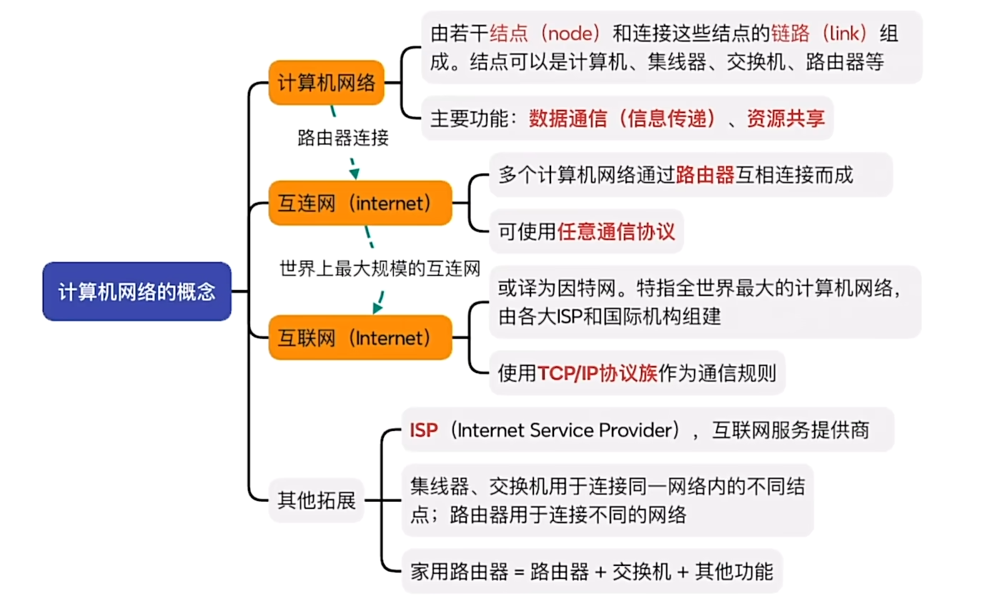
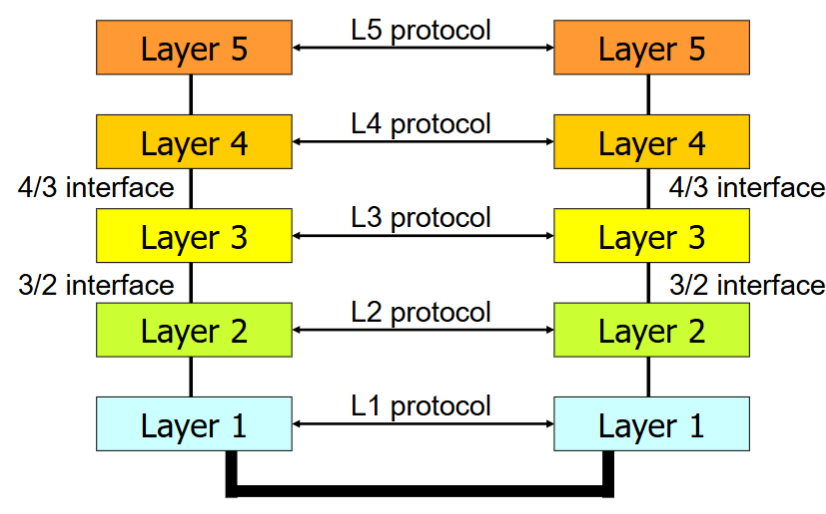
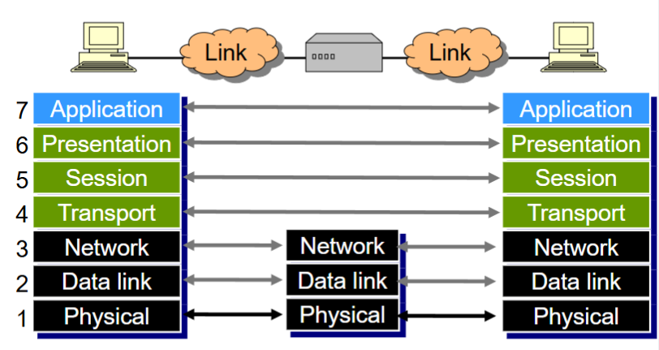
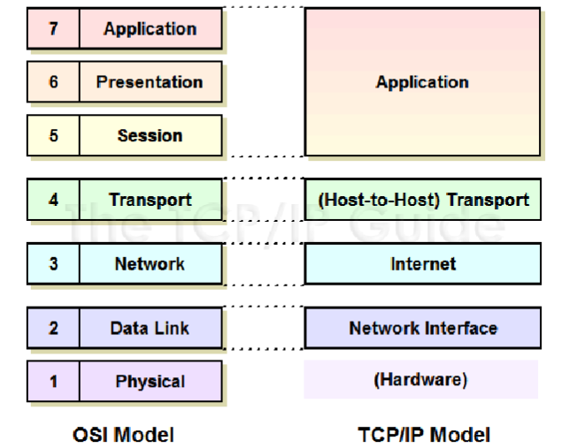

# introduction

## 总览

## others

trace route 命令

windows 下： `tracert <url>`

## Protocol layers, service models

### **Protocol Layers 的几个部分：**

- hosts 主机
- routers 路由器
- links of various media 多种媒体链接
- applications 应用

### **为什么要分层？**

    
         
     

**Advantages:**

- Modularity -- 更加易于管理和维护
- Abstract functionality -- 下层改变而不会影响下层
- Reuse -- 上层可以重用下层提供的功能

**Disadvantage：**

- Information Hiding -- 低效的实现，简单数据也要经过层层处理

### **Layered Protocol Architecture 分层协议架构**

每一层都为其上一层提供服务(service)

**服务是定义在同一机器的不同层，协议是定义在不同机器的同一层**

- Peer ：对等体，不同机器的对应层

- Protocol： 对等体的通信方式
  - Protocol interface： 规定网络元素之间的通信规则和格式
  - 确定对等方如何实现服务
  - 不控制单个机器上的实现，而是如何在不同机器之间实现该层

### **层封装（Layer Encapsulation）**

    
       
    
<

​    

### Services  && Interfaces

### OSI Reference Model

### TCP/IP Reference Model

