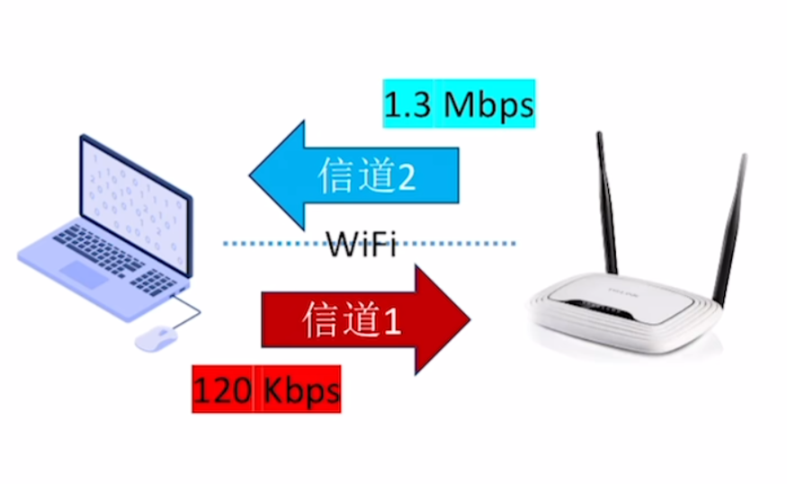
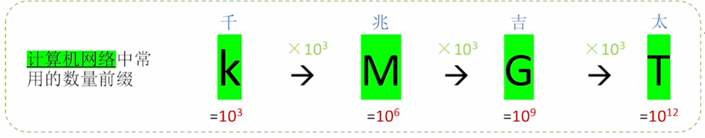
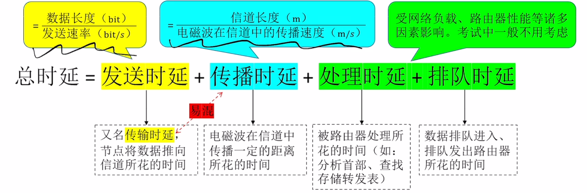
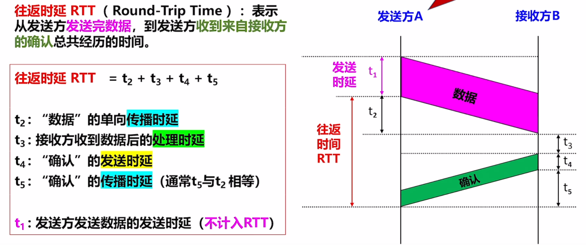
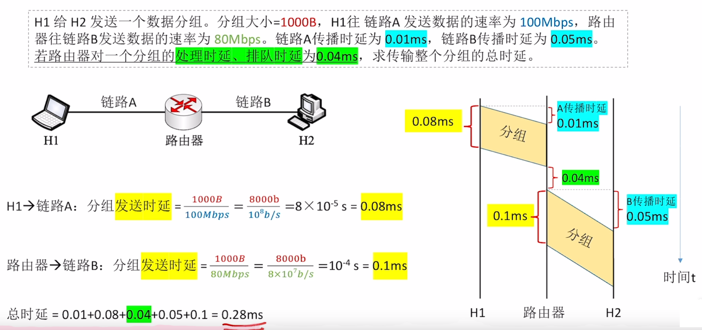

# 计算机网络的性能指标

## 速率相关指标

###  信道速率 (bit rate)

- 信道速率: 又称**数据率**、**比特率**、**传输速率**

- 单位: bit/s，  b/s，  **bps**

- 单位换算：以 10 为底 (以 1000 为一个台阶)

 

 

### 带宽 (bandwidth)

**带宽**：某信道所能传送的**最高比特率**， 单位 **bps**

**by the way:** 在 **《通信原理》**中，带宽（bandwidth）表示**某信道允许通过的信号频带范围**。基础单位为 Hz

> 但是二者本质相同，都是**信道带宽越大传输数据的能力越强**

### 吞吐量(Throughput)

吞吐量：指单位时间内通过某个网络（或信道、接口）的**实际数据量**， 单位 **bps**

吞吐量受带宽、复杂的网络负载情况影响

## 时间相关指标

### 时延（Delay）

**时延**： 指数据从网络的一端传送到另一端所需要的时间，单位为 **s**

- 传输时延，Transmission Delay
- 传播时延，Propagation Delay

### 时延带宽积

$$
时延带宽积 = Propagation \ Delay \times Bandwidth
$$

**含义**：一条链路中，已经从发送端发出但是尚未到达接收端的**最大比特数**，单位 bit

### 往返时延 (RTT, Round-Trip Time)

**含义**：表示从发送方发送完数据，到发送方收到来自接收方的确认总共经历的时间

### 信道利用率

$$
\eta = \frac{有数据通过的时间}{有数据通过的时间 \ + \ 无数据通过的时间}
$$

- 信道利用率过高： 导致网络堵塞
- 信道利用率过低： 浪费带宽资源

## 例题

